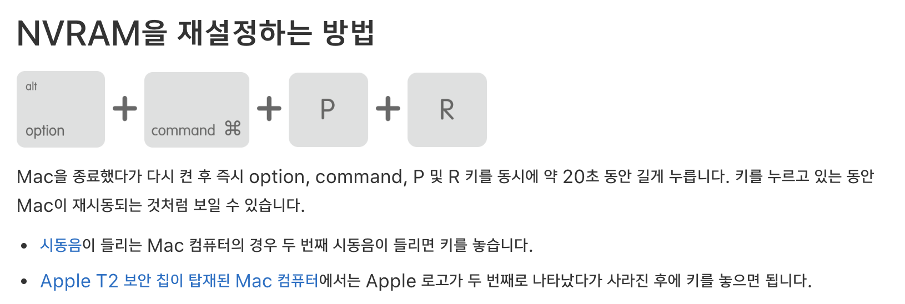

# 맥에서 SMC 및 NVRAM 혹은 PRAM 재설정하기

## SMC(System Management Controller) 재설정

<https://support.apple.com/ko-kr/HT201295>

## NVRAM(Nonvolatile Random-Access Memory) 또는 PRAM(Parameter RAM) 재설정

<https://support.apple.com/ko-kr/HT204063>

