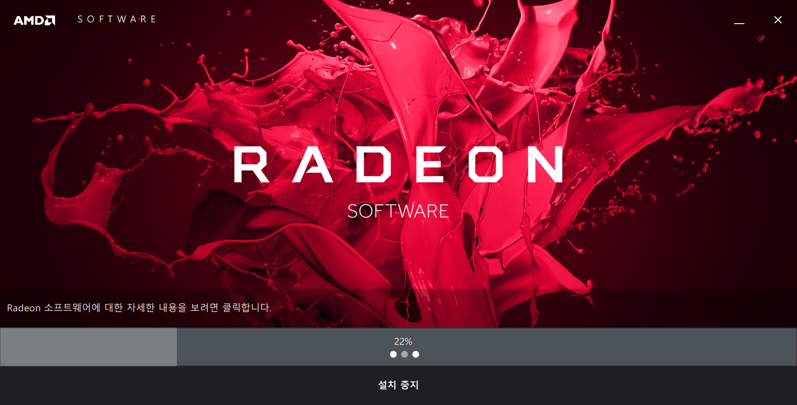
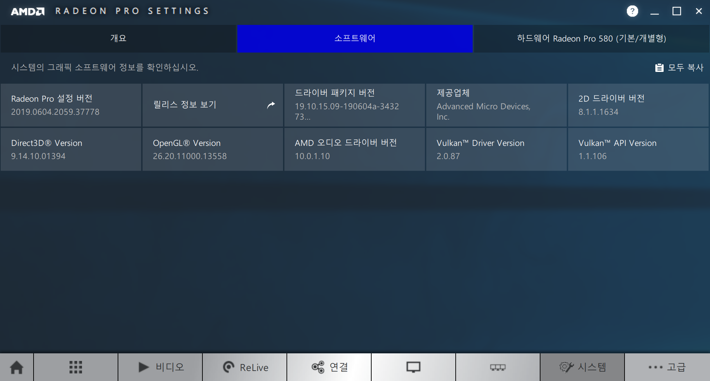
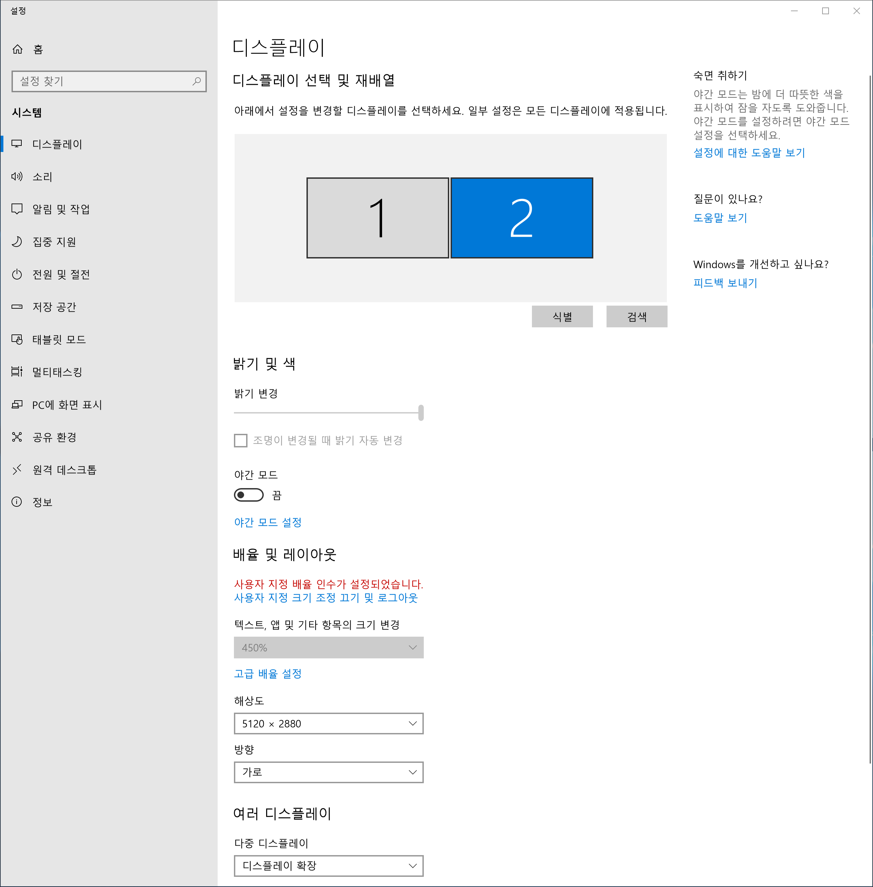

# 맥 부트캠프 amd 그래픽 드라이버 최신으로 업데이트하기

애플에서 제공하는 `windows 지원 소프트웨어`에는 윈도우용 최신 그래픽드라이버가 포함되어있지 않다.

애플 공식 웹페이지에서 제공하는 방법 [Boot Camp에서 Windows용 AMD 그래픽 드라이버 업데이트하기](https://support.apple.com/ko-kr/HT208908)을 따라해도 최신 드라이버가 제공되지 않는다.

AMD 공식 웹페이지에 가면 안정화된 최신 드라이버를 제공한다.  
<https://www.amd.com/ko/support/kb/release-notes/apple-boot-camp>  
하지만 이것도 가장 마지막에 릴리즈되는 드라이버를 제공하지 않는다

## 가장 최신 드라이버를 설치하는 방법

https://www.bootcampdrivers.com/
위 사이트에 접속하면 운영환경에 따른 버전별 최신 드라이버를 다운받을 수 있다.  
또한 호환성 문제에 대해서도 알아 볼 수 있다.

필자는 아이맥2017 5K + LG 울트라파인 5K로 듀얼모니터 환경을 가지고 있는데 기존 드라이버는 부트캠프 윈도우10에서 울트라파인5K 확장모드로 연결하면 4K 해상도로 사용 할 수 밖에 없었다.

이 곳에서 최신 드라이버인 Adrenalin June 2019 edition 을 받아서 드라이버 업데이트를 하였더니 이제 부트캠프 울트라파인 5K가 확장모드에서도 5K 해상도로 작동하게 되었다

