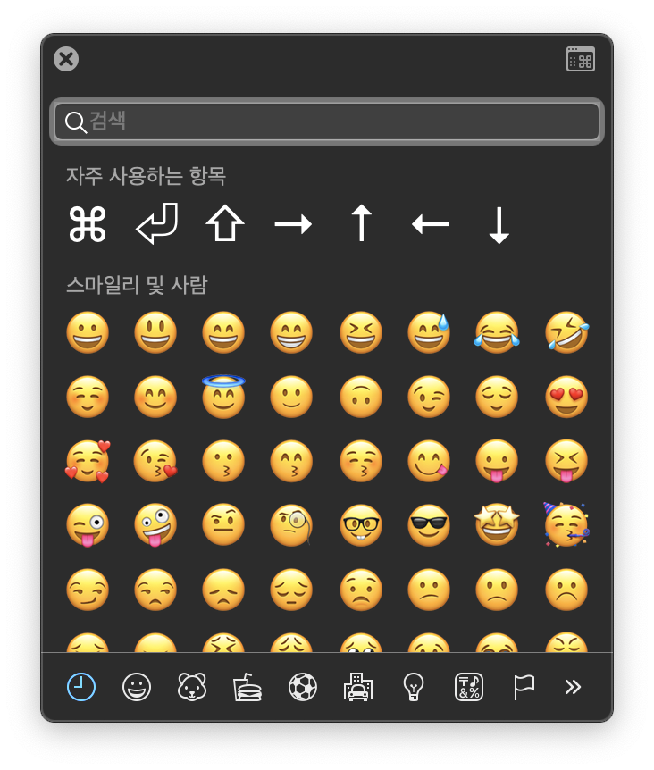
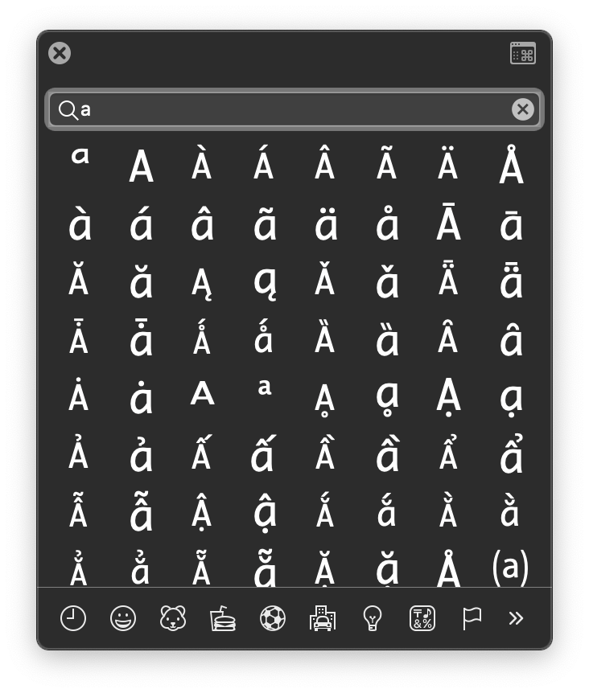
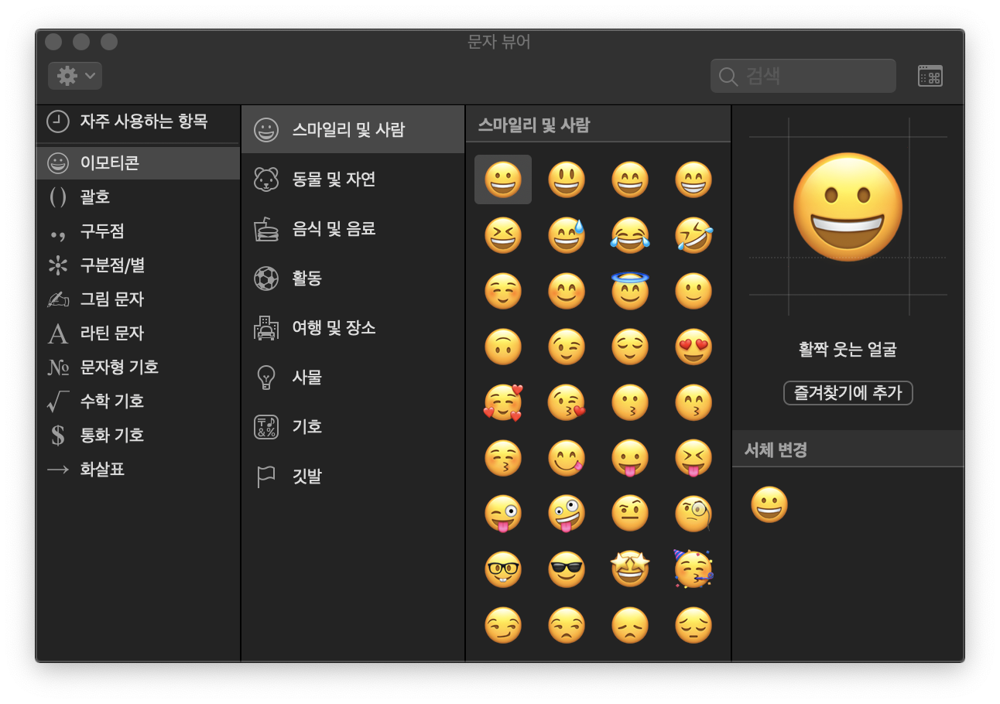
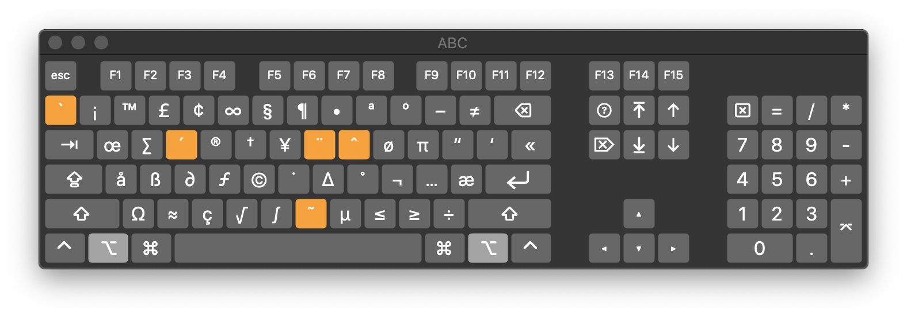
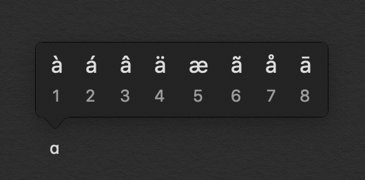

# 맥에서 특수 문자 입력하기

## 1. 단축키 입력

⌘⇧Space(Command + Control + Space)를 누르면 특수문자 뷰어 윈도우가 나타난다

입력하고 싶은 특수 문자 찾기가 힘들다면 관련된 문자나 숫자를 입력해서 검색 할 수 있다. 알파벳 a를 검색했을때 관련된 특수문자들이 나온 결과이다

오른쪽 상단의 ⌘모양의 윈도우를 클릭하면 특수문자 뷰어가 상세하게 확장된다

## 2. 상태표시줄에서 특수문자 불러오기

상태표시줄에서 입력소스를 나타내는 아이콘을 클릭하면 아래에 나오는 '이모티콘 및 기호 보기'를 선택한다

## 3. 영문 키입력 모드에서 OPTION + 알파벳

예측이 불가능 한 경우 상태표시줄에서 '키보드 뷰어 보기'를 선택하면 미리 볼 수 있다

## 4. 악센트 표시가 있는 문자 입력하는 방법

키입력 영어모드에서 알파벳을 길게 누르면 위에 옵션이 뜬다
