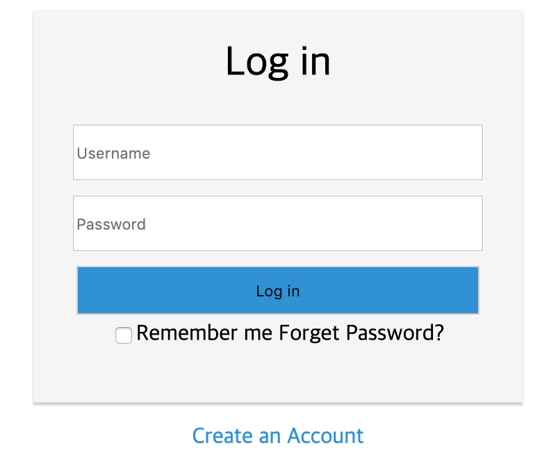

# CSS Login 페이지 실습


위와 같이 로그인 폼을 만드시오

---

시간내에 작성을 다 하지 못해서 미완성이지만 내가 작성 한 것

```html
<!DOCTYPE html>
<html lang="en">
  <head>
    <meta charset="UTF-8" />
    <meta name="viewport" content="width=device-width, initial-scale=1.0" />
    <meta http-equiv="X-UA-Compatible" content="ie=edge" />
    <title>login</title>

    <style>
      body {
        text-align: center;
      }

      a:link {
        color: rgb(43, 147, 211);
        text-decoration: none;
      }

      a:hover {
        color: red;
        text-decoration: none;
      }

      #center {
        border: 1px solid whitesmoke;
        background-color: whitesmoke;
        box-shadow: 0px 2px 1px lightgray;
        margin: auto;
        width: 350px;
        height: 280px;
      }

      #title {
        font-size: 30px;
        margin: 20px;
      }

      #button {
        background-color: rgb(43, 147, 211);
        width: 290px;
        height: 35px;
        margin: 5px;
      }

      #user,
      #passwd {
        width: 290px;
        height: 35px;
        margin: 5px;
      }

      #create_account {
        margin: 10px;
      }

      #keep {
        text-align: left;
      }

      #forget {
        text-align: right;
      }
    </style>
  </head>

  <body>
    <div id="center">
      <div id="title">Log in</div>
      <input type="text" placeholder="Username" id="user" /><br />
      <input type="password" placeholder="Password" id="passwd" /><br />
      <input type="button" id="button" value="Log in" /><br />
      <div style="width: 290px; margin: auto;">
        <table style="width: 290px;">
          <tr>
            <td id="keep"><input type="checkbox" />Remember me</td>
            <td id="forget">
              <a href="forget_password.html">Forget Password?</a>
            </td>
          </tr>
        </table>
      </div>
    </div>
    <div id="create_account">
      <a href="/create_account.html">Create an Account</a>
    </div>
  </body>
</html>
```


