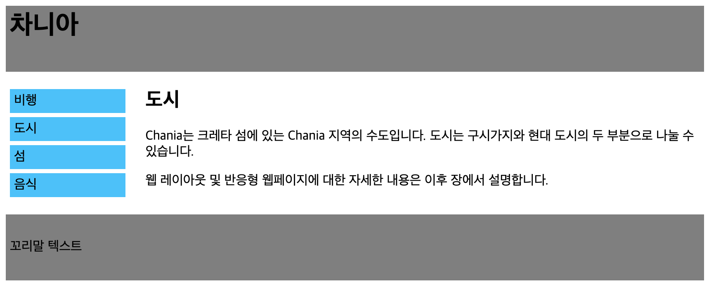

# float 기능과 clearfix를 이용하여 웹페이지 만들기


float와 clearfix를 활용하여 위와 같은 웹페이지를 작성하시오

## 내가 작성한 코드 v1.0

```html
<!DOCTYPE html>
<html>
  <head>
    <meta charset="UTF-8" />
    <meta name="viewport" content="width=device-width, initial-scale=1.0" />
    <meta http-equiv="X-UA-Compatible" content="ie=edge" />
    <title>차이나</title>
    <style>
      /* body {
            margin: 0;
        } */

      #header {
        background-color: gray;
        height: 70px;
        padding: 5px;
      }

      h1 {
        margin: 0;
      }

      #footer {
        background-color: gray;
        height: 70px;
        padding: 5px;
        line-height: 38px;
      }

      #nav li {
        background-color: rgb(0, 195, 255);
        width: 130px;
        padding: 5px;
        margin: 5px;
        list-style-type: none;
      }

      #nav ul {
        display: inline-block;
        padding-left: 0;
      }

      #body {
        width: 80%;
        float: right;
        align-self: auto;
      }

      #nav {
        overflow: auto;
      }
    </style>
  </head>

  <body>
    <div id="header">
      <h1>차니아</h1>
    </div>
    <div id="nav">
      <ul>
        <li>비행</li>
        <li>도시</li>
        <li>섬</li>
        <li>음식</li>
      </ul>
      <div id="body">
        <h2>도시</h2>
        <p>
          Chania는 크레타 섬에 있는 Chania 지역의 수도입니다. 도시는 구시가지와
          현대 도시의 두 부분으로 나눌 수 있습니다.
        </p>
        <p>
          웹 레이아웃 및 반응형 웹페이지에 대한 자세한 내용은 이후 장에서
          설명합니다.
        </p>
      </div>
    </div>

    <div id="footer">
      <p>꼬리말 텍스트</p>
    </div>
  </body>
</html>
```


데스크톱 환경에서 실행


모바일 환경에서 실행

문제가 발생했다. 모바일로 전환하면 위와같이 깨지게 된다. 무엇이 문제인지 확인하고 해결하자

## v2.0

```html
<!DOCTYPE html>
<html>
  <head>
    <meta charset="UTF-8" />
    <meta name="viewport" content="width=device-width, initial-scale=1.0" />
    <meta http-equiv="X-UA-Compatible" content="ie=edge" />
    <title>차이나</title>
    <style>
      /* body {
            margin: 0;
        } */

      #header {
        background-color: gray;
        height: 70px;
        padding: 5px;
      }

      h1 {
        margin: 0;
      }

      #footer {
        background-color: gray;
        height: 70px;
        padding: 5px;
        line-height: 38px;
      }

      #nav li {
        background-color: rgb(0, 195, 255);
        width: 130px;
        padding: 5px;
        margin: 5px;
        list-style-type: none;
      }

      #nav ul {
        display: inline-block;
        padding-left: 0;
      }

      #nav {
        display: inline-block;
        clear: right;
      }

      #body {
        display: inline-block;
      }

      .clearfix {
        overflow: auto;
      }
    </style>
  </head>

  <body>
    <div id="header">
      <h1>차니아</h1>
    </div>
    <div id="nav">
      <ul>
        <li>비행</li>
        <li>도시</li>
        <li>섬</li>
        <li>음식</li>
      </ul>
    </div>
    <div id="body" class="clearfix">
      <h2>도시</h2>
      <p>
        Chania는 크레타 섬에 있는 Chania 지역의 수도입니다. 도시는 구시가지와
        현대 도시의 두 부분으로 나눌 수 있습니다.
      </p>
      <p>
        웹 레이아웃 및 반응형 웹페이지에 대한 자세한 내용은 이후 장에서
        설명합니다.
      </p>
    </div>

    <div id="footer">
      <p>꼬리말 텍스트</p>
    </div>
  </body>
</html>
```

반응형으로 움직이지만 문제가 또 생김.
\<div id="body">블록의 글자를 침범해서 페이지 너비를 줄이면 바로 블록이 아래로 내려오는 현상이 발생한다
적절한 너비에서 블록이 내려오도록 설정을 하자
