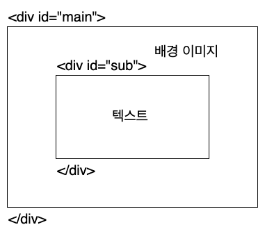

# 이미지 위 가운데에 텍스트 넣기


위 사진처럼 이미지 위에 텍스트나 버튼을 넣는 방법에 대해 알아보자

## 구조 만들기



위 구조를 기반으로 HTML 문서를 작성하자

```html
<!DOCTYPE html>

<head>
    <meta charset="UTF-8">
    <meta name="viewport" content="width=device-width, initial-scale=1.0">
    <meta http-equiv="X-UA-Compatible" content="ie=edge">
    <title>이미지 위 가운데에 텍스트 넣기</title>
</head>

<body>
    <div id="main">
        
        <div id="sub">
            <h1>2018 BlockChain Hackathon</h1>
            <p>20 - 21 July, 2018</p>
            <button type="button">
                <p>Learn More</p>
        </div>
    </div>
</body>

</html>
```


이렇게 작성하게 되면 텍스트와 버튼이 위치한 `<div id="sub">` 블록은 이미지 아래에 위치하게 된다.

## 스타일시트 적용하기

`<div id="sub">` 블록을 이미지 가운데에 위치하기 위해 스타일시트에서 `position` 값을 지정하자.

- `<div id="main">` 블록에는 position: relative; 값을 지정한다
- `<div id="sub">` 블록에는 position: absolute; 값을 지정하고 top, left, transform 속성을 사용한다

적용된 값은 아래와 같다

```html
<!DOCTYPE html>

<head>
    <meta charset="UTF-8">
    <meta name="viewport" content="width=device-width, initial-scale=1.0">
    <meta http-equiv="X-UA-Compatible" content="ie=edge">
    <title>이미지 위 가운데에 텍스트 넣기</title>
    <style>
        body {
            margin: 0px;
        }

        .main {
            text-align: center;
            position: relative;
            color: white;
        }

        .sub {
            position: absolute;
            top: 50%;
            left: 50%;
            transform: translate(-50%, -50%)
        }

        #more_button {
            border: 2px solid white;
            width: 120px;
            height: 50px;
            background-color: rgba(255, 255, 255, 0);
            color: white
        }

        #more_button p {
            font-size: 1rem;
        }
    </style>
</head>

<body>
    <div class="main">
        
        <div class="sub">
            <h1>2018 BlockChain Hackathon</h1>
            <p>20 - 21 July, 2018</p>
            <!--  -->
            <button type="button" id="more_button" onclick="window.location='/learn_more.html'">
                <p>Learn More</p>
        </div>
    </div>
</body>

</html>
```
