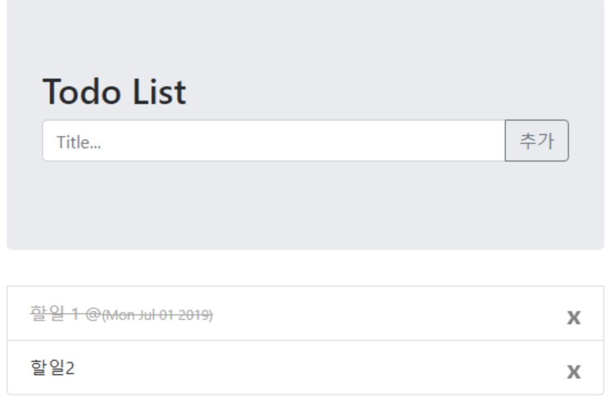

# todo 리스트 만들기

bootstrap과 jQuery를 활용하여 todo 리스트 만들기를 해보자



요구 기능

- 입력창에 항목 입력 후 엔터 키 누르면 리스트 아이템 추가
- 입력창에 항목 입력 후 추가 버튼을 누르면 리스트 아이템 추가
- 아이템 추가 후에는 입력창을 비우고 focus 가도록
- 리스트 항목에서 텍스트를 클릭하면 text-decoration:’line-through’ 효과
- X 표시 클릭하면 hide() 효과

---

내가 짠 코드

```html
<!DOCTYPE html>
<html lang="en">
  <head>
    <meta charset="UTF-8" />
    <meta name="viewport" content="width=device-width, initial-scale=1.0" />
    <meta http-equiv="X-UA-Compatible" content="ie=edge" />
    <title>Document</title>

    <!-- jQuery first, then Popper.js, then Bootstrap JS -->
    <script
      src="https://code.jquery.com/jquery-3.2.1.slim.min.js"
      integrity="sha384-KJ3o2DKtIkvYIK3UENzmM7KCkRr/rE9/Qpg6aAZGJwFDMVNA/GpGFF93hXpG5KkN"
      crossorigin="anonymous"
    ></script>
    <script
      src="https://cdnjs.cloudflare.com/ajax/libs/popper.js/1.12.9/umd/popper.min.js"
      integrity="sha384-ApNbgh9B+Y1QKtv3Rn7W3mgPxhU9K/ScQsAP7hUibX39j7fakFPskvXusvfa0b4Q"
      crossorigin="anonymous"
    ></script>
    <script
      src="https://maxcdn.bootstrapcdn.com/bootstrap/4.0.0/js/bootstrap.min.js"
      integrity="sha384-JZR6Spejh4U02d8jOt6vLEHfe/JQGiRRSQQxSfFWpi1MquVdAyjUar5+76PVCmYl"
      crossorigin="anonymous"
    ></script>

    <!-- Bootstrap CSS -->
    <link
      rel="stylesheet"
      href="https://maxcdn.bootstrapcdn.com/bootstrap/4.0.0/css/bootstrap.min.css"
      integrity="sha384-Gn5384xqQ1aoWXA+058RXPxPg6fy4IWvTNh0E263XmFcJlSAwiGgFAW/dAiS6JXm"
      crossorigin="anonymous"
    />

    <style>
      .input {
        display: inline-block;
        text-decoration: line-through;
      }

      div #allList {
        position: relative;
      }

      .deleteBtn {
        position: absolute;
        right: 20px;
      }

      .ext {
        width: 80%;
        margin: auto;
        padding-top: 20px;
      }

      #innerBox {
        background-color: rgb(214, 228, 238);
        height: 200px;
      }

      #todoBox {
        width: 80%;
        margin: auto;
        padding-top: 50px;
      }
    </style>
  </head>

  <body>
    <div class="ext">
      <div id="innerBox">
        <div id="todoBox">
          <h2>Todo List</h2>
          <div class="input-group mb-3">
            <input
              type="text"
              class="form-control"
              placeholder="Title.."
              aria-label="title"
              id="addBox"
              onkeypress="addEnter();"
            />
            <div class="input-group-append">
              <button
                class="btn  btn-outline-secondary"
                id="addBtn"
                onclick="addData();   "
                type="button"
              >
                추가
              </button>
            </div>
          </div>
        </div>
      </div>

      <div>
        <ul class="list-group" id="allList"></ul>
      </div>
    </div>

    <script>
      function addData() {
        var data = document.getElementById("addBox").value;

        // 만약 입력값이 빈 값으로 들어오면 alert 창을 띄운다
        if (data == "") {
          return alert("텍스트를 입력하세요");
        }

        // 리스트의 아이디값에 번호를 증분시킨다
        n = n + 1;

        allData =
          `<span class="allData" onclick="$(this).css({'color':'gray', 'text-decoration':'line-through'})">` +
          data +
          `</span>`;
        //console.log(allData);

        delBtn =
          `<span class="deleteBtn" onclick="$('#listNum` +
          n +
          `').hide();"> X </span>`;

        console.log(delBtn);

        $("ul").append(
          '<li class="list-group-item" id=listNum' +
            n +
            ">" +
            allData +
            delBtn +
            " </li>"
        );

        // console.log("Add data complete");
        // 입력 뒤 텍스트입력 박스 초기화
        document.getElementById("addBox").value = "";
      }

      function addEnter() {
        if (event.keyCode == 13) {
          addData();
          //console.log("keyCode : " + event.keyCode);
        }
      }
    </script>
  </body>
</html>
```

결국 시간 내에 텍스트가 변할 때 시간 삽입 하는 것을 못했다

---

강사님께서 짠 코드

```html
<!DOCTYPE html>
<html lang="en">
  <head>
    <meta charset="UTF-8" />
    <meta name="viewport" content="width=device-width, initial-scale=1.0" />
    <meta http-equiv="X-UA-Compatible" content="ie=edge" />
    <title>Document</title>

    <!-- jQuery first, then Popper.js, then Bootstrap JS -->
    <script
      src="https://code.jquery.com/jquery-3.2.1.slim.min.js"
      integrity="sha384-KJ3o2DKtIkvYIK3UENzmM7KCkRr/rE9/Qpg6aAZGJwFDMVNA/GpGFF93hXpG5KkN"
      crossorigin="anonymous"
    ></script>
    <script
      src="https://cdnjs.cloudflare.com/ajax/libs/popper.js/1.12.9/umd/popper.min.js"
      integrity="sha384-ApNbgh9B+Y1QKtv3Rn7W3mgPxhU9K/ScQsAP7hUibX39j7fakFPskvXusvfa0b4Q"
      crossorigin="anonymous"
    ></script>
    <script
      src="https://maxcdn.bootstrapcdn.com/bootstrap/4.0.0/js/bootstrap.min.js"
      integrity="sha384-JZR6Spejh4U02d8jOt6vLEHfe/JQGiRRSQQxSfFWpi1MquVdAyjUar5+76PVCmYl"
      crossorigin="anonymous"
    ></script>

    <!-- Bootstrap CSS -->
    <link
      rel="stylesheet"
      href="https://maxcdn.bootstrapcdn.com/bootstrap/4.0.0/css/bootstrap.min.css"
      integrity="sha384-Gn5384xqQ1aoWXA+058RXPxPg6fy4IWvTNh0E263XmFcJlSAwiGgFAW/dAiS6JXm"
      crossorigin="anonymous"
    />

    <style>
      .input {
        display: inline-block;
        text-decoration: line-through;
      }

      div #allList {
        position: relative;
      }

      .deleteBtn {
        position: absolute;
        right: 20px;
      }

      .ext {
        width: 80%;
        margin: auto;
        padding-top: 20px;
      }

      #innerBox {
        background-color: rgb(214, 228, 238);
        height: 200px;
      }

      #todoBox {
        width: 80%;
        margin: auto;
        padding-top: 50px;
      }

      .allData {
        display: inline-block;
      }
    </style>
  </head>

  <body>
    <div class="ext">
      <div id="innerBox">
        <div id="todoBox">
          <h2>Todo List</h2>
          <div class="input-group mb-3">
            <input
              type="text"
              class="form-control"
              placeholder="Title.."
              aria-label="title"
              id="addBox"
              onkeypress="addEnter();"
            />
            <div class="input-group-append">
              <button
                class="btn  btn-outline-secondary"
                id="addBtn"
                onclick="addData();   "
                type="button"
              >
                추가
              </button>
            </div>
          </div>
        </div>
      </div>

      <div>
        <ul class="list-group" id="allList"></ul>
      </div>
    </div>

    <script>
      function addData() {
        // 입력받은 값을 data 변수에 저장
        var data = $("#addBox").val();
        console.log(data);

        // 입력값이 없을 경우 경고창을 띄운다
        if (data == "") {
          return alert("텍스트를 입력하세요");
        }

        //
        $("ul").append(
          '<li class="list-group-item"><span class="item_text">' +
            data +
            '</span><span class="deleteBtn">x</span>'
        );
      }

      // 엔터 입력시 addData() 실행
      function addEnter() {
        if (event.keyCode == 13) {
          addData();
        }
      }

      // document에서 .item_text 클래스를 클릭하면 함수를 실행
      $(document).on("click", ".item_text", function() {
        var date = new Date().toDateString();
        var txt = $(this).html() + " @" + date;
        console.log(txt);
        $(this)
          .html(txt)
          .css({
            "text-decoration": "line-through",
            color: "lightgray"
          });
      });

      // 버튼을 클릭하면 삭제
      $(document).on("click", ".deleteBtn", function() {
        //현재의 부모요소를 선택하여 숨긴다
        $(this)
          .parent()
          .hide();
      });
    </script>
  </body>
</html>
```

---

최종버전

```html
<!DOCTYPE html>
<html lang="en">
  <head>
    <meta charset="UTF-8" />
    <meta name="viewport" content="width=device-width, initial-scale=1.0" />
    <meta http-equiv="X-UA-Compatible" content="ie=edge" />
    <title>Document</title>

    <link
      rel="stylesheet"
      href="https://maxcdn.bootstrapcdn.com/bootstrap/4.3.1/css/bootstrap.min.css"
    />

    <script src="https://ajax.googleapis.com/ajax/libs/jquery/3.4.1/jquery.min.js"></script>
    <script src="https://cdnjs.cloudflare.com/ajax/libs/popper.js/1.14.7/umd/popper.min.js"></script>
    <script src="https://maxcdn.bootstrapcdn.com/bootstrap/4.3.1/js/bootstrap.min.js"></script>
    <style></style>
    <script>
      $(document).on('click', '.close', function() {
          $(this).parent().hide();
      });

      $(document).on('click', '.list-group-item', function() {
          $(this).css({'text-decoration':'line-through', 'color':'darkgray'});
          let span = $(this).children('span');
          $(span).before(' @<small>(' + new Date().toDateString() + ')</small>');
      });

      $(function () {
          // $('.close').on('click',function() {
          //     $(this).parent().hide();
          // });

          $('#addbtn').click(function() {
              let data = $('#todoInput').val();
              $('#todoList').append('<li class="list-group-item">' + data + '<span class="close">x</span></li>');
              $('#todoInput').val('');
              $('#todoInput').focus();
          });

          $('#todoInput').keydown(function(key) {
              if(key.keyCode == 13) {
                  let data = $('#todoInput').val();
                  $('#todoList').append('<li class="list-group-item">' + data + '<span class="close">x</span></li>');
                  $('#todoInput').val('');
                  $('#todoInput').focus();

          });
      });
    </script>
  </head>

  <body>
    <div class="container">
      <div class="row">
        <div class="col"></div>
        <div class="col-sm-6">
          <div id="header" class="jumbotron">
            <h2>Todo List</h2>
            <div class="input-group mb-3">
              <input
                type="text"
                class="form-control"
                id="todoInput"
                placeholder="Title..."
              />
              <div class="input-group-append">
                <button
                  class="btn btn-outline-secondary"
                  id="addbtn"
                  type="button"
                >
                  추가
                </button>
              </div>
            </div>
          </div>
          <ul id="todoList" class="list-group">
            <li class="list-group-item">
              HTML 복습하기<span class="close">x</span>
            </li>
            <li class="list-group-item">
              다운받은 미드 보기<span class="close">x</span>
            </li>
            <li class="list-group-item">
              헬스장 가서 운동하기<span class="close">x</span>
            </li>
          </ul>
        </div>
        <div class="col"></div>
      </div>
    </div>
  </body>
</html>
```
