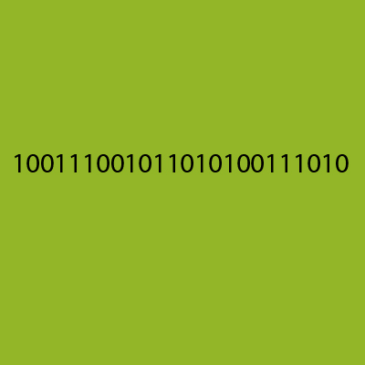
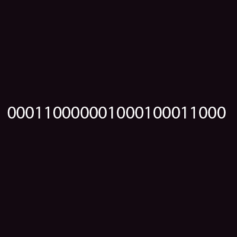
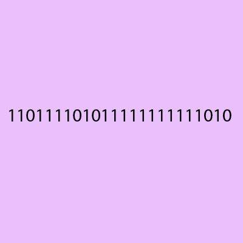
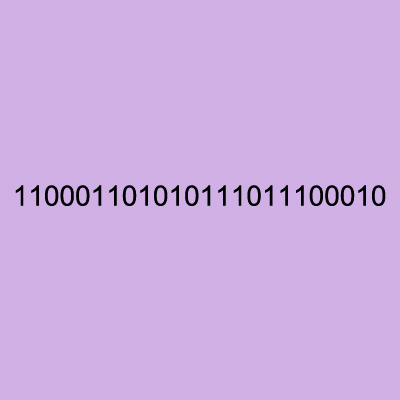

# 최고의 시프트 암호

<https://ko.khanacademy.org/computing/computer-science/cryptography/ciphers/a/xor-bitwise-operation>

[일회용 암호표](https://ko.khanacademy.org/computing/computer-science/cryptography/crypt/v/one-time-pad) 수업을 들어본 적이 있다면 이것이 최고의 시프트 암호라는 것을 알 것입니다. 이는 `메시지 길이` 와 `시프트의 랜덤 목록` 이 같다는 점을 응용합니다. 왜 1회용 암호표는 해독할 수 없으며, 어떻게 완벽히 비밀을 보장하는지 정확하게 이해하는 것이 중요합니다

그 이유를 이해하려면 AND, OR, XOR 비트 연산자를 먼저 알아야 합니다. 특히 컴퓨터에서 1회용 암호표 수행할 때 왜 XOR이 사용되어야 하는지 말입니다.

## 비트 연산

비트 연산은 그 말대로 개별적인 비트, 즉 이진수를 다룬다는 뜻입니다. 현대의 컴퓨터화된 암호 체계에서는 이진수로 기호를 표현합니다. 왜 그런지 잊어버렸다면 [컴퓨터 메모리에서 관련 동영상](https://ko.khanacademy.org/computing/computer-science/cryptography/comp-number-theory/v/what-is-computer-memory-prime-adventure-part-7)을 확인해 볼 수 있습니다.

# 색의 암호화

칸 아카데미 로고에 있는 색을 암호화하는 시각적 예제를 살펴봅시다.

색을 어떻게 숫자로 바꿀까요? 지금 여러분은 RGB 색 모델을 이용하여 정의된 HTML 색을 보고 있습니다. 이는 빨강, 초록, 파랑 빛의 혼합에 기반한 가색 모델입니다

숫자 0에서 255범위에 있는 수로 빨강, 초록, 파랑이 각각 섞이는 비율을 정확하게 지정할 수 있습니다. 검은색은 모두 꺼짐 (0,0,0)인 반면 하양은 모두 켜짐 (255,255,255)입니다. 둘 사이에는 1천600만 가지 색 이 있습니다 (256 _ 256 _ 256). 다음으로 칸 아카데미의 잎에 있는 초록색으로 이미지 편집을 해 봅시다.

이 초록색의 숫자가 RED=156, GREEN=181, BLUE=58로 저장되어 있다는 것에 주목합니다.

수를 이진수로 나타내면 다음과 같습니다:
RED=10011100, GREEN=10110101, BLUE=00111010.

수를 이어보면 이렇습니다: 100111001011010100111010

칸 아카데미 초록색의 RGB 를 이진수로 나타내면 다음과 같습니다.

# 랜덤 시프트의 적용

동전 뒤집기를 이용하여 시프트 수열을 만들어 이진수로 바꿨다고 합시다.

HTHTTHTHHHHTTHTTTTHTTHHH = 010110100001101111011000

1회용 암호표를 이용하여 색을 암호화하기 위해 이 시프트 수열을 어떻게 적용할 수 있을지 생각해 봅시다.

100,111,001,011,000,000,000,000 + 10,110,100,001,100,000,000,000 = ?

1회용 암호표가 제대로 작동하도록 올바른 연산을 선택해서, 결과 수열이 나올 가능성이 모든 색상에 대해 비슷하도록 해야 합니다. 세 가지의 연산 AND, OR, XOR을 살펴봅시다.

# AND

AND 연산은 논리곱이라고도 하며 곱하기처럼 작용합니다.
이 연산에서는 모든 입력값이 1일 때만 1을 출력합니다. 다음은 진리표입니다:

0 AND 0 = 0  
0 AND 1 = 0  
1 AND 0 = 0  
1 AND 1 = 1

시도해 봅시다:  
100111001011010100111010 AND 010110100001101111011000 = 000110000001000100011000

연산 결과 아주 어두운 보라색이 되었습니다. 이진수에 AND 연산을 하면 결과 수열은 더 커질 수 없습니다. 색깔 예제에서 이런 특성은 색을 검은색 쪽으로 보내기 때문에 다른 색을 차단합니다.

# OR

OR 연산은 논리합이라고도 불립니다. 이는 하나 이상의 입력값이 1이면 1을 출력합니다. 아래는 진리표입니다:

0 OR 0 = 0  
0 OR 1 = 1  
1 OR 0 = 1  
1 OR 1 = 1

시도해 봅시다:  
100111001011010100111010 OR 010110100001101111011000 = 110111101011111111111010

연산 결과 밝은 보라색이 되었습니다. 특정 이진수 수열에 OR 연산을 하면 결과 수열은 더 작아질 수 없습니다. 이는 색을 하얀 색 쪽으로 보내기 때문에 다른 많은 색이 나올 가능성을 없앱니다.

# XOR

XOR 연산은 입력값이 같지 않으면 1을 출력합니다. 이는 두 입력 중 하나만이 배타적으로 참일 경우에만 일어납니다. 이 연산은 더해서 mod 2 를 구하는 것의 결과와 동일합니다. 다음은 진리표입니다:

0 XOR 0 = 0  
0 XOR 1 = 1  
1 XOR 0 = 1  
1 XOR 1 = 0

시도해 봅시다:
100111001011010100111010 XOR 010110100001101111011000 = 110001101010111011100010

연산 결과 OR 연산과 비교해서 약간 더 어두운 보라색이 되었습니다. 이진수 수열에 XOR 연산을 하게 되면 결과 수열은 어떤 수열도 될 수 있습니다. 어떤 암호화된 색이 있을 때 알 수 있는 건 오로지 "원래색은 어떤 색이든 될 수 있다는 것"입니다. 맹목적 추측을 개선시킬 수 있는 어떤 정보도 없습니다 (1/16, 000, 000).

마지막으로 일회용 암호표를 보면서 알아보도록 하겠습니다. 그러면 더 많은 에너지 포인트를 얻을 수 있을 겁니다!
