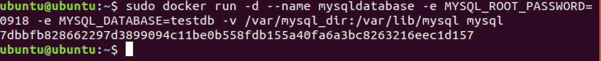
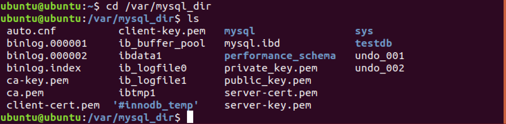
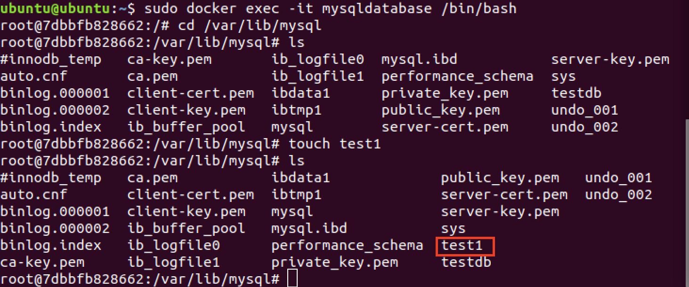
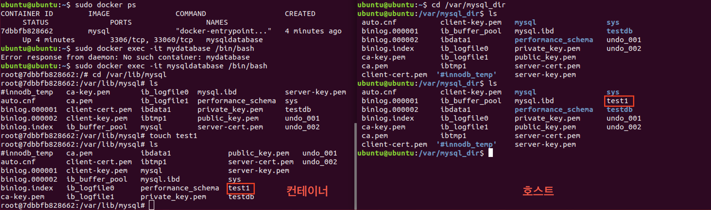
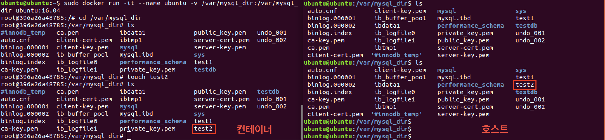
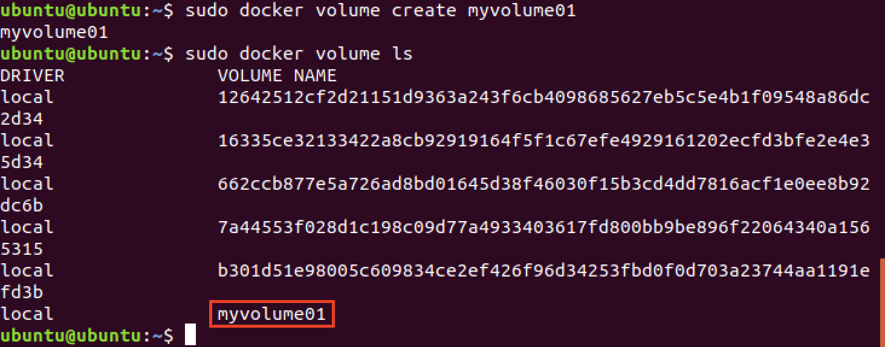
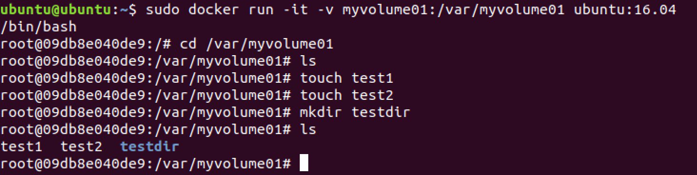
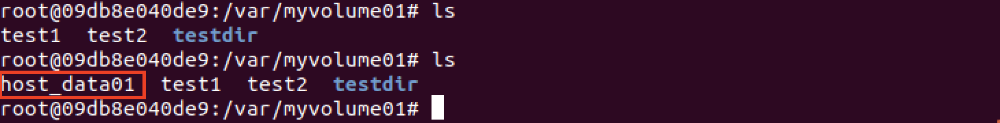
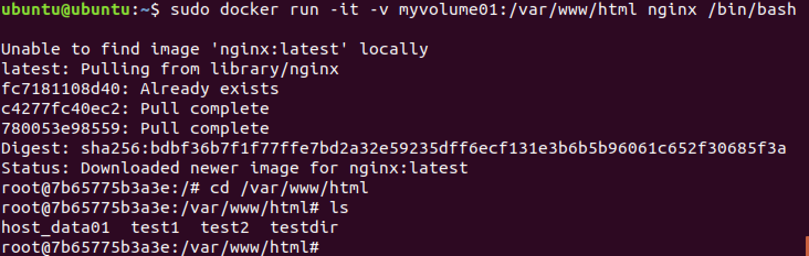

# 도커 볼륨

## Volume

- 컨테이너에 들어간 데이터는 컨테이너를 제거하면 다 지워짐
- 데이터베이스 컨테이너를 지우면 그 안의 데이터도 지워짐
- 컨테이너 외부에 데이터를 보관하는 것이 유리
- 호스트의 특정 폴더를 컨테이너에 마운트하여 컨테이너에서 생성된 데이터가 호스트에 저장되도록 유도
- 컨테이너가 지워지더라도 데이터는 안전함
- 컨테이너간 데이터 공유에도 사용됨

---

## 볼륨을 사용한 mysql container (바인딩 방식)

```bash
# -v 옵션 뒤에 호스트의 절대경로 디렉터리:컨테이너의 절대경로 디렉터리
docker run -d --name mysqldatabase -e MYSQL_ROOT_PASSWORD=0918 -e MYSQL_DATABASE=testdb -v /var/mysql_dir:/var/lib/mysql mysql
```



### 볼륨 데이터 확인

```
# /var/mysql_dir 디렉터리로 이동
cd /var/mysql_dir

# 확인
ls
```



### mysqldatabase 컨테이너에 접속

```bash
# mysqldatabase 이름을 가진 컨테이너에 -it(표준입출력사용)옵션을 이용하여 접속하고 /bin/bash를 실행함
sudo docker exec -it mysqldatabase /bin/bash

# mysqldatabase 컨테이너의 /var/lib/mysql 디렉터리로 이동
cd /var/lib/mysql

# 리스트를 확인한다
ls

# test1 파일을 생성한다
touch test1

# test1 파일이 정상적으로 생성되었는지 리스트를 다시 확인한다
ls
```




호스트 디렉토리에 test1 파일이 존재하는 것을 확인 할 수 있다

### 볼륨 데이터 공유하기

```bash
sudo docker run exec -it --name ubuntu -v /var/mysql_dir:/var/mysql_dir ubuntu:16.04

cd /var/mysql_dir

ls

touch test2

ls
```


ubuntu 컨테이너에서 생성한 test2파일이 호스트 디렉토리에도 존재하는 것을 확인 할 수 있다

앞서 작업한대로 mysqldatabase 컨테이너와 ubuntu컨테이너는 호스트의 /var/mysql_dir 디렉터리를 공유하게 된다

---

## 도커볼륨(도커 볼륨 방식)

도커가 관리하는 디렉터리에 볼륨을 생성해서 관리

### 도커 볼륨 생성

```bash
sudo docker volume create myvolume01
```

### 도커 볼륨 리스트 확인

```bash
sudo docker volume ls
```



### 도커 볼륨 사용하기

```bash
sudo docker run -it -v myvolume01:/var/myvolume01 ubuntu:16.04 /bin/bash

# 리스트 확인
ls

# test1 파일 생성
touch test1

# test2 파일 생성
touch test2

# testdir 디렉터리 생성
mkdir testdir

# 생성된 디렉터리와 파일 리스트를 확인
ls
```



### 호스트에서 볼륨 디렉터리 위치 확인

```bash
sudo docker inspect myvolume01
```


### 호스트에서 볼륨 데이터 확인

```bash
sudo ls /var/lib/docker/volumes/myvolume01/_data
```


### 호스트에서 볼륨 수정하기

```bash
# myvolume01 호스트 디렉터리에 host_data01 파일 추가
sudo touch /var/lib/docker/volumes/myvolume01/_data/host_data01

# host_data01파일이 추가된 것을 확인 할 수 있다
sudo ls /var/lib/docker/volumes/myvolume01/_data
```


### 컨테이너에서 수정된 파일 확인


호스트 볼륨에서 작성한 host_data01 파일을 컨테이너에서도 볼 수 있다

### 다른 컨테이너에서 볼륨 데이터 접근하기

```bash
sudo docker run -it -v myvolume01:/var/www/html nginx /bin/bash

cd /var/www/html

ls
```



### 볼륨 삭제

```bash
# 볼륨 삭제
sudo docker volume rm [volume ID or NAME]

# 사용하지 않는 볼륨 모두 삭제
sudo docker volume prune
```
