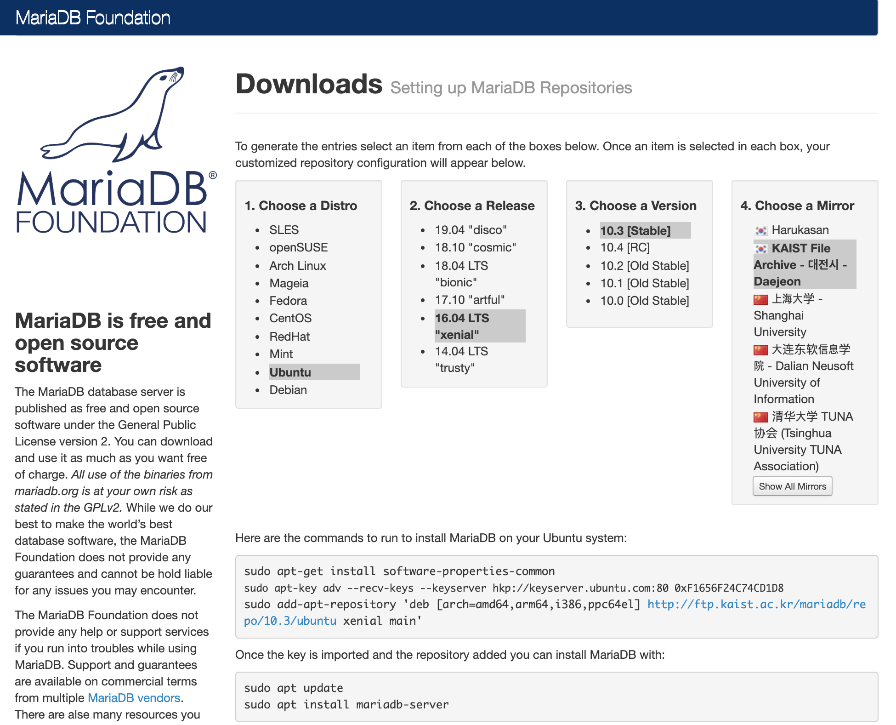
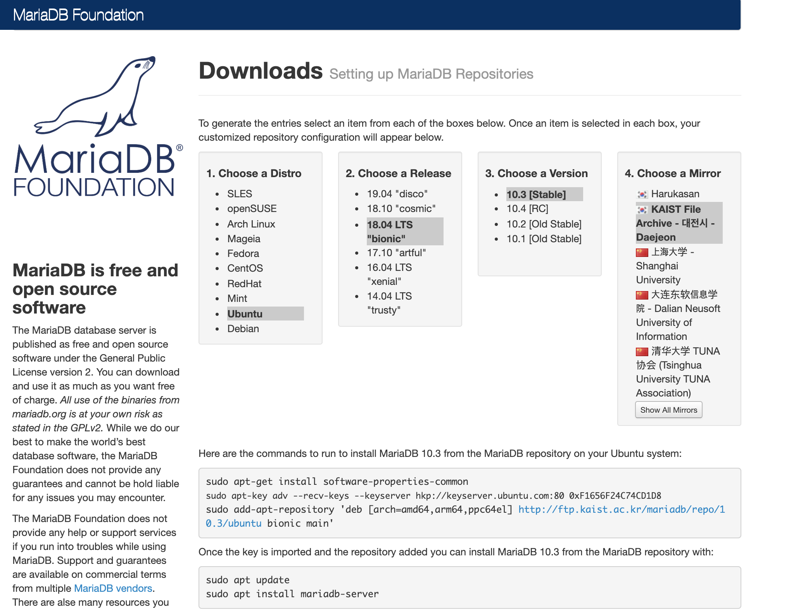
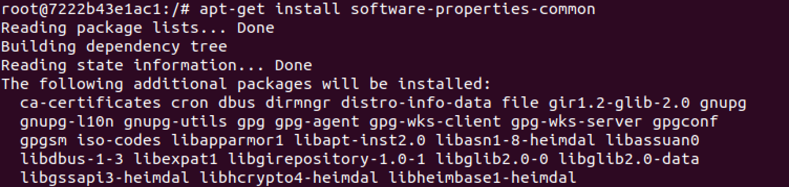
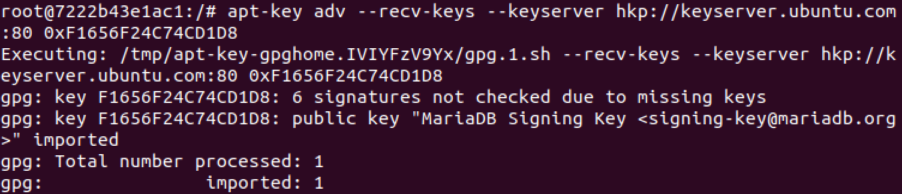
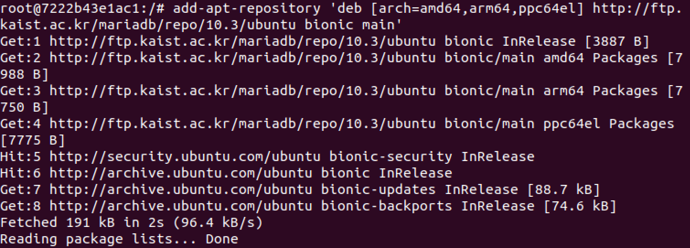
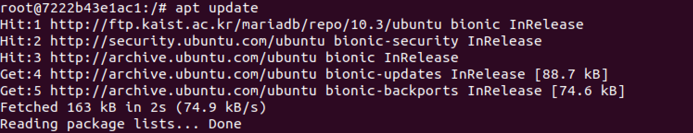
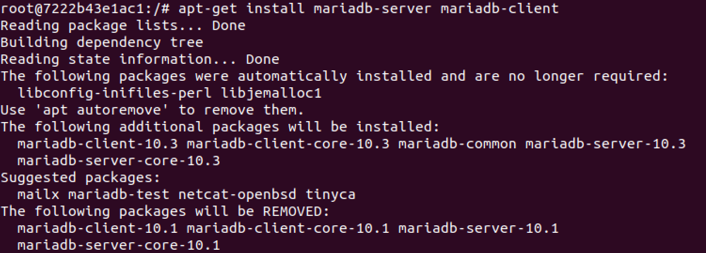
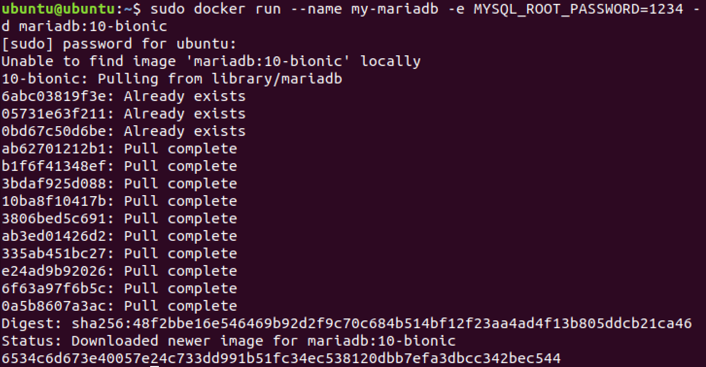

# 도커 컨테이너에 MariaDB 서버 올리기

<www.mariadb.com/‎

>

## 도커 컨테이너에 우분투 16.04를 띄운다

```bash
sudo docker run -it ubuntu:16.04
```

<https://downloads.mariadb.org/mariadb/repositories/#mirror=kaist&distro=Ubuntu&distro_release=xenial--ubuntu_xenial&version=10.3>

### repository 추가



```bash
sudo apt-get install software-properties-common

sudo apt-key adv --recv-keys --keyserver hkp://keyserver.ubuntu.com:80 0xF1656F24C74CD1D8

sudo add-apt-repository 'deb [arch=amd64,arm64,i386,ppc64el] http://ftp.kaist.ac.kr/mariadb/repo/10.3/ubuntu xenial main'
```

### MariaDB Server, Client 설치

```bash
apt update

apt -y install mariadb-server mariadb-client
```

---

## 도커 컨테이너에 우분투 18.04를 띄운다

```bash
sudo docker run -it ubuntu:18.04
```


### MariaDB 설치

<https://downloads.mariadb.org/mariadb/repositories/#mirror=kaist&distro=Ubuntu&distro_release=bionic--ubuntu_bionic&version=10.3>

### repository 추가



```bash
sudo apt-get install software-properties-common

sudo apt-key adv --recv-keys --keyserver hkp://keyserver.ubuntu.com:80 0xF1656F24C74CD1D8

sudo add-apt-repository 'deb [arch=amd64,arm64,ppc64el] http://ftp.kaist.ac.kr/mariadb/repo/10.3/ubuntu bionic main'
```





### MariaDB Server, Client 설치

```bash
apt update

apt-get install mariadb-server mariadb-client
```




---

## Docker Hub 를 통한 MariaDB 설치

```bash
sudo docker run --name my-mariadb -e MYSQL_ROOT_PASSWORD=1234 -d mariadb:10-bionic
```


