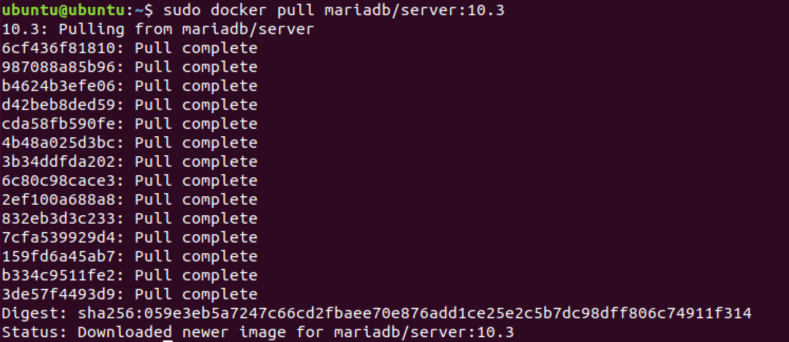
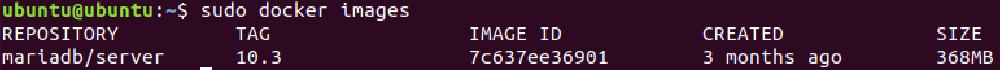
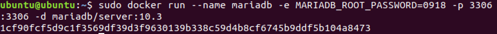
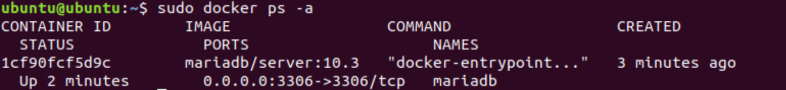
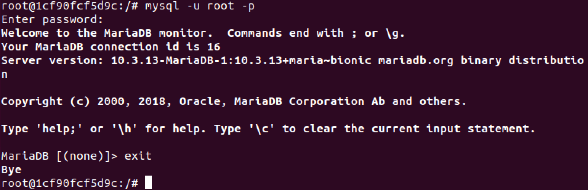
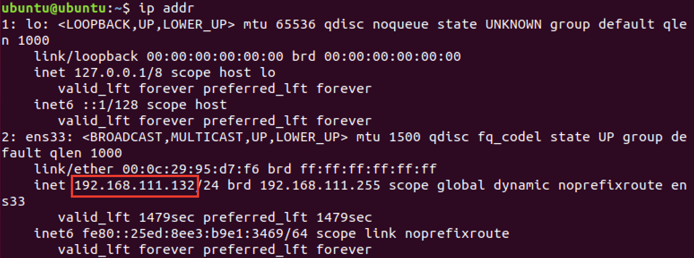
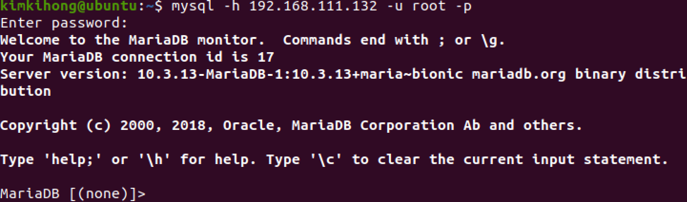

# 도커 컨테이너에 MariaDB 서버 올리기

## Docker Hub 를 통한 MariaDB 설치

### 도커 이미지 검색

```bash
sudo docker search mariadb
```

https://hub.docker.com/r/mariadb/server  
설치 방법이 자세히 나와있다

### MariaDB 이미지 내려받기

```bash
# mariadb/server:10.3 버전을 다운받는다. 뒤에 버전을 적지 않으면 최신 버전을 받는다
sudo docker pull mariadb/server:10.3
```



### 받은 이미지 확인하기

```bash
sudo docker images
```



이미지를 삭제하려면 `docker rmi [image id]` 명령어를 실행한다

## 도커 컨테이너 만들기

```bash
sudo docker run --name mariadb -e MARIADB_ROOT_PASSWORD=0918 -p 3306:3306 -d mariadb/server:10.3

# --name 옵션 뒤에 컨테이너 이름을 지정한다
# -p 옵션 뒤에 호스트포트:컨테이너포트를 맵핑한다
# MARIADB_ROOT_PASSWORD는 root 패스워드이다
```



### 생성된 컨테이너 확인

```bash
sudo docker ps -a
```



```bash
# 컨테이너 실행에 필요한 명령어는 restart, stop, start, kill이 있다
sudo docker restart mariadb
sudo docker stop mariadb
sudo docker start mariadb
sudo docker kill mariadb

# 컨테이너를 깨끗하게 삭제하려면 docker rm -v 를 명령한다
sudo docker rm -v mariadb
```

## 컨테이너 접속 및 MariaDB 설정

### 컨테이너 접속하기

```bash
sudo docker exec -it mariadb bash
```


컨테이너에 접속이 되었고 root권한을 가진다

```bash
# Repository를 업데이트한다
apt-get update

# vim 에디터를 설치한다
apt-get install vim
```

MariaDB에 Shutdown 명령을 실행하면 컨테이너 밖으로 나가게 되고 컨테이너도 종료된다. 그냥 나가려면 'exit'를 입력한다

```bash
mysqladmin -u root -p shutdown
# or
exit
```


만약 shutdown했으면 컨테이너를 다시 실행시키기 위해 `sudo docker restart mariadb` 명령을 입력한다


### MariaDB에 접근

```bash
mysql -u root -p
```



## 외부에서 접근하기

### 호스트 ip 확인

```bash
ip addr
```



### 외부에서 접근

```bash
mysql -h 192.168.111.132 -u root -p
```


접근되었다

---

<www.mariadb.com/‎>

## 도커 컨테이너에 우분투 16.04를 띄운다

```bash
sudo docker run -it ubuntu:16.04

apt-get update
```

<https://downloads.mariadb.org/mariadb/repositories/#mirror=kaist&distro=Ubuntu&distro_release=xenial--ubuntu_xenial&version=10.3>

### repository 추가


```bash
sudo apt-get install software-properties-common

sudo apt-key adv --recv-keys --keyserver hkp://keyserver.ubuntu.com:80 0xF1656F24C74CD1D8

sudo add-apt-repository 'deb [arch=amd64,arm64,i386,ppc64el] http://ftp.kaist.ac.kr/mariadb/repo/10.3/ubuntu xenial main'
```

### MariaDB Server, Client 설치

```bash
apt-get update

apt -y install mariadb-server mariadb-client
```

---

## 도커 컨테이너에 우분투 18.04를 띄운다

```bash
sudo docker run -it ubuntu:18.04

apt-get update
```


### MariaDB 설치

<https://downloads.mariadb.org/mariadb/repositories/#mirror=kaist&distro=Ubuntu&distro_release=bionic--ubuntu_bionic&version=10.3>

### repository 추가


```bash
sudo apt-get install software-properties-common

sudo apt-key adv --recv-keys --keyserver hkp://keyserver.ubuntu.com:80 0xF1656F24C74CD1D8

sudo add-apt-repository 'deb [arch=amd64,arm64,ppc64el] http://ftp.kaist.ac.kr/mariadb/repo/10.3/ubuntu bionic main'
```


### MariaDB Server, Client 설치

```bash
apt update

apt-get install mariadb-server mariadb-client
```


