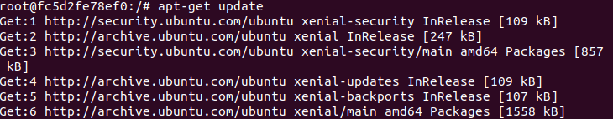
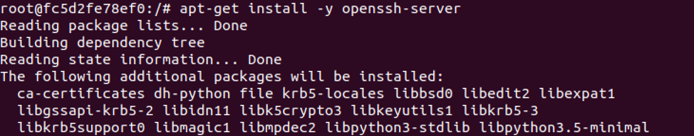
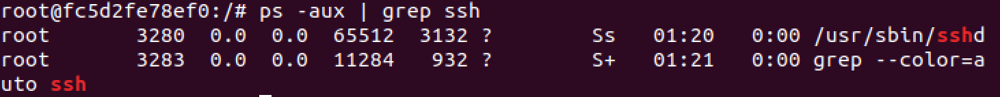
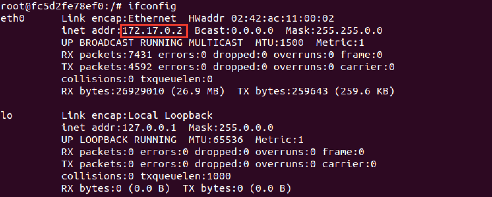
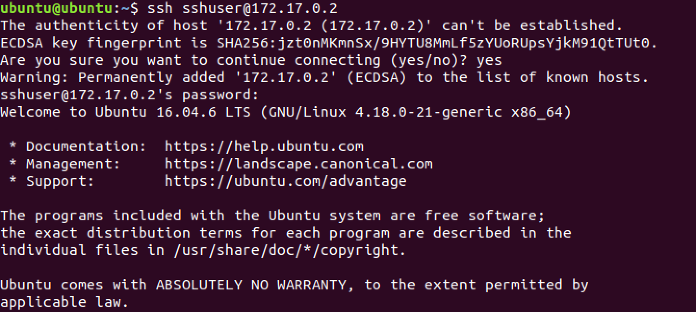

# 도커 컨테이너에 OpenSSH 서버 구축하기

```bash
# 도커 컨테이너에 ubuntu 16.04 띄우기
sudo docker run -it ubuntu:16.04
```

```bash
apt-get update
```



```bash
apt-get install net-tools
```


```bash
apt-get install -y openssh-server
```



```bash
service ssh restart
```


### ssh 서버 동작 확인

```bash
ps -aux | grep ssh
```



### 유저 추가

```bash
adduser sshuser
```


### 컨테이너 네트워크 ip 확인

```bash
ifconfig
```



## 호스트에서 도커 컨테이너로 ssh 접속

```bash
ssh sshuser@172.17.0.2
```


