# 도커 컨테이너에 텔넷 서버 구축하기

## 텔넷 서버 구축

Ubuntu 16.04 docker 컨테이너 띄우기

```bash
sudo docker run -it ubuntu:16.04
```

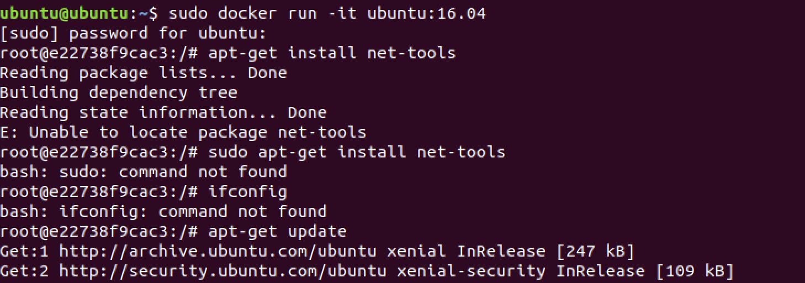

```bash
apt-get update

apt-get install net-tools
```

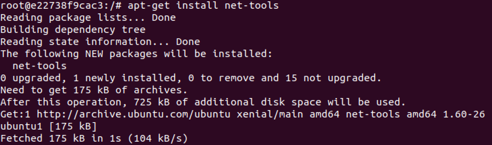

```bash
ifconfig
```

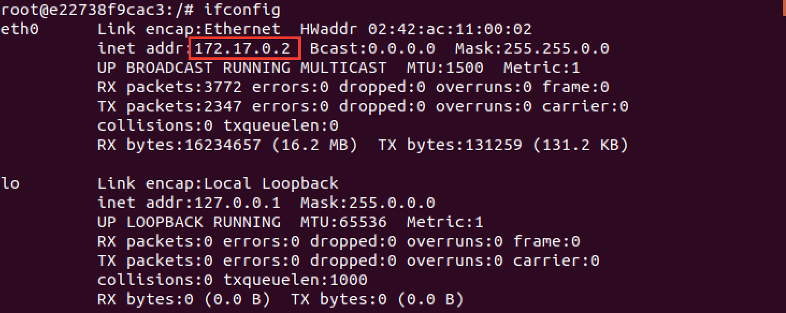

### telnetd 설치

```bash
dpkg -l xinetd

apt-get install -y xinetd telnetd
```

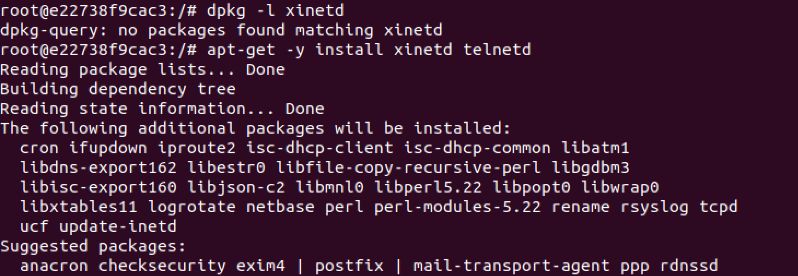

```bash
cd /etc/xinetd.d/

touch telnet

apt-get install vim
```

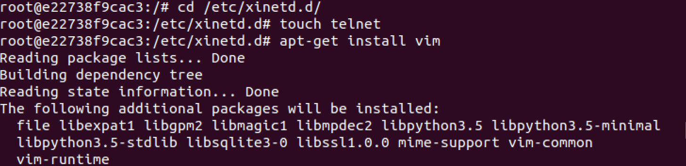

```bash
vim telnet
```

```bash
service telnet
{
    disable = no
    flags = REUSE
    socket_type = stream
    wait = no
    user = root
    server = /usr/sbin/in.telnetd
    log_on_failure += USERID
}
```

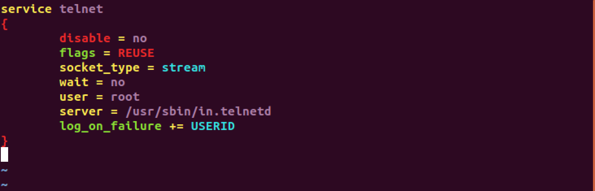

```bash
service xinetd restart
# or
systemctl restart xinetd
```


### 사용자 추가하기

```bash
adduser teluser
```

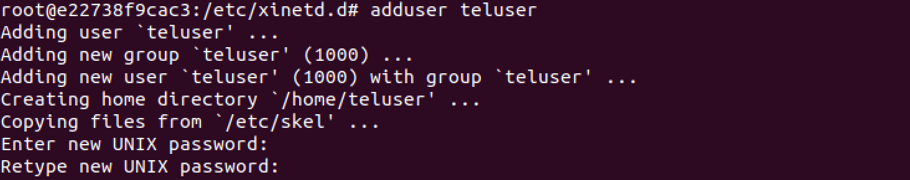

### 원격 접속 확인

```bash
telnet 172.17.0.3
```

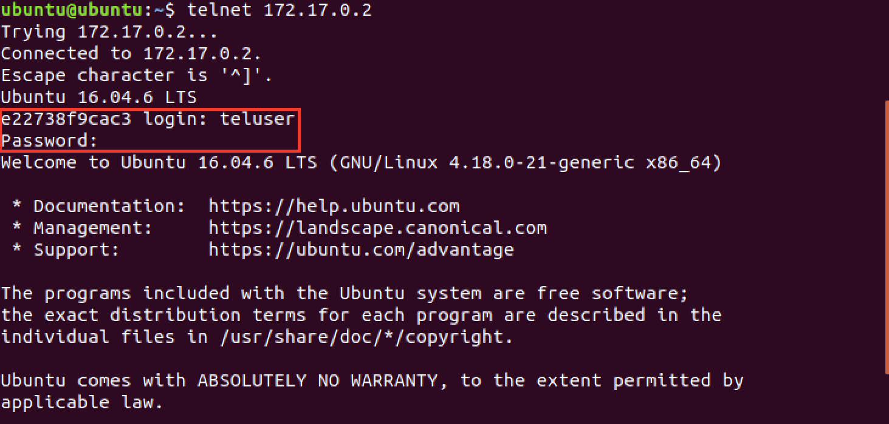

### 도커 컨테이너에서 테스트 파일 생성

```bash
# /home/teluser 디렉터리로 이동
cd /home/teluser

# ls -l
ll

# test1234 파일을 생성
touch test1234
```

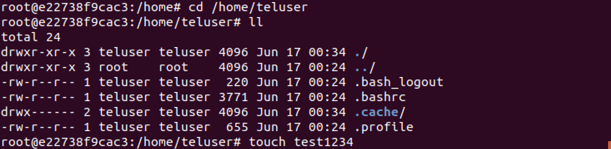

### 텔넷 클라이언트 접속된 호스트에서 확인

컨테이너에서 생성한 test1234 파일을 리스트로 확인해보자

```bash
ll
```

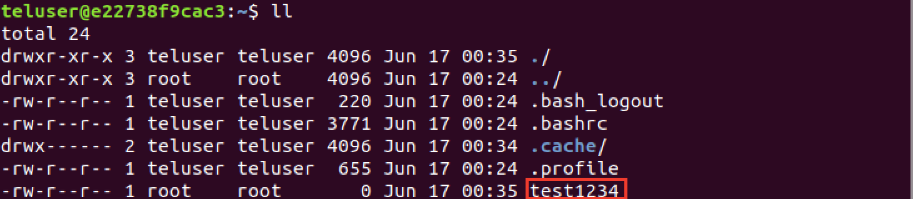

---

## 실습

컨테이너 1 : telnet server  
컨테이너 2 : ubuntu 16.04, telnet으로 컨테이너1 에 접속해서 teluser 폴더에 touch test0987 파일 생성

터미널을 열어서 컨테이너2를 띄운다

```bash
sudo docker run -it ubuntu:16.04

apt-get update

# telnet 클라이언트를 설치한다
apt-get install telnet

telnet 172.17.0.2

ll

touch test0987
```

### 컨테이너 1에서 확인

```bash
ll
```

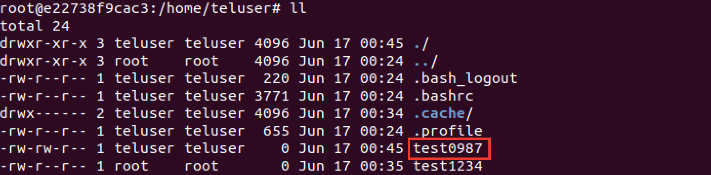
