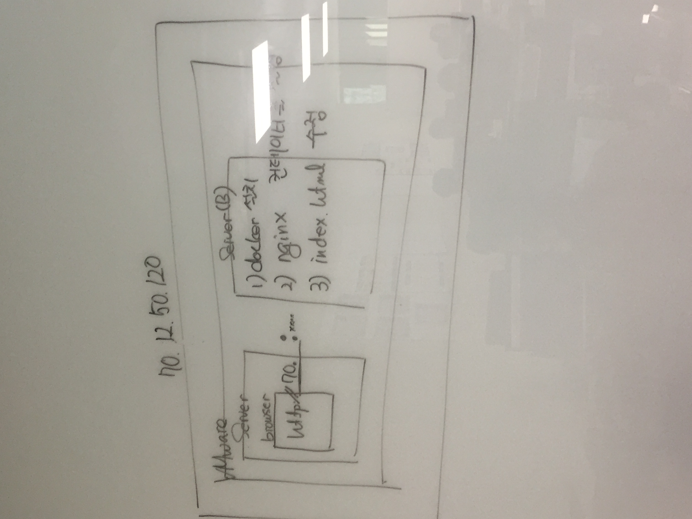

# 우분투에 도커 설치하기 - 19.05.31 수업

## Docker 설치

공식문서 ⇒ https://docs.docker.com/install/linux/docker-ce/ubuntu/

## 도커 레파지토리를 추가

```bash
gedit /etc/apt/sources.list
```

```bash
# /etc/apt/sources.list
deb https://apt.dockerproject.org/repo ubuntu-xenial main
```

## HTTPS 통신에 사용되는 패키지와 공개키를 설치

```bash
apt-get install -y apt-transport-https ca-certificates curl gnupg-agent software-properties-common
```

```bash
apt-key adv --keyserver hkp://p80.pool.sks-keyservers.net:80 --recv-keys 58118E89F3A912897C070ADBF76221572C52609D
```

```bash
apt-get update
```

## linux-image-extra와 docker-engine 패키지를 설치

```bash
apt-get install linux-image-extra-$(uname -r)
apt-get install docker-engine

# 도커 버전 확인
docker version
```

## main.go 작성

```golang
package main

import (
	"fmt"
	"log"
	"net/http"
)

func main() {
    	http.HandleFunc("/", func(w http.ResponseWriter, r *http.Request) {
		log.Println("received request")
		fmt.Fprintf(w, "Hello Docker !!!")
    	})
	log.Println("start server")

	server := &http.Server{Addr: ":8080"}
	if err := server.ListenAndServe(); err != nil {
		log.Println(err)
	}
}
```

브라우저에서 `localhost:8080` 입력해서 서버에 접속한다  
Hello Docker !!! 가 뜨면 성공

Dockerfile을 생성한다

```bash
# 도커 허브에서 공식배포하는 라이브러리에서 golang1.9를 가져온다
FROM golang1.9

# echo 디렉토리를 만든다
RUN mkdir /echo

# main.go 파일을 echo디렉토리로 복사
COPY main.go /echo

# 실행
CMD [ "go", "run", "/echo/main.go" ]
```

## 도커 이미지를 생성

```bash
# 도커 이미지를 생성한다 example:개인고유아이디, echo:이미지이름, latest:버전
docker image build -t example/echo:latest .
```

생성된 이미지를 확인해보자

```bash
# 도커 이미지 확인
docker image ls

# 숨겨진 도커 이미지까지 확인
docker image ls -a
```

## 도커 컨테이너 업데이트

파일 변경에 따른 컨테이너를 업데이트해보자

main.go 파일에서 Hello Docker !!! -> Hello Docker... !!! 으로 변경해서 저장하자

```bash
# 새로 이미지를 올리자. 버전은 다르게 생성
docker image build -t example/echo:latest1 .
```

컨테이너를 실행하자

```bash
# -p 9000:8080 = 8080번 포트를 9000번 포트로 포트포워딩 한다. -d = detach 프롬프트로 나온다
docker container run -p 9000:8080 -d example/echo:latest1
```

웹 브라우저에서 `localhost:9000` 입력해서 들어가면 업데이트된 서버로 접속된다

컨테이너는 프로세스이다

```bash
docker container ls
# 또는
docker container ps    # 살아있는 컨테이너만 표시

# 죽어있는 컨테이너 표시
docker container ps -a

# 컨테이너 재실행
docker container restart [docker id]

# 컨테이너 멈추기
docker container stop [docker id]
```

컨테이너에 이름을 부여 할 수도 있다

컨테이너는 여러개 띄울 수 있다

```bash
# 컨테이너를 하나 더 실행해보자
# -p 9001:8080 = 8080번 포트를 9001번 포트로 포트포워딩 한다. -d = detach
docker container run -p 9001:8080 -d example/echo:latest1
```

웹 브라우저에서 `localhost:9001` 입력해서 들어가면 새로운 컨테이너 서버로 접속된다. 기존에 9000번 컨테이너도 같이 접속된다.

# 컨테이너 전부 내리기

실행중인 컨테이너 아이디 확인

```bash
docker container ps -q
```

전체 삭제

```
docker container rm -f $(container ps -q)
```

## 컨테이너 interaction 설치

```bash
# -it = interaction(상호작용)
docker container run -it -p 9000:8080 -d example/echo:latest /bin/bash
```

컨테이너 접속

```bash
docker attach [docker id]
```

## 필터

```bash
# 컨테이너 이름으로 필터링
docker container ps --filter 'container name'
```

필터된 아이디를 한번에 지우는 방법

```
docker container rm -f $(docker container ps --filter '[container name]' -q)
```

## tag 이름 변경하여 추가하기

```bash
docker image tag [기존의 태그 네임] [변경할 태그 네임]

# 이미지 리스트 확인
docker image ls
```

## 도커 허브에 접속하기

```bash
docker login -u [아이디]
```

## 도커 허브에 이미지 올리기

```bash
docker image push [이미지 태그 네임]
```

## 도커 허브에서 이미지 가져오기

```bash
docker image pull [이미지 태그 네임]
```

## 도커 허브에서 이미지 찾기

```bash
docker search [이미지 태그 네임]
```

## 도커 시스템 전체 삭제(초기화)

```bash
docker system prune
```

## 도커 컨테이너 명령어 실행

```
docker container exec [컨테이너 아이디] ls /usr/share/nginx/html
```

실습



docker container run -d -p 9999:80 nginx

docker container exec 컨테이너아이디 ls /usr/share/nginx/html

docker container cp 컨테이너아이디:/usr/share/nginx/html/index.html .

server-b 호스트에서
파일 편집 후

docker container cp ./index.html 컨테이너아이디:/usr/share/nginx/html/index.html

vmware 네트워크 에디터에서
nat 세팅 포트포워딩
서버b 사설 ip 입력

서버a 브라우저에서 서버b 공인 ip입력
