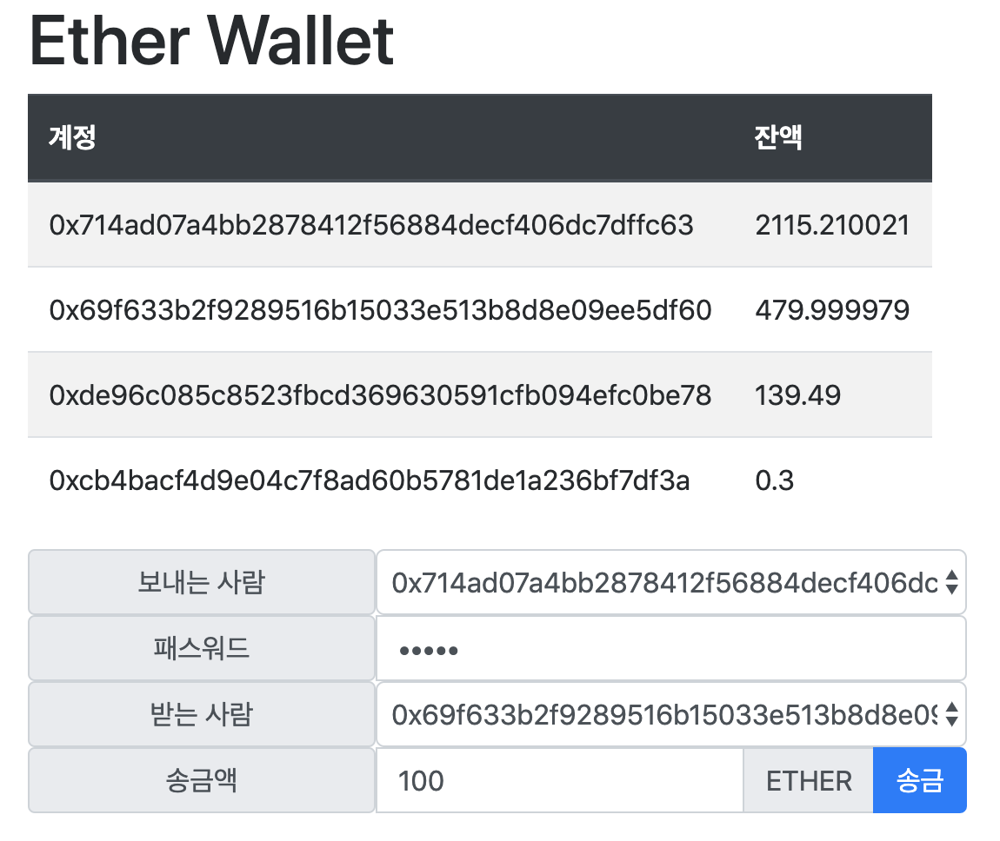

# 이더리움 월렛 만들기



## 내가 짠 코드

```html
<!DOCTYPE html>
<html>
  <head>
    <meta charset="utf-8" />
    <script src="https://cdn.jsdelivr.net/gh/ethereum/web3.js@0.20.6/dist/web3.js"></script>

    <!-- jquery 라이브러리 가져오기 -->
    <script
      src="https://code.jquery.com/jquery-3.4.1.min.js"
      integrity="sha256-CSXorXvZcTkaix6Yvo6HppcZGetbYMGWSFlBw8HfCJo="
      crossorigin="anonymous"
    ></script>

    <!-- bootstrap js 라이브러리 가져오기 -->
    <script
      src="https://stackpath.bootstrapcdn.com/bootstrap/4.3.1/js/bootstrap.min.js"
      integrity="sha384-JjSmVgyd0p3pXB1rRibZUAYoIIy6OrQ6VrjIEaFf/nJGzIxFDsf4x0xIM+B07jRM"
      crossorigin="anonymous"
    ></script>

    <!-- bootstrap css 라이브러리 가져오기 -->
    <link
      href="https://stackpath.bootstrapcdn.com/bootstrap/4.3.1/css/bootstrap.min.css"
      rel="stylesheet"
      integrity="sha384-ggOyR0iXCbMQv3Xipma34MD+dH/1fQ784/j6cY/iJTQUOhcWr7x9JvoRxT2MZw1T"
      crossorigin="anonymous"
    />
    <style>
      label {
        min-width: 200px !important;
        display: inline-block !important;
      }
    </style>
  </head>
  <body>
    <div class="container">
      <!-- title -->
      <div class="row">
        <h1>Ether Wallet</h1>
      </div>
      <!-- balance -->
      <div class="row">
        <div class="divStatus">
          <table class="table table-striped">
            <thead class="thead-dark">
              <tr>
                <th scope="col">계정</th>
                <th scope="col">잔액</th>
              </tr>
            </thead>
            <tbody id="account_balance_list"></tbody>
          </table>
        </div>
      </div>
      <!-- transaction -->
      <div class="row">
        <div class="input-group">
          <label class="input-group-text" for="fromAccounts">보내는 사람</label>
          <select class="form-control accountsList" id="fromAccounts">
            <option selected>선택하세요.</option>
          </select>
        </div>
        <div class="input-group">
          <label class="input-group-text" for="fromPassword">패스워드</label>
          <input class="form-control" id="fromPassword" type="password" />
        </div>
        <div class="input-group">
          <label class="input-group-text" for="toAccounts">받는 사람</label>
          <select class="form-control accountsList" id="toAccounts">
            <option selected>선택하세요.</option>
          </select>
        </div>
        <div class="input-group">
          <label class="input-group-text" for="amount">송금액</label>
          <input class="form-control" id="amount" type="number" />
          <div class="input-group-append">
            <span class="input-group-text">ETHER</span>
            <button
              type="button"
              class="btn btn-primary"
              id="btnSend"
              onclick="{sendEth()}"
            >
              송금
            </button>
          </div>
        </div>
      </div>
    </div>

    <script>
      var Web3 = require("web3");
      web3 = new Web3(new Web3.providers.HttpProvider("http://localhost:8545"));

      console.log(web3.isConnected());

      // 계정 정보를 조회해서 보내는 사람과 받는 사람 선택창에 설정
      function setAccountsList() {
        let accountsList = web3.eth.accounts;
        accountsList.forEach(element => {
          $("#fromAccounts").append(
            `<option value=${element}>${element}</option>`
          );
          $("#toAccounts").append(
            `<option value=${element}>${element}</option>`
          );
        });
      }

      // 계정별 잔액을 divStatus 아이디 영역에 출력
      function showStatus() {
        let accountsList = web3.eth.accounts;
        accountsList.forEach(function(account) {
          const accountBalance = web3.fromWei(
            web3.eth.getBalance(account),
            "ether"
          );
          $("#account_balance_list").append(`<tr>
            <td>${account}</td>
            <td>${accountBalance}</td>
        </tr>`);
        });
      }

      function sendEth() {
        console.log("sended");
        let selectedFromAccount = document.getElementById("fromAccounts").value;
        let selectedToAccount = document.getElementById("toAccounts").value;
        let sendAmount = document.getElementById("amount").value;
        let fromAccountPassword = document.getElementById("fromPassword").value;
        console.log(selectedFromAccount);

        if (
          web3.personal.unlockAccount(selectedFromAccount, fromAccountPassword)
        ) {
          web3.eth.sendTransaction(
            {
              from: selectedFromAccount,
              to: selectedToAccount,
              value: web3.toWei(sendAmount, "ether")
            },
            function(error, result) {
              if (!error) {
                console.log(`txid = ${result}`);
              } else {
                console.error(error);
              }
            }
          );
        }
      }

      // 해당하는 문서가 로딩 될 때 setAccountList(), showStatus() 호출
      $(function() {
        setAccountsList();
        showStatus();
        // 블록에 변화가 생기면 계정별 잔액 정보를 갱신
        web3.eth.filter("latest").watch(function() {
          let accountsList = web3.eth.accounts;
          document.getElementById("account_balance_list").innerHTML = "";
          accountsList.forEach(function(account) {
            const accountBalance = web3.fromWei(
              web3.eth.getBalance(account),
              "ether"
            );
            $("#account_balance_list").append(`<tr>
            <td>${account}</td>
            <td>${accountBalance}</td>
        </tr>`);
          });
        });
      });
    </script>
  </body>
</html>
```

## 강사님이 짠 코드

```html
<!DOCTYPE html>
<html>
  <head>
    <meta charset="utf-8" />
    <script src="https://cdn.jsdelivr.net/gh/ethereum/web3.js@0.20.6/dist/web3.js"></script>

    <!--	
		jquery, bootstrap 라이브러리를 추가
	-->
    <script
      src="https://code.jquery.com/jquery-3.4.1.min.js"
      integrity="sha256-CSXorXvZcTkaix6Yvo6HppcZGetbYMGWSFlBw8HfCJo="
      crossorigin="anonymous"
    ></script>
    <script
      src="https://stackpath.bootstrapcdn.com/bootstrap/4.3.1/js/bootstrap.min.js"
      integrity="sha384-JjSmVgyd0p3pXB1rRibZUAYoIIy6OrQ6VrjIEaFf/nJGzIxFDsf4x0xIM+B07jRM"
      crossorigin="anonymous"
    ></script>
    <link
      href="https://stackpath.bootstrapcdn.com/bootstrap/4.3.1/css/bootstrap.min.css"
      rel="stylesheet"
      integrity="sha384-ggOyR0iXCbMQv3Xipma34MD+dH/1fQ784/j6cY/iJTQUOhcWr7x9JvoRxT2MZw1T"
      crossorigin="anonymous"
    />

    <style>
      label {
        min-width: 200px !important;
        display: inline-block !important;
      }
    </style>
  </head>
  <body>
    <div class="container">
      <!-- 제목 -->
      <div class="row">
        <h1>ETHER wallet</h1>
      </div>
      <!-- 계좌 잔고 출력 -->
      <div class="row">
        <div id="divStatus"></div>
      </div>
      <!-- 송금 입력 창 -->
      <div class="row">
        <div class="input-group">
          <label class="input-group-text" for="fromAccounts">보내는 사람</label>
          <select class="form-control accountsList" id="fromAccounts">
            <option selected>선택하세요.</option>
          </select>
        </div>
        <div class="input-group">
          <label class="input-group-text" fro="fromPassword">패스워드</label>
          <input class="form-control" id="fromPassword" type="password" />
        </div>
        <div class="input-group">
          <label class="input-group-text" for="toAccounts">받는 사람</label>
          <select class="form-control accountsList" id="toAccounts">
            <option selected>선택하세요.</option>
          </select>
        </div>
        <div class="input-group">
          <label class="input-group-text" for="amount">송금액</label>
          <input class="form-control" id="amount" type="number" />
          <div class="input-group-append">
            <span class="input-group-text">ETHER</span>
            <button type="button" class="btn btn-primary" id="btnSend">
              송금
            </button>
          </div>
        </div>
      </div>
    </div>

    <script>
      var Web3 = require("web3");
      web3 = new Web3(new Web3.providers.HttpProvider("http://localhost:8545"));

      // 계정 정보를 조회해서 보내는 사람과 받는 사람 선택창에 설정
      function setAccountsList() {
        // TODO
      }

      // 계정별 잔액을 divStatus 영역에 출력
      function showStatus() {
        // TODO
      }

      $(function() {
        setAccountsList();
        showStatus();

        // 블록에 변화가 생기면 계정별 잔액 정보를 갱신
        // TODO

        // 송금 버튼을 클릭하면 송금을 요청
        // TODO
      });
    </script>
  </body>
</html>

// 계정 정보를 조회해서 보내는 사람과 받는 사람 선택창에 설정 function
setAccountsList() { let accounts = web3.eth.accounts; accounts.forEach(account
=> { $('.accountsList').append(`<option value="${account}">${account}</option
>`); }); } // 계정 정보를 조회해서 보내는 사람과 받는 사람 선택창에 설정
function setAccountsList() { let accounts = web3.eth.accounts;
accounts.forEach(account => { $('.accountsList').append(`
<option value="${account}"
  >${account.substr(0,6)}...${account.substr(-4)}</option
>
`); }); } // 계정별 잔액을 divStatus 영역에 출력 function showStatus() { const
table = `
<table class="table table-striped">
  <thead class="thead-dark">
    <tr>
      <th scope="col">계정</th>
      <th scope="col">잔액</th>
    </tr>
  </thead>
  <tbody></tbody>
</table>
`; $('#divStatus').empty(); $('#divStatus').append(table); let totalAmount = 0;
let accounts = web3.eth.accounts; accounts.forEach(account => { let balance =
web3.eth.getBalance(account); // 계정별 잔액 조회 (wei) balance =
web3.fromWei(balance, "ether"); // wei 단위를 ether 단위로 환산 totalAmount +=
balance; // 전체 금액을 누적 $('tbody').append(`
<tr>
  <td>${account}</td>
  <td>${balance}</td>
</tr>
`); }); $('tbody').append(`
<tr>
  <td>총액</td>
  <td>${totalAmount}</td>
</tr>
`); } $(function() { setAccountsList(); showStatus(); // 블록에 변화가 생기면
계정별 잔액 정보를 갱신 web3.eth.filter('latest').watch(function() {
showStatus(); }); // 송금 버튼을 클릭하면 송금을 요청
$('#btnSend').click(function() { let fromAccount = $('#fromAccounts').val(); let
toAccount = $('#toAccounts').val(); let fromPassword = $('#fromPassword').val();
let amount = $('#amount').val(); // 보내는 사람의 계정을 언락 처리 let isUnlock
= web3.personal.unlockAccount(fromAccount, fromPassword); if (isUnlock) {
web3.eth.sendTransaction( { from : fromAccount, to : toAccount, value :
web3.toWei(amount, "ether") }, function(err, res) { if (!err) console.log(`txid
is ${res}`); else console.error(err); } ); } }); });
```
