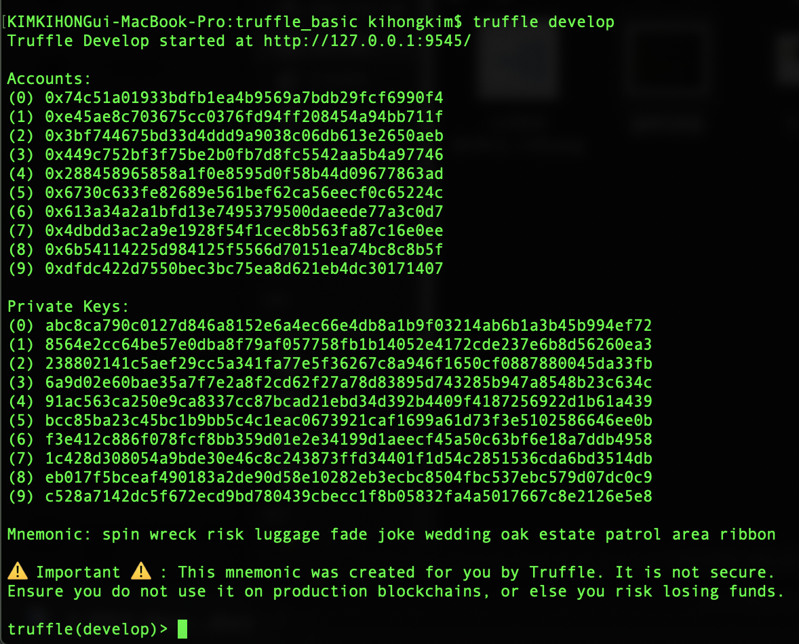
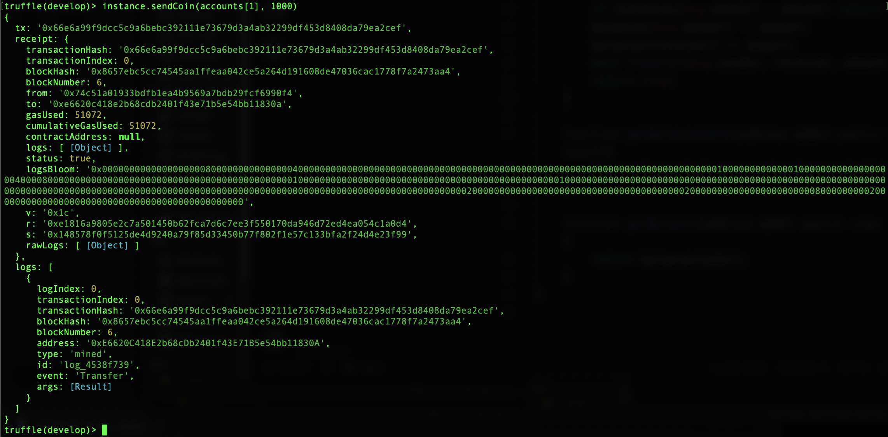
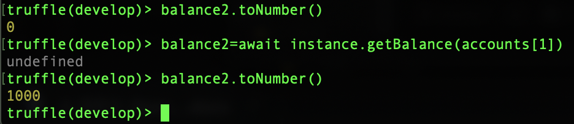

## 개발환경 설치

### 트러플 설치

```bash
sudo npm install -g truffle
```

```bash
mkdir truffle_basic

cd truffle_basic

truffle init
```

### Truffle Develop

```bash
truffle develop
```



---

```bash
var instance=await MetaCoin.deployed()

var accounts=await web3.eth.getAccounts()

var balance1=await instance.getBalance(accounts[0])

balance1.toNumber() # 10000이더 보유

var balance2=await instance.getBalance(accounts[1])

balance2.toNumber() # 0이더 보유
```

```bash
instance.sendCoin(accounts[1], 1000)
```



```bash
balance2.toNumber()

balance2=await instance.getBalance(accounts[1])

balance2.toNumber()
```



---

## ganache 설치

<https://www.trufflesuite.com/ganache>
