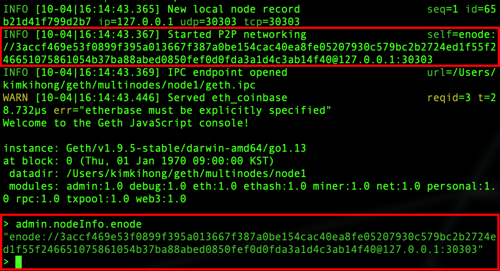
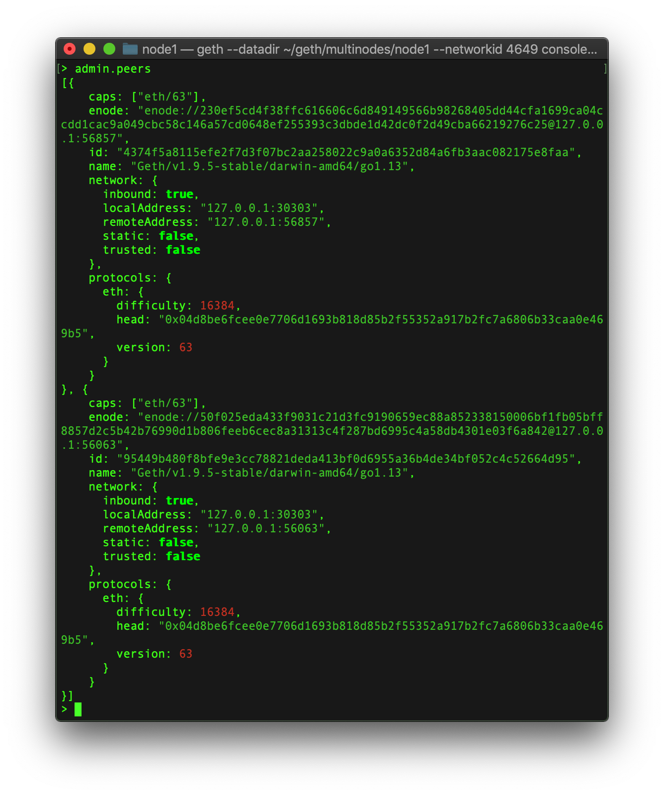

# 단일 머신에 여러 노드(geth) 띄우기

```bash
mkdir multinodes

cd multinodes

mkdir node1
mkdir node2
mkdir node3
```

### 동일한 genesis.json 파일을 이용해서 geth 초기화

```bash
geth --datadir ~/geth/multinodes/node1 init ~/geth/testnet/genesis.json

geth --datadir ~/geth/multinodes/node2 init ~/geth/testnet/genesis.json

geth --datadir ~/geth/multinodes/node3 init ~/geth/testnet/genesis.json

```

### 터미널을 세 개 띄워서 geth 노드 구동

```bash
# 터미널 1
cd geth/multinodes/node1

# 터미널 2
cd geth/multinodes/node2

# 터미널 3
cd geth/multinodes/node3
```

### 첫번째 노드는 부트 노드로 활용

부트 노드는 피어들을 관리해주는 역할

```bash
# 노드1 (터미널 1)
geth --datadir ~/geth/multinodes/node1 --networkid 4649 console

# 부트노드의 주소(enode)를 확인
admin.nodeInfo.enode
```



### 두번째 노드는 일반 노드로 활용

```bash
# 노드2 (터미널 2)
geth --datadir ~/geth/multinodes/node2 --networkid 4649 console --port 30304 --ipcdisable

# 부트노드에 피어로 등록
# admin.addPeer(부트노드의 enode 주소)
admin.addPeer("enode://3accf469e53f0899f395a013667f387a0be154cac40ea8fe05207930c579bc2b2724ed1f55f246651075861054b37ba88abed0850fef0d0fda3a1d4c3ab14f40@127.0.0.1:30303")
```

### 세번째 노드는 마이너(채굴)노드로 활용

```bash
# 노드3 (터미널 3)
geth --datadir ~/geth/multinodes/node3 --networkid 4649 console --port 30305 --ipcdisable

# 부트노드에 피어로 등록
# admin.addPeer(부트노드의 enode 주소)
admin.addPeer("enode://3accf469e53f0899f395a013667f387a0be154cac40ea8fe05207930c579bc2b2724ed1f55f246651075861054b37ba88abed0850fef0d0fda3a1d4c3ab14f40@127.0.0.1:30303")
```

### 노드 1에서 연결 확인

```bash
net.peerCount # 2를 출력한다

admin.peers
```



## 계정생성

### 노드1에서 생성

```bash
# 노드 1에서 계정 생성 및 코인베이스 설정
personal.newAccount("node1-0")

eth.coinbase
```

### 노드2에서 생성

```bash
personal.newAccount("node2-0")

eth.coinbase
```

### 노드3에서 생성

```bash
personal.newAccount("node3-0")

eth.coinbase
```

## 노드1, 노드2, 노드3에서 마이닝

```bash
# node1, 2, 3 콘솔에서 마이닝 시작
miner.start(1)

miner.stop()
```

### 블록 조회

```bash
# node1, 2, 3 콘솔에서 블록 넘버 확인
eth.blockNumber
```

### 각 노드의 코인베이스 잔액 조회

```bash
node1, 2, 3 콘솔에서 코인베이스 계좌 조회
web3.fromWei(eth.getBalance(eth.coinbase), "ether")
```

### 노드1의 코인베이스 계정에서 노드2의 코인베이스 계정으로 10이더 송금

```bash
# 노드 1
personal.unlockAccount(eth.coinbase, "node1-0")

eth.sendTransaction({from: eth.coinbase, to: "0xd4a9090bc3249574b6c3ecfd4ef71d9c15976f32", value: web3.toWei(10, "ether")})

# 노드 3에서 마이닝 시작 후 블록 생성되면 중지
miner.start(1)
miner.stop()

# 노드 1에서 코인베이스 잔액 조회 - 10이더 잔액이 차감되는걸 볼 수 있다.
web3.fromWei(eth.getBalance(eth.coinbase), "ether")

# 노드 2에서 코인베이스 잔액 조회 - 10이더가 증가 한 것을 볼 수 있다.
web3.fromWei(eth.getBalance(eth.coinbase), "ether")
```

---

과제

HelloWordl.sol 스마트컨트랙트를 배포하고 다른 노드에서 호출하여 결과값 출력하기
