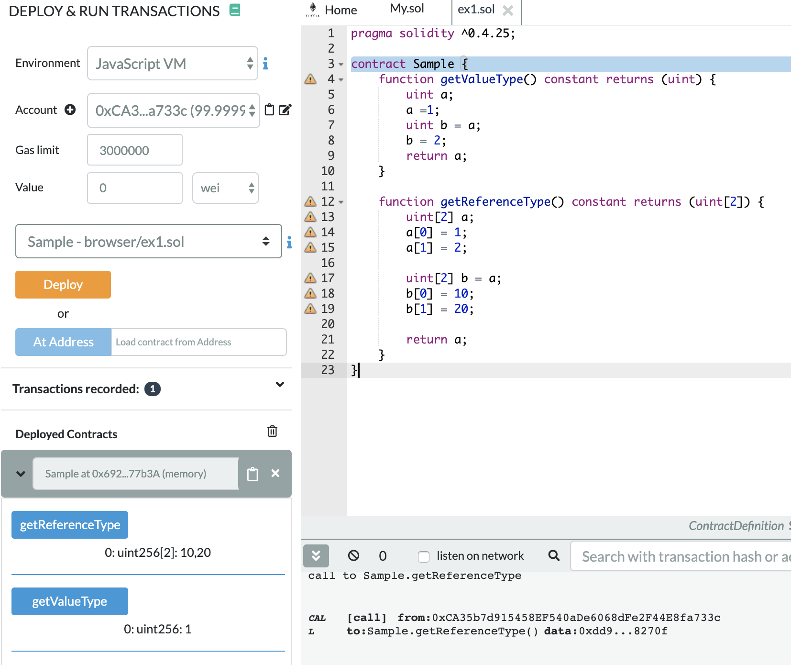

# 이건 뭐지

```sol
pragma solidity ^0.4.25;

contract Sample {
    function getValueType() constant returns (uint) {
        uint a;
        a =1;
        uint b = a;
        b = 2;
        return a;
    }

    // 가지고 있는 값이 공유가 되기 때문에 a의 출력 값은 10, 20이 된다.
    function getReferenceType() constant returns (uint[2]) {
        uint[2] a;
        a[0] = 1;
        a[1] = 2;

        uint[2] b = a;
        b[0] = 10;
        b[1] = 20;

        return a;
    }
}
```


