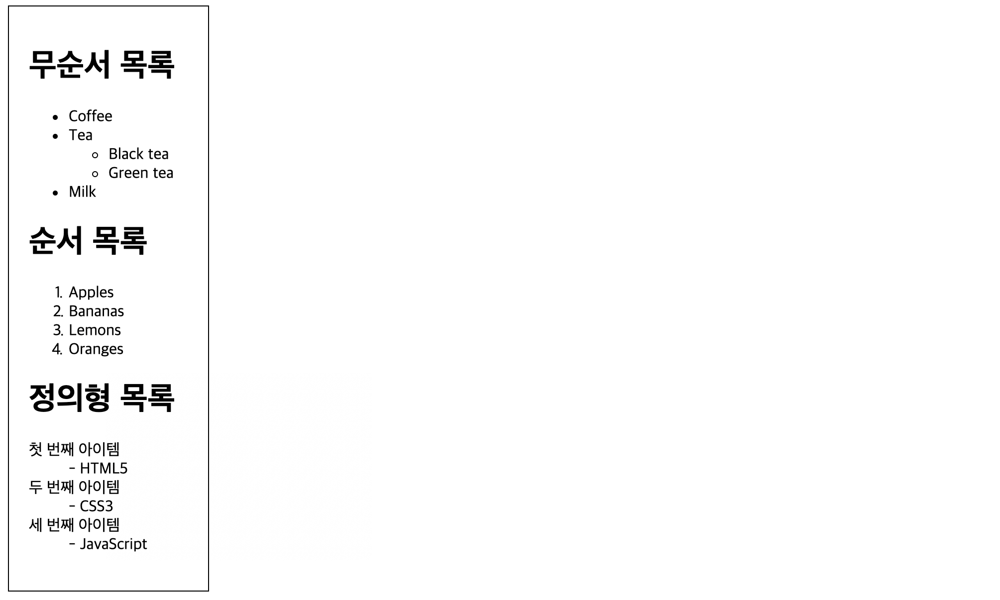

# HTML Lists(리스트)

## Ordered HTML List

\<ol> 태그는 순서대로 숫자 또는 문자로 표기한다.

예제

```html
<ol>
  <li>아침에 일어난다</li>
  <li>세수를 한다</li>
  <li>밥을 먹는다</li>
  <li>출근을 한다</li>
</ol>
```

> <ol>
>     <li>아침에 일어난다</li>
>     <li>세수를 한다</li>
>     <li>밥을 먹는다</li>
>     <li>출근을 한다</li>
> </ol>

### Orderd HTML List - Type 속성

#### Type="1"

숫자를 순차적으로 나열한다

```html
<ol type="1">
  <li>비행기</li>
  <li>자동차</li>
  <li>배</li>
</ol>
```

> <ol type="1">
>     <li>비행기</li>
>     <li>자동차</li>
>     <li>배</li>
> </ol>

#### Type="A"

대문자 A부터 순차적으로 나열한다

```html
<ol type="A">
  <li>비행기</li>
  <li>자동차</li>
  <li>배</li>
</ol>
```

> <ol type="A">
>     <li>비행기</li>
>     <li>자동차</li>
>     <li>배</li>
> </ol>

#### Type="a"

소문자 a부터 순차적으로 나열한다

```html
<ol type="a">
  <li>비행기</li>
  <li>자동차</li>
  <li>배</li>
</ol>
```

> <ol type="a">
>     <li>비행기</li>
>     <li>자동차</li>
>     <li>배</li>
> </ol>

#### Type="I"

로마자 숫자 대문자를 순차적으로 나열한다

```html
<ol type="I">
  <li>비행기</li>
  <li>자동차</li>
  <li>배</li>
</ol>
```

> <ol type="I">
>     <li>비행기</li>
>     <li>자동차</li>
>     <li>배</li>
> </ol>

#### Type="i"

로마자 숫자 소문자를 순차적으로 나열한다

```html
<ol type="i">
  <li>비행기</li>
  <li>자동차</li>
  <li>배</li>
</ol>
```

> <ol type="i">
>     <li>비행기</li>
>     <li>자동차</li>
>     <li>배</li>
> </ol>

## Unordered HTML List

\<ul> 태그는 숫자나 문자같은 순서 지정 없이 블랙도트 같은 특수기호로 표현하여 나열한다

### Unordered HTML List - 스타일 속성

\<ul> 태그는 `list-style-type` 스타일 속성을 지정하여 모양을 다르게 나타낼 수 있다

#### disc 속성

스타일 속성을 지정하지 않아도 기본값으로 들어간다

```html
<ul style="list-style-type:disc;">
  <li>비행기</li>
  <li>자동차</li>
  <li>배</li>
</ul>
```

> <ul style="list-style-type:disc;">
>   <li>비행기</li>
>   <li>자동차</li>
>   <li>배</li>
> </ul>

#### Circle 속성

도넛 모양의 원으로 나타낸다

```html
<ul style="list-style-type:circle;">
  <li>비행기</li>
  <li>자동차</li>
  <li>배</li>
</ul>
```

> <ul style="list-style-type:circle;">
>   <li>비행기</li>
>   <li>자동차</li>
>   <li>배</li>
> </ul>

#### Square 속성

사각으로 나타낸다

```html
<ul style="list-style-type:square;">
  <li>비행기</li>
  <li>자동차</li>
  <li>배</li>
</ul>
```

> <ul style="list-style-type:square;">
>   <li>비행기</li>
>   <li>자동차</li>
>   <li>배</li>
> </ul>

#### None 속성

아무런 기호도 나타내지 않는다

```html
<ul style="list-style-type:none;">
  <li>비행기</li>
  <li>자동차</li>
  <li>배</li>
</ul>
```

> <ul style="list-style-type:none;">
>   <li>비행기</li>
>   <li>자동차</li>
>   <li>배</li>
> </ul>

---

## 실습


위의 예제와 같이 리스트를 작성하라

```html
<!DOCTYPE html>
<html>
  <head>
    <style>
      div {
        border: 1px solid black;
        width: 160px;
        padding: 20px;
      }
    </style>
  </head>

  <body>
    <div>
      <h1>무순서 목록</h1>
      <ul>
        <li>Coffee</li>
        <li>
          Tea
          <ul>
            <li>Black tea</li>
            <li>Green tea</li>
          </ul>
        </li>
        <li>Milk</li>
      </ul>
      <h1>순서 목록</h1>
      <ol>
        <li>Apples</li>
        <li>Bananas</li>
        <li>Lemons</li>
        <li>Oranges</li>
      </ol>
      <h1>정의형 목록</h1>
      <dl>
        <dt>첫 번째 아이템</dt>
        <dd>- HTML5</dd>
        <dt>두 번째 아이템</dt>
        <dd>- CSS3</dd>
        <dt>세 번째 아이템</dt>
        <dd>- JavaScript</dd>
      </dl>
    </div>
  </body>
</html>
```


