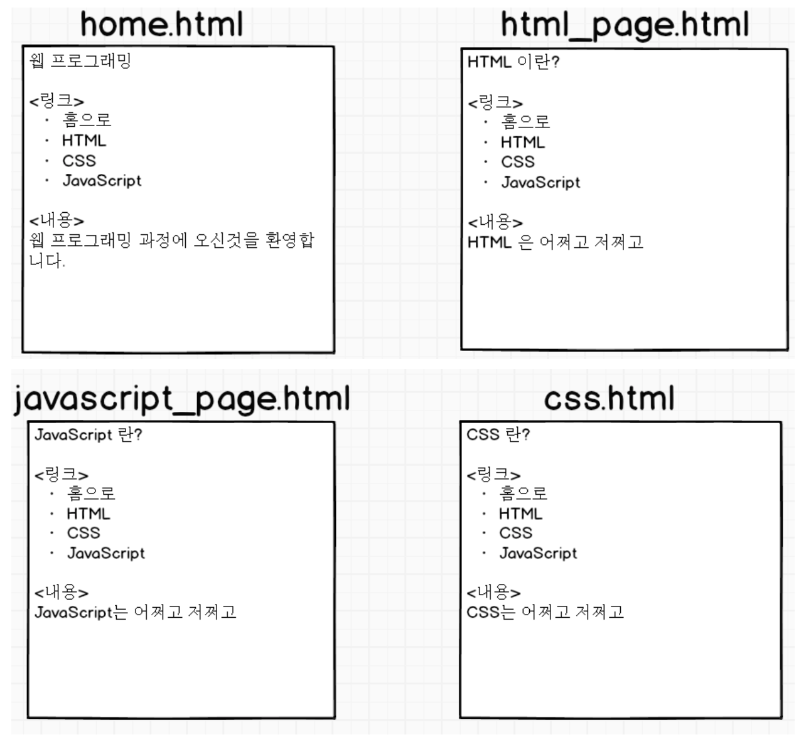

# 간단한 웹페이지 만들기 실습



위와 같이 간단한 웹페이지를 만드시오

---

### home.html

```html
<!DOCTYPE html>
<html>
  <head>
    <meta charset="UTF-8" />
    <meta name="viewport" content="width=device-width, initial-scale=1.0" />
    <meta http-equiv="X-UA-Compatible" content="ie=edge" />
    <title>GANZIK WEB SERVICE</title>
  </head>

  <body>
    <h1>웹 프로그래밍</h1>
    <p>링크</p>
    <ul>
      <li><a href="/home.html">홈으로</a></li>
      <li><a href="/html_page.html">HTML</a></li>
      <li><a href="/css.html">CSS</a></li>
      <li><a href="/javascript_page.html">JavaScript</a></li>
    </ul>
    <p>내용</p>
    <p>웹 프로그래밍 과정에 오신것을 환영합니다.</p>
  </body>
</html>
```

### html_page.html

```html
<!DOCTYPE html>
<html>
  <head>
    <meta charset="UTF-8" />
    <meta name="viewport" content="width=device-width, initial-scale=1.0" />
    <meta http-equiv="X-UA-Compatible" content="ie=edge" />
    <title>HTML PAGE</title>
  </head>

  <body>
    <h1>웹 프로그래밍</h1>
    <p>링크</p>
    <ul>
      <li><a href="/home.html">홈으로</a></li>
      <li><a href="/html_page.html">HTML</a></li>
      <li><a href="/css.html">CSS</a></li>
      <li><a href="/javascript_page.html">JavaScript</a></li>
    </ul>
    <p>내용</p>
    <p>HTML 은 어쩌고 저쩌고</p>
  </body>
</html>
```

### javascript_page.html

```html
<!DOCTYPE html>
<html>
  <head>
    <meta charset="UTF-8" />
    <meta name="viewport" content="width=device-width, initial-scale=1.0" />
    <meta http-equiv="X-UA-Compatible" content="ie=edge" />
    <title>HTML PAGE</title>
  </head>

  <body>
    <h1>웹 프로그래밍</h1>
    <p>링크</p>
    <ul>
      <li><a href="/home.html">홈으로</a></li>
      <li><a href="/html_page.html">HTML</a></li>
      <li><a href="/css.html">CSS</a></li>
      <li><a href="/javascript_page.html">JavaScript</a></li>
    </ul>
    <p>내용</p>
    <p>JavaScript는 어쩌고 저쩌고</p>
  </body>
</html>
```

### css.html

```html
<!DOCTYPE html>
<html>
  <head>
    <meta charset="UTF-8" />
    <meta name="viewport" content="width=device-width, initial-scale=1.0" />
    <meta http-equiv="X-UA-Compatible" content="ie=edge" />
    <title>CSS PAGE</title>
  </head>

  <body>
    <h1>웹 프로그래밍</h1>
    <p>링크</p>
    <ul>
      <li><a href="/home.html">홈으로</a></li>
      <li><a href="/html_page.html">HTML</a></li>
      <li><a href="/css.html">CSS</a></li>
      <li><a href="/javascript_page.html">JavaScript</a></li>
    </ul>
    <p>내용</p>
    <p>CSS는 어쩌고 저쩌고</p>
  </body>
</html>
```
