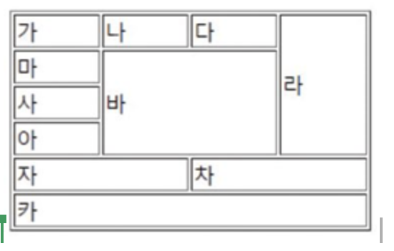
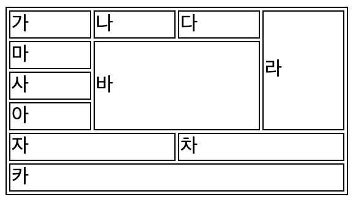

# HTML 실습

## 테이블(표) 만들기

아래와 같은 표를 작성해보자


```html
<!DOCTYPE html>
<html>
  <head>
    <style>
      table,
      td,
      tr {
        border: 1px solid black;
        text-align: left;
      }

      td {
        padding-right: 50px;
      }
    </style>
  </head>

  <body>
    <table>
      <tr>
        <td>가</td>
        <td>나</td>
        <td>다</td>
        <td rowspan="4">라</td>
      </tr>
      <tr>
        <td>마</td>
        <td colspan="2" rowspan="3">바</td>
      </tr>
      <tr>
        <td>사</td>
      </tr>
      <tr>
        <td>아</td>
      </tr>
      <tr>
        <td colspan="2">자</td>

        <td colspan="2">차</td>
      </tr>
      <tr>
        <td colspan="4">카</td>
      </tr>
    </table>
  </body>
</html>
```


