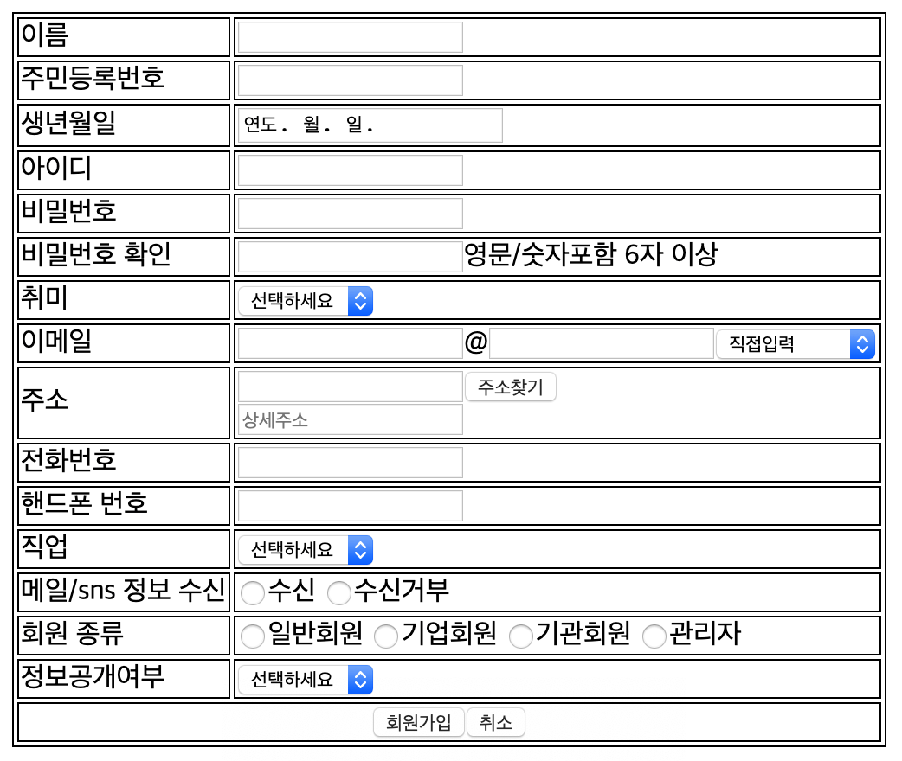

# 회원가입 폼 실습


HTML을 이용하여 위와 같은 폼을 만드시오

---

결과


```html
<!DOCTYPE html>
<html lang="en">
  <head>
    <meta charset="UTF-8" />
    <meta name="viewport" content="width=device-width, initial-scale=1.0" />
    <meta http-equiv="X-UA-Compatible" content="ie=edge" />
    <title>Sign Up</title>
    <style>
      table,
      td {
        border: 1px solid black;
      }
    </style>
  </head>

  <body>
    <table>
      <tr>
        <td>이름</td>
        <td><input type="text" name="name" /></td>
      </tr>
      <tr>
        <td>주민등록번호</td>
        <td><input type="number" name="pid" /></td>
      </tr>
      <tr>
        <td>생년월일</td>
        <td><input type="date" name="birth" placeholder="연도-월-일" /></td>
      </tr>
      <tr>
        <td>아이디</td>
        <td><input type="text" name="id" /></td>
      </tr>
      <tr>
        <td>비밀번호</td>
        <td><input type="password" name="password" /></td>
      </tr>
      <tr>
        <td>비밀번호 확인</td>
        <td>
          <input type="password" name="confirm_password" />영문/숫자포함 6자
          이상
        </td>
      </tr>
      <tr>
        <td>취미</td>
        <td>
          <select name="hobby">
            <option value="choice">선택하세요</option>
            <option value="guitar">기타</option>
            <option value="photography">사진</option>
            <option value="invest">투자</option>
          </select>
        </td>
      </tr>
      <tr>
        <td>이메일</td>
        <td>
          <input type="text" name="email_head" />@<input
            type="text"
            name="email_foot"
          /><select name="email_select" id="email_select">
            <option value="doyourselfinput">직접입력</option>
            <option value="doyourselfinput_naver">naver.com</option>
            <option value="doyourselfinput_google">google.com</option>
          </select>
        </td>
      </tr>
      <tr>
        <td>주소</td>
        <td>
          <input type="text" name="address" /><input
            type="button"
            value="주소찾기"
          /><br /><input
            type="text"
            name="detail_address"
            placeholder="상세주소"
          />
        </td>
      </tr>
      <tr>
        <td>전화번호</td>
        <td><input type="tel" name="telnumber" /></td>
      </tr>
      <tr>
        <td>핸드폰 번호</td>
        <td><input type="tel" name="cellphone_number" /></td>
      </tr>
      <tr>
        <td>직업</td>
        <td>
          <select name="job" id="job">
            <option value="choicejob">선택하세요</option>
            <option value="student">학생</option>
            <option value="doctor">의사</option>
            <option value="salaryman">샐러리맨</option>
          </select>
        </td>
      </tr>
      <tr>
        <td>메일/sns 정보 수신</td>
        <td>
          <input type="radio" name="subscription" id="allow" />수신
          <input type="radio" name="subscription" id="deny" />수신거부
        </td>
      </tr>
      <tr>
        <td>회원 종류</td>
        <td>
          <input type="radio" name="membership" id="default" />일반회원
          <input type="radio" name="membership" id="business" />기업회원
          <input type="radio" name="membership" id="organization" />기관회원
          <input type="radio" name="membership" id="admin" />관리자
        </td>
      </tr>
      <tr>
        <td>정보공개여부</td>
        <td>
          <select name="openinfo" id="openinfo">
            <option value="choice">선택하세요</option>
            <option value="allow">공개</option>
            <option value="deny">비공개</option>
          </select>
        </td>
      </tr>
      <tr>
        <td colspan="2">
          <div style="text-align: center">
            <input type="button" value="회원가입" /><input
              type="button"
              value="취소"
            />
          </div>
        </td>
      </tr>
    </table>
  </body>
</html>
```
