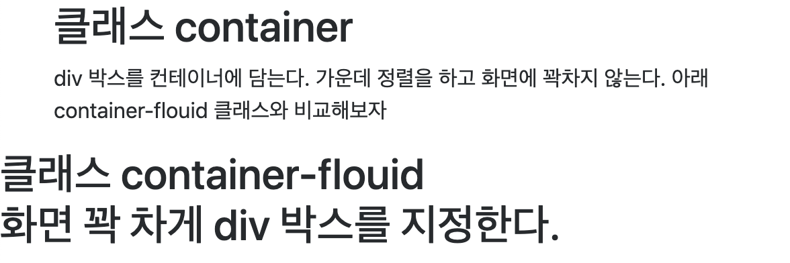
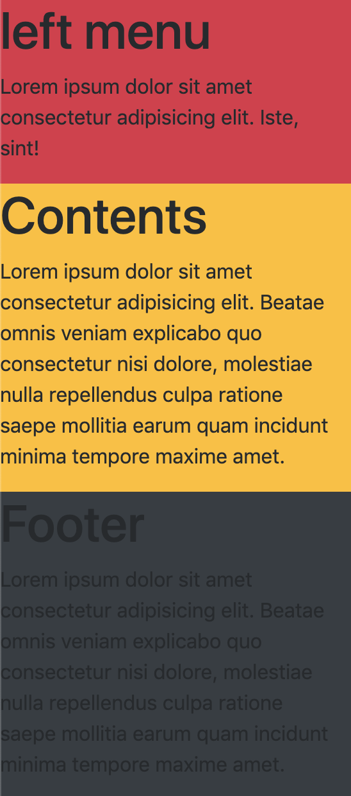
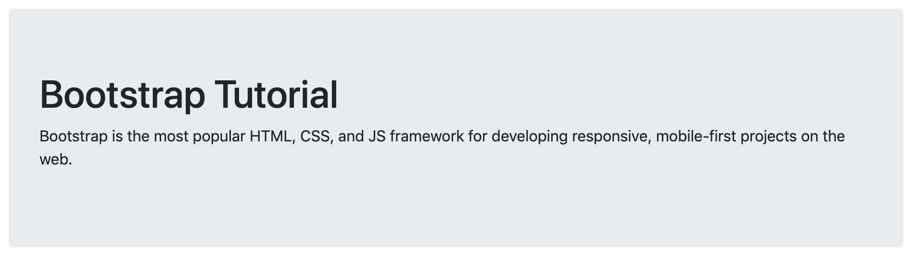

# 부트스트랩 (bootstrap)

공식 웹사이트
<https://getbootstrap.com/>

한국어 메뉴얼 사이트
<http://bootstrapk.com/>

w3schools - bootstrap4 tutorial
<https://www.w3schools.com/bootstrap4/default.asp>

Start Bootstrap - bootstrap theme
<https://startbootstrap.com/themes/>

<https://startbootstrap.com/>

부트스트랩은 html 문서 형식을 지키면서 쉽게 웹사이트를 제작 할 수 있도록 css와 javastipt 클래스를 제공하는 템플릿이다

## Bootstrap 4 is mobile-first

Bootstrap 4 is designed to be responsive to mobile devices. Mobile-first styles are part of the core framework.

To ensure proper rendering and touch zooming, add the following `<meta>` tag inside the `<head>` element:

```html
<meta name="viewport" content="width=device-width, initial-scale=1" />
```

The `width=device-width` part sets the width of the page to follow the screen-width of the device (which will vary depending on the device).

The `initial-scale=1` part sets the initial zoom level when the page is first loaded by the browser.

## 클래스 컨테이너

3. Containers

Bootstrap 4 also requires a containing element to wrap site contents.

There are two container classes to choose from:

1. The .container class provides a responsive fixed width container
2. The .container-fluid class provides a full width container, spanning the entire width of the viewport

```html
<div class="container">
  <h2>클래스 container</h2>
  <p>
    div 박스를 컨테이너에 담는다. 가운데 정렬을 하고 화면에 꽉차지 않는다. 아래
    container-flouid 클래스와 비교해보자
  </p>
</div>
```

```html
<div class="container-flouid">
<h2>클래스 container-flouid</h>
<p>화면 꽉 차게 div 박스를 지정한다.</p>
</div>
```



## 그리드 시스템 - Grid system

Bootstrap's grid system is built with flexbox and allows up to 12 columns across the page.

If you do not want to use all 12 columns individually, you can group the columns together to create wider columns:


The grid system is responsive, and the columns will re-arrange automatically depending on the screen size.

Make sure that the sum adds up to 12 or fewer (it is not required that you use all 12 available columns).

### Grid Classes

The Bootstrap 4 grid system has five classes:

- `.col-` (extra small devices - screen width less than 576px)
- `.col-sm-` (small devices - screen width equal to or greater than 576px)
- `.col-md-` (medium devices - screen width equal to or greater than 768px)
- `.col-lg-` (large devices - screen width equal to or greater than 992px)
- `.col-xl-` (xlarge devices - screen width equal to or greater than 1200px)
  The classes above can be combined to create more dynamic and flexible layouts.

Tip: Each class scales up, so if you wish to set the same widths for `sm` and `md`, you only need to specify `sm`.

지정된 픽셀까지는 전체사이즈로 표시되다가 그 이하로 떨어지면 한줄씩 표시가 된다(반응형)  
예를 들어 `.col-sm-` 을 클래스 값으로 선언하면 576px 이하가 되면 표가 한줄씩 표현된다

### Grid layout

1. Three Equal Columns

The following example shows how to create three equal-width columns, on all devices and screen widths:

```html
<div class="row">
  <div class="col">one</div>
  <div class="col">two</div>
  <div class="col">three</div>
</div>
```

2. Responsive Columns

The following example shows how to create four equal-width columns starting at tablets and scaling to extra large desktops. On mobile phones or screens that are less than 576px wide, the columns will automatically stack on top of each other:

```html
<div class="row">
  <div class="col-sm-3">.col-sm-3</div>
  <div class="col-sm-3">.col-sm-3</div>
  <div class="col-sm-3">.col-sm-3</div>
  <div class="col-sm-3">.col-sm-3</div>
</div>
```

### Two Unequal Responsive Columns

The following example shows how to get two various-width columns starting at tablets and scaling to large extra desktops:

```html
<div class="row">
  <div class="col-sm-4">.col-sm-4</div>
  <div class="col-sm-8">.col-sm-8</div>
</div>
```

### Grid Background-Color

클래스 `bg-primary`와 같이 입력해서 표현 가능하다

```html
<div class="row">
  <div class="col-sm-4 bg-danger">
    <h1>left menu</h1>
    <p>Lorem ipsum dolor sit amet consectetur adipisicing elit. Iste, sint!</p>
  </div>
</div>
<div class="row">
  <div class="col-sm-4 bg-warning">
    <h1>Contents</h1>
    <p>
      Lorem ipsum dolor sit amet consectetur adipisicing elit. Beatae omnis
      veniam explicabo quo consectetur nisi dolore, molestiae nulla repellendus
      culpa ratione saepe mollitia earum quam incidunt minima tempore maxime
      amet.
    </p>
  </div>
</div>
<div class="row">
  <div class="col-sm-4 bg-dark">
    <h1>Footer</h1>
    <p>
      Lorem ipsum dolor sit amet consectetur adipisicing elit. Beatae omnis
      veniam explicabo quo consectetur nisi dolore, molestiae nulla repellendus
      culpa ratione saepe mollitia earum quam incidunt minima tempore maxime
      amet.
    </p>
  </div>
</div>
```



### Grid in Grid

그리드 안에 그리드를 생성할 수 있다.
그리드 한 개에 또 그리드 12개를 생성 할 수 있다. 이것 또한 반응형으로 작동 할 수 있다.

## Text Colors

Bootstrap 4 has some contextual classes that can be used to provide "meaning through colors".

The classes for text colors are: `.text-muted`, `.text-primary`, `.text-success`, `.text-info`, `.text-warning`, `.text-danger`, `.text-secondary`, `.text-white`, `.text-dark`, `.text-body` (default body color/often black) and `.text-light`:

```html
<div class="container">
  <h2>Contextual Link Colors</h2>
  <p>Hover over the links.</p>
  <a href="#" class="text-muted">Muted link.</a>
  <a href="#" class="text-primary">Primary link.</a>
  <a href="#" class="text-success">Success link.</a>
  <a href="#" class="text-info">Info link.</a>
  <a href="#" class="text-warning">Warning link.</a>
  <a href="#" class="text-danger">Danger link.</a>
  <a href="#" class="text-secondary">Secondary link.</a>
  <a href="#" class="text-dark">Dark grey link.</a>
  <a href="#" class="text-body">Body/black link.</a>
  <a href="#" class="text-light">Light grey link.</a>
</div>
```


## Table

A basic Bootstrap 4 table has a light padding and horizontal dividers.

The `.table` class adds basic styling to a table:

```html
<div class="container">
  <table class="table">
    <thead>
      <td>Firstname</td>
      <td>Lastname</td>
      <td>Email</td>
    </thead>
    <tbody>
      <tr>
        <td>John</td>
        <td>Doe</td>
        <td>John@google.com</td>
      </tr>
      <tr>
        <td>Mary</td>
        <td>Moe</td>
        <td>Mary@naver.com</td>
      </tr>
      <tr>
        <td>July</td>
        <td>Dooley</td>
        <td>july@icloud.me</td>
      </tr>
    </tbody>
  </table>
</div>
```

### Striped Rows

The .table-striped class adds zebra-stripes to a table:

```html
<div class="container">
  <table class="table table-striped">
    <thead>
      <td>Firstname</td>
      <td>Lastname</td>
      <td>Email</td>
    </thead>
    <tbody>
      <tr>
        <td>John</td>
        <td>Doe</td>
        <td>John@google.com</td>
      </tr>
      <tr>
        <td>Mary</td>
        <td>Moe</td>
        <td>Mary@naver.com</td>
      </tr>
      <tr>
        <td>July</td>
        <td>Dooley</td>
        <td>july@icloud.me</td>
      </tr>
    </tbody>
  </table>
</div>
```

### Bordered Table

The `.table-bordered` class adds borders on all sides of the table and cells:

```html
<div class="container">
  <table class="table table-bordered">
    <thead>
      <td>Firstname</td>
      <td>Lastname</td>
      <td>Email</td>
    </thead>
    <tbody>
      <tr>
        <td>John</td>
        <td>Doe</td>
        <td>John@google.com</td>
      </tr>
      <tr>
        <td>Mary</td>
        <td>Moe</td>
        <td>Mary@naver.com</td>
      </tr>
      <tr>
        <td>July</td>
        <td>Dooley</td>
        <td>july@icloud.me</td>
      </tr>
    </tbody>
  </table>
</div>
```

### Hover Rows

The `.table-hover` class adds a hover effect (grey background color) on table rows:

```html
<div class="container">
  <table class="table table-hover">
    <thead>
      <td>Firstname</td>
      <td>Lastname</td>
      <td>Email</td>
    </thead>
    <tbody>
      <tr>
        <td>John</td>
        <td>Doe</td>
        <td>John@google.com</td>
      </tr>
      <tr>
        <td>Mary</td>
        <td>Moe</td>
        <td>Mary@naver.com</td>
      </tr>
      <tr>
        <td>July</td>
        <td>Dooley</td>
        <td>july@icloud.me</td>
      </tr>
    </tbody>
  </table>
</div>
```

### Black/Dark Table

The `.table-dark` class adds a black background to the table:

```html
<div class="container">
  <table class="table table-dark">
    <thead>
      <td>Firstname</td>
      <td>Lastname</td>
      <td>Email</td>
    </thead>
    <tbody>
      <tr>
        <td>John</td>
        <td>Doe</td>
        <td>John@google.com</td>
      </tr>
      <tr>
        <td>Mary</td>
        <td>Moe</td>
        <td>Mary@naver.com</td>
      </tr>
      <tr>
        <td>July</td>
        <td>Dooley</td>
        <td>july@icloud.me</td>
      </tr>
    </tbody>
  </table>
</div>
```

### Dark Striped Table

Combine `.table-dark` and `.table-striped` to create a dark, striped table:

```html
<div class="container">
  <table class="table table-dark table-striped">
    <thead>
      <td>Firstname</td>
      <td>Lastname</td>
      <td>Email</td>
    </thead>
    <tbody>
      <tr>
        <td>John</td>
        <td>Doe</td>
        <td>John@google.com</td>
      </tr>
      <tr>
        <td>Mary</td>
        <td>Moe</td>
        <td>Mary@naver.com</td>
      </tr>
      <tr>
        <td>July</td>
        <td>Dooley</td>
        <td>july@icloud.me</td>
      </tr>
    </tbody>
  </table>
</div>
```

### Hoverable Dark Table

The `.table-hover` class adds a hover effect (grey background color) on table rows:

```html
<div class="container">
  <table class="table table-dark table-hover">
    <thead>
      <td>Firstname</td>
      <td>Lastname</td>
      <td>Email</td>
    </thead>
    <tbody>
      <tr>
        <td>John</td>
        <td>Doe</td>
        <td>John@google.com</td>
      </tr>
      <tr>
        <td>Mary</td>
        <td>Moe</td>
        <td>Mary@naver.com</td>
      </tr>
      <tr>
        <td>July</td>
        <td>Dooley</td>
        <td>july@icloud.me</td>
      </tr>
    </tbody>
  </table>
</div>
```

### Borderless Table

The `.table-borderless` class removes borders from the table:

```html
<div class="container">
  <table class="table table-borderless">
    <thead>
      <td>Firstname</td>
      <td>Lastname</td>
      <td>Email</td>
    </thead>
    <tbody>
      <tr>
        <td>John</td>
        <td>Doe</td>
        <td>John@google.com</td>
      </tr>
      <tr>
        <td>Mary</td>
        <td>Moe</td>
        <td>Mary@naver.com</td>
      </tr>
      <tr>
        <td>July</td>
        <td>Dooley</td>
        <td>july@icloud.me</td>
      </tr>
    </tbody>
  </table>
</div>
```

## Jumbotron

A jumbotron indicates a big grey box for calling extra attention to some special content or information.

Tip: Inside a jumbotron you can put nearly any valid HTML, including other Bootstrap elements/classes.

```html
<div class="jumbotron">
  <h1>Bootstrap Tutorial</h1>
  <p>Bootstrap is the most popular HTML, CSS...</p>
</div>
```



### Full-width Jumbotron

If you want a full-width jumbotron without rounded borders, add the `.jumbotron-fluid` class and a `.container` or `.container-fluid` inside of it:

```html
<div class="jumbotron jumbotron-fluid">
  <div class="container">
    <h1>Bootstrap Tutorial</h1>
    <p>Bootstrap is the most popular HTML, CSS...</p>
  </div>
</div>
```

## Alerts

Alerts are created with the .alert class, followed by one of the contextual classes `.alert-success`, `.alert-info`, `.alert-warning`, `.alert-danger`, `.alert-primary`, `.alert-secondary`, `.alert-light` or `.alert-dark`:

```html
<div class="alert alert-success">
  <strong>Success!</strong> Indicates a successful or positive action.
</div>
```

### Alert Links

Add the `alert-link` class to any links inside the alert box to create "matching colored links":

```html
<div class="alert alert-success">
  <strong>Success!</strong> You should
  <a href="#" class="alert-link">read this message</a>.
</div>
```

### Closing Alerts

To close the alert message, add a `.alert-dismissible` class to the alert container. Then add `class="close"` and `data-dismiss="alert"` to a link or a button element (when you click on this the alert box will disappear).

```html
<div class="alert alert-success alert-dismissible">
  <button type="button" class="close" data-dismiss="alert">&times;</button>
  <strong>Success!</strong> Indicates a successful or positive action.
</div>
```

### Animated Alerts

The `.fade` and`.show` classes adds a fading effect when closing the alert message:

```html
<div class="alert alert-danger alert-dismissible fade show"></div>
```

## Button Styles

The button classes can be used on \<a>, \<button>, or \<input> elements:

```html
<a href="#" class="btn btn-info" role="button">Link Button</a>
<button type="button" class="btn btn-info">Button</button>
<input type="button" class="btn btn-info" value="Input Button" />
<input type="submit" class="btn btn-info" value="Submit Button" />
```

### Button Outline

```html
<button type="button" class="btn btn-outline-primary">Primary</button>
<button type="button" class="btn btn-outline-secondary">Secondary</button>
<button type="button" class="btn btn-outline-success">Success</button>
<button type="button" class="btn btn-outline-info">Info</button>
<button type="button" class="btn btn-outline-warning">Warning</button>
<button type="button" class="btn btn-outline-danger">Danger</button>
<button type="button" class="btn btn-outline-dark">Dark</button>
<button type="button" class="btn btn-outline-light text-dark">Light</button>
```

### Button Sizes

Use the `.btn-lg` class for large buttons or `.btn-sm` class for small buttons:

```html
<button type="button" class="btn btn-primary btn-lg">Large</button>
<button type="button" class="btn btn-primary">Default</button>
<button type="button" class="btn btn-primary btn-sm">Small</button>
```

### Block Level Buttons

Add class `.btn-block` to create a block level button that spans the entire width of the parent element.

```html
<button type="button" class="btn btn-primary btn-block">
  Full-Width Button
</button>
```

### Active/Disabled Buttons

The class `.active` makes a button appear pressed, and the disabled attribute makes a button unclickable. Note that \<a> elements do not support the disabled attribute and must therefore use the `.disabled` class to make it visually appear disabled.

```html
<button type="button" class="btn btn-primary active">Active Primary</button>
<button type="button" class="btn btn-primary" disabled>Disabled Primary</button>
<a href="#" class="btn btn-primary disabled">Disabled Link</a>
```

### Spinner Buttons

```html
<button class="btn btn-primary">
  <span class="spinner-border spinner-border-sm"></span>
</button>

<button class="btn btn-primary">
  <span class="spinner-border spinner-border-sm"></span>
  Loading..
</button>

<button class="btn btn-primary" disabled>
  <span class="spinner-border spinner-border-sm"></span>
  Loading..
</button>

<button class="btn btn-primary" disabled>
  <span class="spinner-grow spinner-grow-sm"></span>
  Loading..
</button>
```

## Button Groups

Use a \<div> element with class `.btn-group` to create a button group:

```html
<div class="btn-group">
  <button type="button" class="btn btn-primary">Apple</button>
  <button type="button" class="btn btn-primary">Samsung</button>
  <button type="button" class="btn btn-primary">Sony</button>
</div>
```

Tip: Instead of applying button sizes to every button in a group, use class `.btn-group-lg` for a large button group or the `.btn-group-sm` for a small button group:

### Vertical Button Groups

Use the class `.btn-group-vertical` to create a vertical button group:

### Nesting Button Groups & Dropdown Menus

```html
<div class="btn-group">
  <button type="button" class="btn btn-primary">Apple</button>
  <button type="button" class="btn btn-primary">Samsung</button>
  <div class="btn-group">
    <button
      type="button"
      class="btn btn-primary dropdown-toggle"
      data-toggle="dropdown"
    >
      Sony
    </button>
    <div class="dropdown-menu">
      <a class="dropdown-item" href="#">Tablet</a>
      <a class="dropdown-item" href="#">Smartphone</a>
    </div>
  </div>
</div>
```

### Split Button Dropdowns

```html
<div class="btn-group">
  <button type="button" class="btn btn-primary">Sony</button>
  <button
    type="button"
    class="btn btn-primary dropdown-toggle dropdown-toggle-split"
    data-toggle="dropdown"
  >
    <span class="caret"></span>
  </button>
  <div class="dropdown-menu">
    <a class="dropdown-item" href="#">Tablet</a>
    <a class="dropdown-item" href="#">Smartphone</a>
  </div>
</div>
```

### Vertical Button Group w/ Dropdown

```html
<div class="btn-group-vertical">
  <button type="button" class="btn btn-primary">Apple</button>
  <button type="button" class="btn btn-primary">Samsung</button>
  <div class="btn-group">
    <button
      type="button"
      class="btn btn-primary dropdown-toggle"
      data-toggle="dropdown"
    >
      Sony
    </button>
    <div class="dropdown-menu">
      <a class="dropdown-item" href="#">Tablet</a>
      <a class="dropdown-item" href="#">Smartphone</a>
    </div>
  </div>
</div>
```
