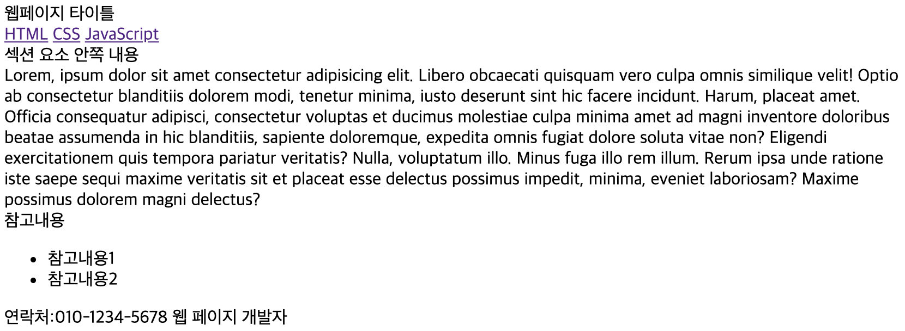

# 시맨틱 요소 태그 - Semantics element

HTML 문서에서 담당하는 구조적인 의미를 나타내는 요소들을 추가적으로 지원하여 검색엔진들의 HTML 문서 탐색에 편의를 제공한다

## 문서 구조 관련 시맨틱 태그들

| 요소                                       | 의미                                                     |
| ------------------------------------------ | -------------------------------------------------------- |
| \<header>                                  | 문서 시작(머리말) 부분                                   |
| \<nav>                                     | 문서의 메인링크 부분 (주 메뉴 표시 부분) - 네비게이션 바 |
| \<aside>                                   | 문서의 왼쪽/오른쪽 부분(부 메뉴 표시 부분)               |
| \<article>                                 | 문서 내용의 부분(대분류) - 본문                          |
| \<section>                                 | 문서 내용의 부분(소분류)                                 |
| <footer>                                   | 문서의 마지막(꼬리말) 부분                               |
| \<tthread>, \<tbody>, \<tfoot>, \<caption> | 표의 헤더, 내용, 푸터, 표 제목 부분                      |

## 시맨틱 태그의 기본 예

```html
<!DOCTYPE html>
<html>
  <head>
    <meta charset="UTF-8" />
    <meta name="viewport" content="width=device-width, initial-scale=1.0" />
    <meta http-equiv="X-UA-Compatible" content="ie=edge" />
    <title>시맨틱 태그</title>
  </head>

  <body>
    <header>웹페이지 타이틀</header>
    <nav>
      <a href="">HTML</a>
      <a href="">CSS</a>
      <a href="">JavaScript</a>
    </nav>
    <section>
      섹션 요소 안쪽 내용
    </section>
    <article>
      Lorem, ipsum dolor sit amet consectetur adipisicing elit. Libero obcaecati
      quisquam vero culpa omnis similique velit! Optio ab consectetur blanditiis
      dolorem modi, tenetur minima, iusto deserunt sint hic facere incidunt.
      Harum, placeat amet. Officia consequatur adipisci, consectetur voluptas et
      ducimus molestiae culpa minima amet ad magni inventore doloribus beatae
      assumenda in hic blanditiis, sapiente doloremque, expedita omnis fugiat
      dolore soluta vitae non? Eligendi exercitationem quis tempora pariatur
      veritatis? Nulla, voluptatum illo. Minus fuga illo rem illum. Rerum ipsa
      unde ratione iste saepe sequi maxime veritatis sit et placeat esse
      delectus possimus impedit, minima, eveniet laboriosam? Maxime possimus
      dolorem magni delectus?
    </article>
    <aside>
      참고내용
      <ul>
        <li>참고내용1</li>
        <li>참고내용2</li>
      </ul>
    </aside>
    <footer>
      연락처:010-1234-5678 웹 페이지 개발자
    </footer>
  </body>
</html>
```


