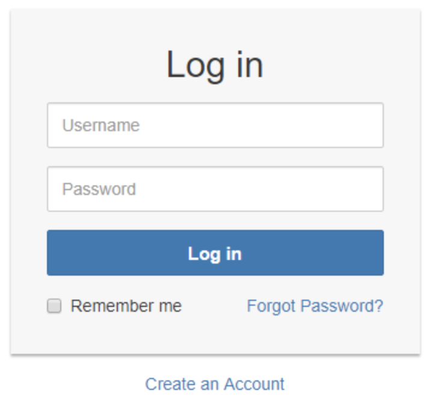
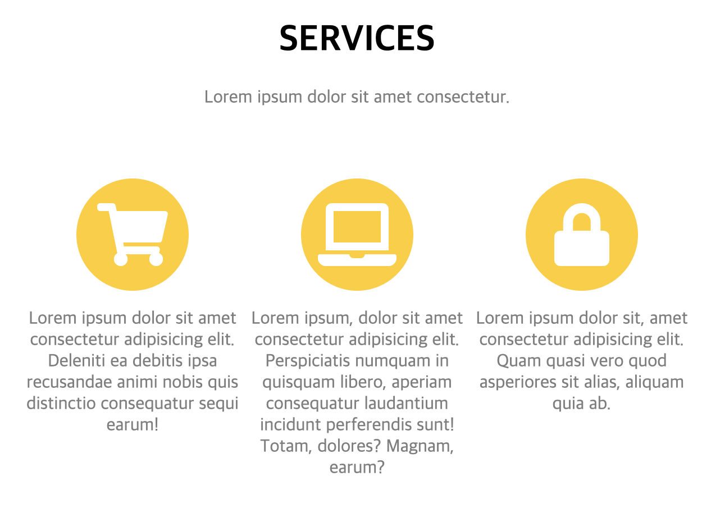

# CSS Login 페이지 실습



위와 같이 로그인 폼을 만드시오

---

시간내에 작성을 다 하지 못해서 미완성이지만 내가 작성 한 것

```html
<!DOCTYPE html>
<html lang="en">
  <head>
    <meta charset="UTF-8" />
    <meta name="viewport" content="width=device-width, initial-scale=1.0" />
    <meta http-equiv="X-UA-Compatible" content="ie=edge" />
    <title>login</title>

    <style>
      body {
        text-align: center;
      }

      a:link {
        color: rgb(43, 147, 211);
        text-decoration: none;
      }

      a:hover {
        color: red;
        text-decoration: none;
      }

      #center {
        border: 1px solid whitesmoke;
        background-color: whitesmoke;
        box-shadow: 0px 2px 1px lightgray;
        margin: auto;
        width: 350px;
        height: 280px;
      }

      #title {
        font-size: 30px;
        margin: 20px;
      }

      #button {
        background-color: rgb(43, 147, 211);
        width: 290px;
        height: 35px;
        margin: 5px;
      }

      #user,
      #passwd {
        width: 290px;
        height: 35px;
        margin: 5px;
      }

      #create_account {
        margin: 10px;
      }

      #keep {
        text-align: left;
      }

      #forget {
        text-align: right;
      }
    </style>
  </head>

  <body>
    <div id="center">
      <div id="title">Log in</div>
      <input type="text" placeholder="Username" id="user" /><br />
      <input type="password" placeholder="Password" id="passwd" /><br />
      <input type="button" id="button" value="Log in" /><br />
      <div style="width: 290px; margin: auto;">
        <table style="width: 290px;">
          <tr>
            <td id="keep"><input type="checkbox" />Remember me</td>
            <td id="forget">
              <a href="forget_password.html">Forget Password?</a>
            </td>
          </tr>
        </table>
      </div>
    </div>
    <div id="create_account">
      <a href="/create_account.html">Create an Account</a>
    </div>
  </body>
</html>
```

결과


### 강사님 코드

내가 작성한 코드와 비교해보고 어떻게 작성하는 것이 깔끔하고 간편한지 생각해보자

```html
<html lang="en">
  <head>
    <meta charset="UTF-8" />
    <meta name="viewport" content="width=device-width, initial-scale=1.0" />
    <meta http-equiv="X-UA-Compatible" content="ie=edge" />
    <title>Document</title>
    <style>
      * {
        box-sizing: border-box;
      }
      #div1 {
        width: 400px;
        margin: 0 auto;
        text-align: center;
        padding: 30px 10px 20px;
        background-color: #f7f7f7;
        box-shadow: 1px 1px #999999;
        border-radius: 5px;
      }
      .text-form {
        width: 300px;
        height: 50px;
        margin: 10px;
        padding: 10px;
        border-radius: 5px;
        font-size: 20px;
        border-style: solid;
        border-width: 1px;
        border-color: #999999;
      }

      input[type="submit"] {
        width: 300px;
        height: 50px;
        margin: 10px;
        padding: 10px;
        font-size: 20px;
        background-color: #347ab6;
        color: white;
        border-radius: 5px;
      }

      a {
        text-decoration: none;
        color: #347ab6;
      }

      #div2 {
        margin-top: 20px;
        text-align: center;
      }
    </style>
  </head>
  <body>
    <form action="" method="POST" id="form1">
      <div id="div1">
        <h1>Log in</h1>
        <input
          type="text"
          name="userid"
          class="text-form"
          placeholder="Username"
        /><br />
        <input
          type="password"
          name="password"
          class="text-form"
          placeholder="Password"
        /><br />
        <input type="submit" value="Log in" /><br />
        <input type="checkbox" name="remember" value="remember" />Remember me
        &nbsp;&nbsp;&nbsp;&nbsp; <a href="#" id="forgotpw">Forgot Password?</a
        ><br />
      </div>
      <div id="div2">
        <a href="#">Create an account</a>
      </div>
    </form>
  </body>
</html>
```

---

# 3열 배치 만들기 실습


위와 똑같이 작성해 보자

아래는 내가 작성한 코드

```html
<!DOCTYPE html>
<html lang="en">
  <head>
    <meta charset="UTF-8" />
    <meta name="viewport" content="width=device-width, initial-scale=1.0" />
    <meta http-equiv="X-UA-Compatible" content="ie=edge" />
    <script src="https://kit.fontawesome.com/44b4f52062.js"></script>
    <title>3단 배치</title>
    <style>
      body {
        text-align: center;
        width: 600px;
        margin: 0 auto;
      }

      p {
        color: gray;
      }

      .parents {
        width: 600px;
        display: table;
        margin: auto;
      }

      .box {
        display: table-cell;
        height: 300px;
      }

      .box-a {
        width: 200px;
      }

      .box-b {
        width: 200px;
      }

      .box-c {
        width: 200px;
      }

      .one {
        height: 100px;
        width: 100px;
        background-color: rgb(255, 208, 0);
        border-radius: 50%;
        margin: auto;
      }

      .fa-shopping-cart,
      .fa-laptop,
      .fa-lock {
        font-size: 3.5em;
        color: white;
        /* <div> 값을 100px로 지정했을 때 line-height 값을 <div> 값과 똑같이 지정해주면 위아래 중간으로 정렬이 된다 */
        line-height: 100px;
      }
    </style>
  </head>

  <body>
    <h1>SERVICES</h1>
    <p>Lorem ipsum dolor sit amet consectetur.</p>
    <p style="padding-bottom: 30px;"></p>

    <div class="parent">
      <div class="box box-a">
        <div class="one">
          <i class="fas fa-shopping-cart"></i>
        </div>
        <p>
          Lorem ipsum dolor sit amet consectetur adipisicing elit. Deleniti ea
          debitis ipsa recusandae animi nobis quis distinctio consequatur sequi
          earum!
        </p>
      </div>
      <div class="box box-b">
        <div class="one">
          <i class="fas fa-laptop"></i>
        </div>
        <p>
          Lorem ipsum, dolor sit amet consectetur adipisicing elit. Perspiciatis
          numquam in quisquam libero, aperiam consequatur laudantium incidunt
          perferendis sunt! Totam, dolores? Magnam, earum?
        </p>
      </div>
      <div class="box box-c">
        <div class="one">
          <i class="fas fa-lock"></i>
        </div>
        <p>
          Lorem ipsum dolor sit, amet consectetur adipisicing elit. Quam quasi
          vero quod asperiores sit alias, aliquam quia ab.
        </p>
      </div>
    </div>
  </body>
</html>
```


내가 만든 결과물

> 무엇을 배웠나
>
> - 아이콘을 <https://fontawesome.com/>에서 받아서 사용하는 법.
>   - 헤더에 스크립트 코드를 불러오고 본문에 아이콘 클래스를 이용하여 첨부한다
> - \<div>태크 안쪽에 아이콘을 상하 중간으로 위치시키는 방법
>   - line-height 속성값을 \<div> 태크와 같은 픽셀로 지정한다

---

## 3열 배치 포트폴리오 만들기 실습


위와 같이 만들어보자

아래는 내가 작성한 코드

```html
<!DOCTYPE html>
<html lang="en">
  <head>
    <meta charset="UTF-8" />
    <meta name="viewport" content="width=device-width, initial-scale=1.0" />
    <meta http-equiv="X-UA-Compatible" content="ie=edge" />
    <title>3단 배치 포트폴리오</title>
    <style>
      body {
        text-align: center;
        width: 600px;
        margin: 0 auto;
      }

      h1,
      h2 {
        margin-bottom: 5px;
      }

      p {
        color: gray;
        margin: 0px;
      }

      .parents {
        width: 600px;
        display: table;
        margin: auto;
      }

      .box {
        display: table-cell;
        height: 300px;
      }

      .box-a {
        width: 200px;
      }

      .box-b {
        width: 200px;
      }

      .box-c {
        width: 200px;
      }

      .one {
        margin: auto;
      }
    </style>
  </head>

  <body>
    <h1>PORTFOLIO</h1>
    <p>Lorem ipsum dolor sit amet consectetur.</p>
    <p style="padding-bottom: 30px;"></p>

    <div class="parent">
      <div class="box box-a">
        <div class="one">
          
        </div>

        <h2>Threads</h2>
        <p>Illustration</p>
      </div>
      <div class="box box-b">
        <div class="one">
          
        </div>

        <h2>Explore</h2>
        <p>Graphic Design</p>
      </div>
      <div class="box box-c">
        <div class="one">
          
        </div>

        <h2>Finish</h2>
        <p>Identity</p>
      </div>
    </div>
  </body>
</html>
```

내가 만든 결과물

