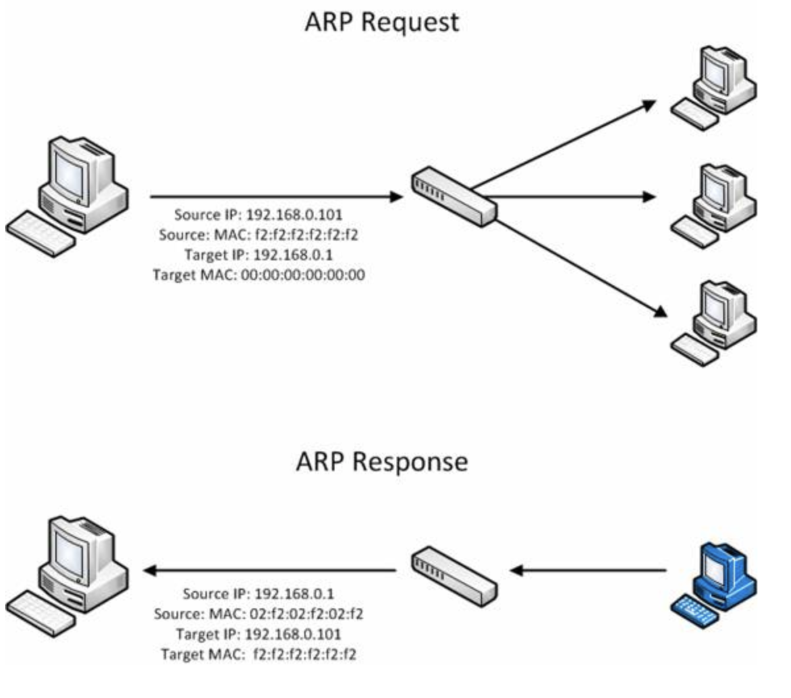
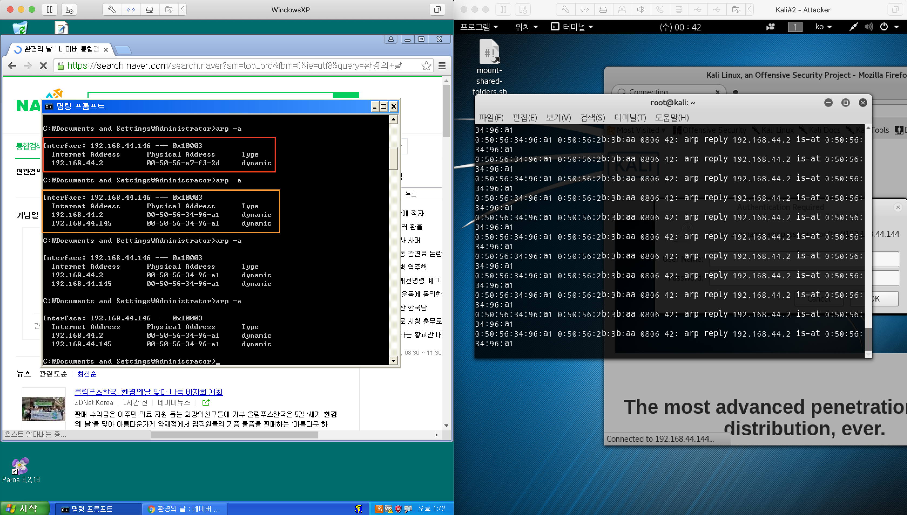
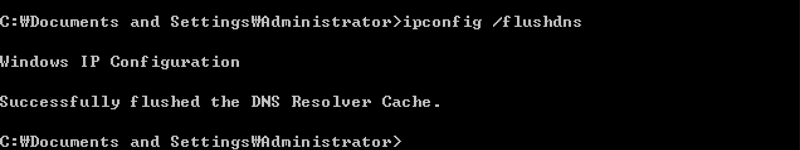

# ARP Spoofing

<https://www.researchgate.net/figure/Arp-Spoofing-Hung-Tran-2014_fig7_328262183>


ARP(Address Resolution Protocol)


주로 효율적으로 게이트웨이를 공격한다

> 실험 할 VM과 ip  
> windows xp : 192.168.44.146  
> kali2(attacker) : 192.168.44.145  
> kali1(victim) : 192.168.44.144

## Arp Spoofing 공격

```bash
# arpspoof -i eth0 -t VICTIM_IP(window_xp) GATEWAY_IP
arpspoof -i eth0 -t 192.168.44.146 192.168.44.2
```



게이트웨이에 피공격자의 mac 주소가 공격자의 mac 주소로 변경되었다

피공격자는 dns를 못찾아서 인터넷에 접속이 안된다(연결이 끊긴다)
게이트웨이(192.168.44.2)로 전달이 되어야 하는데 공격자 ip(192.168.44.145)로 전달을 하기 때문에 외부로 못나간다


피공격자는 이제 맥어드레스가 변경되었고
공격자는 피공격자에게 받은 패킷을 포워딩시킨다

```bash
# 포워딩 시킨다
fragrouter -B1
# fragrouter: base-1: normal IP forwarding
```

이제 피공격자는 다시 인터넷에 접속 가능하게 된다


피공격자(kali1) 에서 wireshark로 확인해보면 맥 어드레스 공격이 계속 들어온다(빨간색 박스). 파란색박스처럼 간간히 정상적인 요청도 들어온다

- 처음에 게이트웨이를 두 개 생겼다 하나로 줄어드는 이유는 ARP 캐시 테이블에 담기기 때문, 시간이 지나서 사라지기 때문에 공격자 게이트웨이만 남는다

## 방어 방법

게이트웨이를 변경되지 않도록 정적으로(스태틱하게) 설정한다 (수동입력)
ARP cache table에 gateway mac 주소를 정적으로 설정

windows에서는 cmd에서 아래와 같이 입력한다



```bash
arp -s GATEWAY_IP GATEWAY_MAC
# or
netst interface ip delete neighbors "NETWORK_CARD_NAME" "GATEWAY_IP"
netst interface ip add neighbors "NETWORK_CARD_NAME" "GATEWAY_IP" "GATEWAY_MAC"
```
