# ettercap

## MTM(Man in The Middle) attack

두 호스트 간에 통신을 하고 있을 때, 중간자가 사이에 끼어들어 통신 내용을 도청, 조작하는 공격


### etter.dns 파일 수정

```bash
vim /etc/ettercap/etter.dns

#etter.dns에 입력
*.naver.* 192.168.44.145    # 공격자(kali#2-attacker) ip 주소입력
```

### ettercap 실행

```bash
ettercap -G
```

Sniff > Unified sniffing > eth 0 ⇐ 스니핑할 NIC를 지정

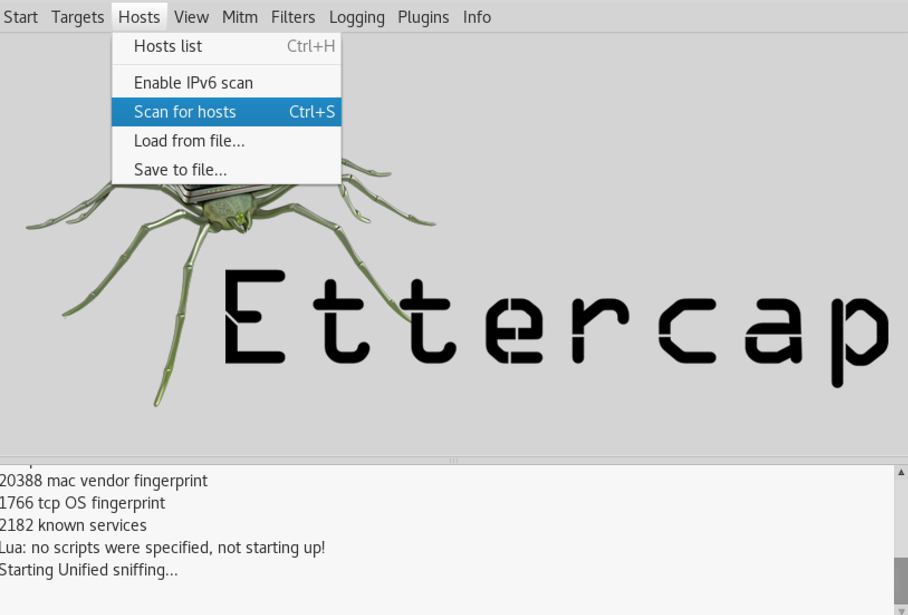
Hosts > Scan for hosts ⇐ 해당 LAN에 존재하는 호스트를 검색

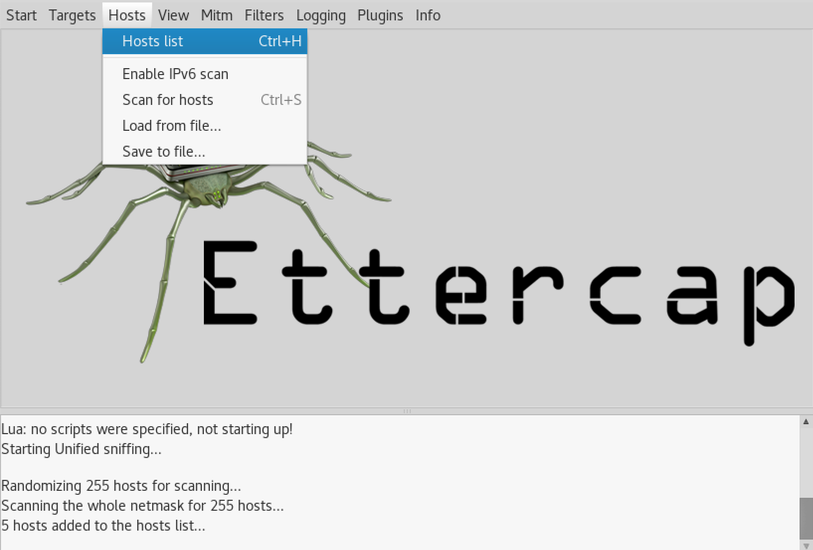
Hosts > Hosts list ⇐ 검색 결과를 확인

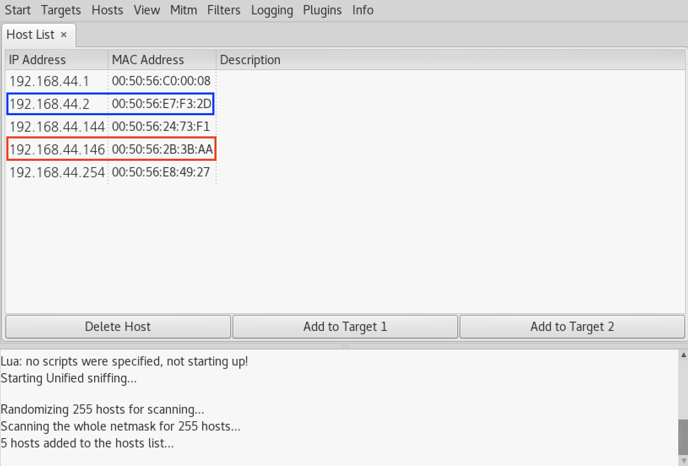
게이트웨이와 공격대상을 타켓으로 설정한다

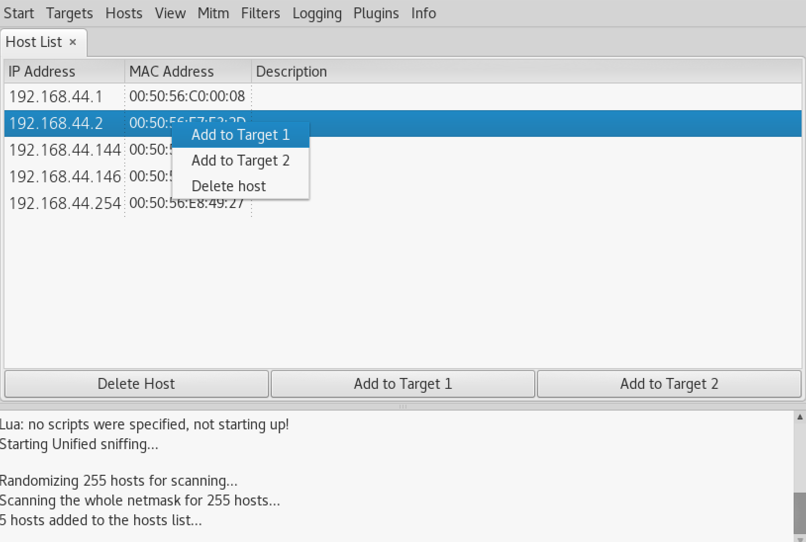
게이트웨이를 타겟1로 설정

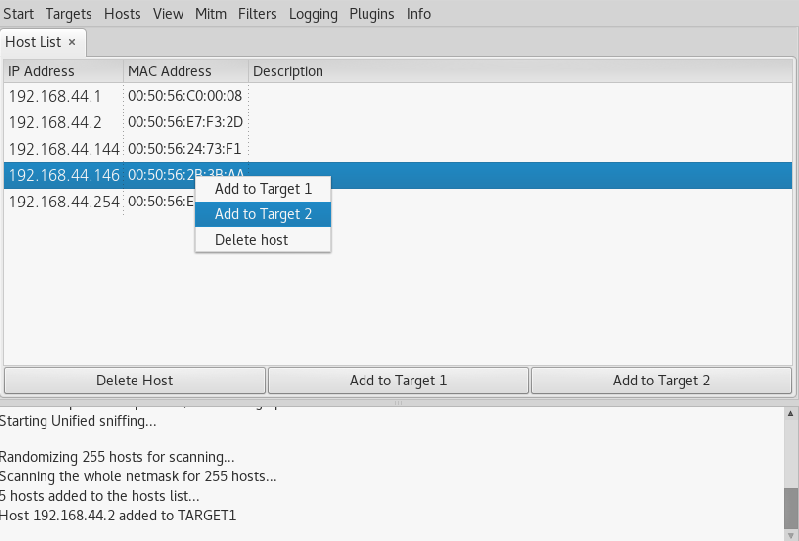
공격대상을 타겟2로 설정

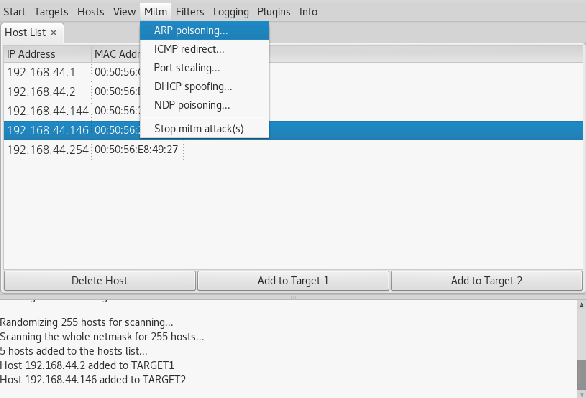
공격자를 공격 대상 사이에 위치 ⇒ WinXP <---> Kali#2 <---> Gateway

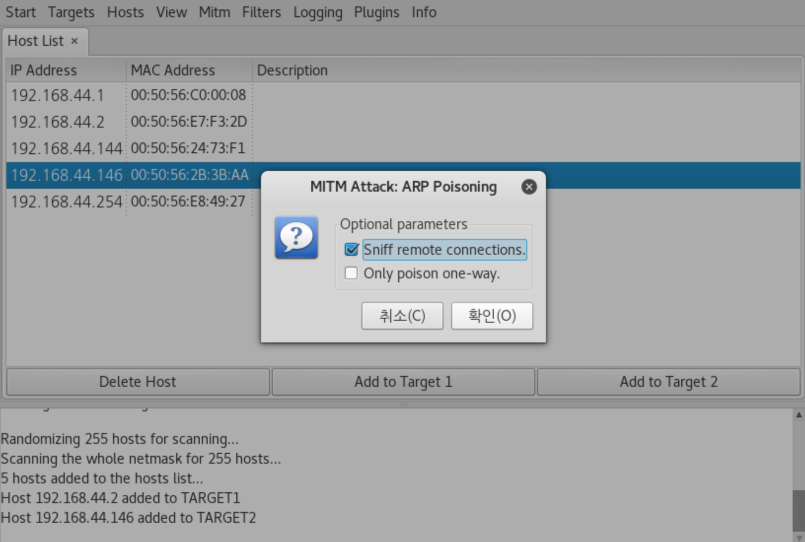
Mitm > ARP Spoofing > Sniff remote connections 체크박스 선택

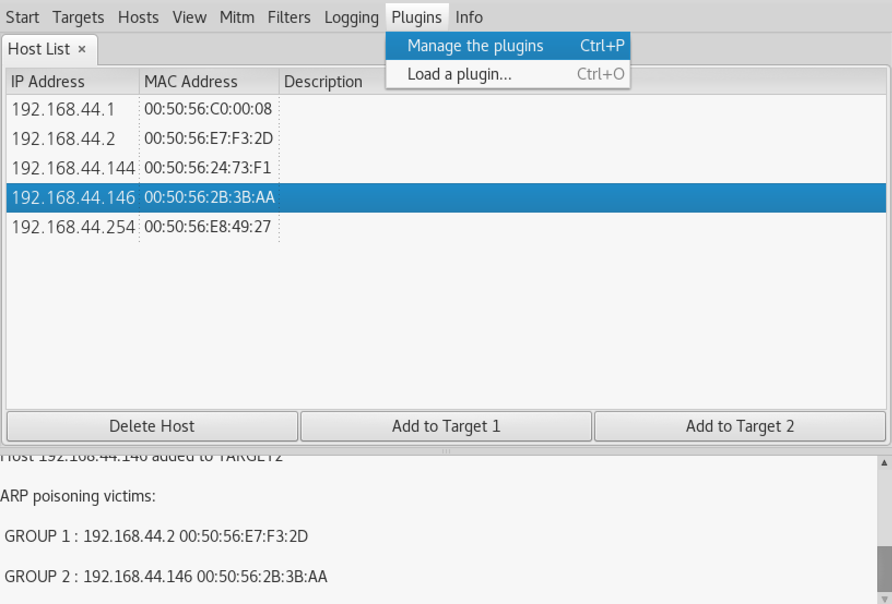
Plugins > Manage the plugins

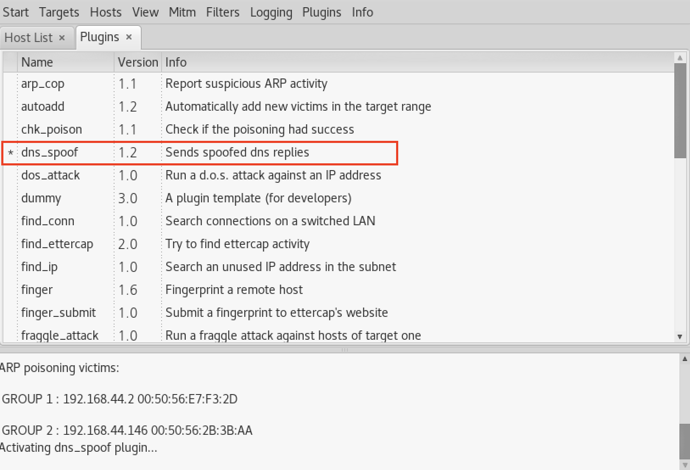
dns_spoof 더블클릭해서 선택

WinXP(공격대상)에서 http://www.naver.com으로 접속을 시도 → Kali#2(attacker)에서 제공하는 웹 페이지가 보이면 공격 성공

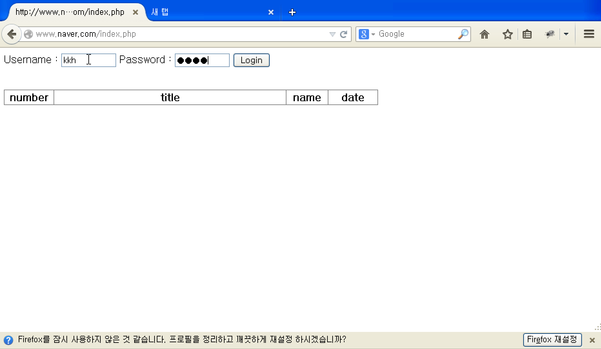
naver.com에 접속을 했지만 kali#2(attacker)가 제공하는 웹페이지가 나타난다

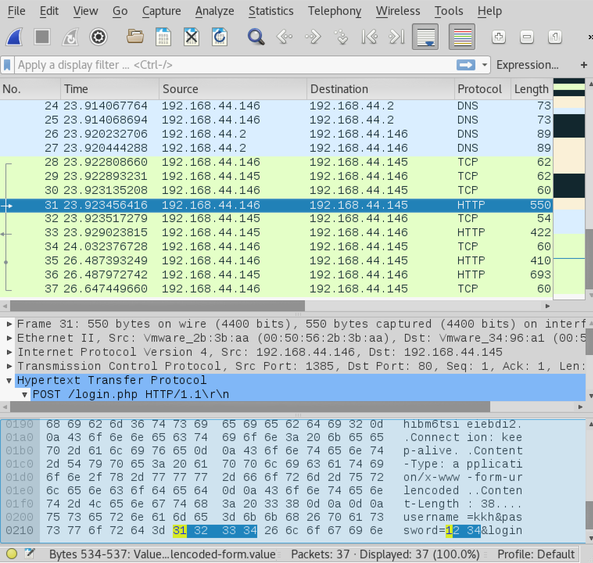
정보를 입력하면 Kali#2(attacker)가 패킷을 볼 수 있다 - 아이디와 비밀번호가 노출된 상황

<https://stackoverflow.com/questions/40515543/chrome-dns-spoofing-protections>

<https://opentogether.tistory.com/27>

<https://opentogether.tistory.com/28>
