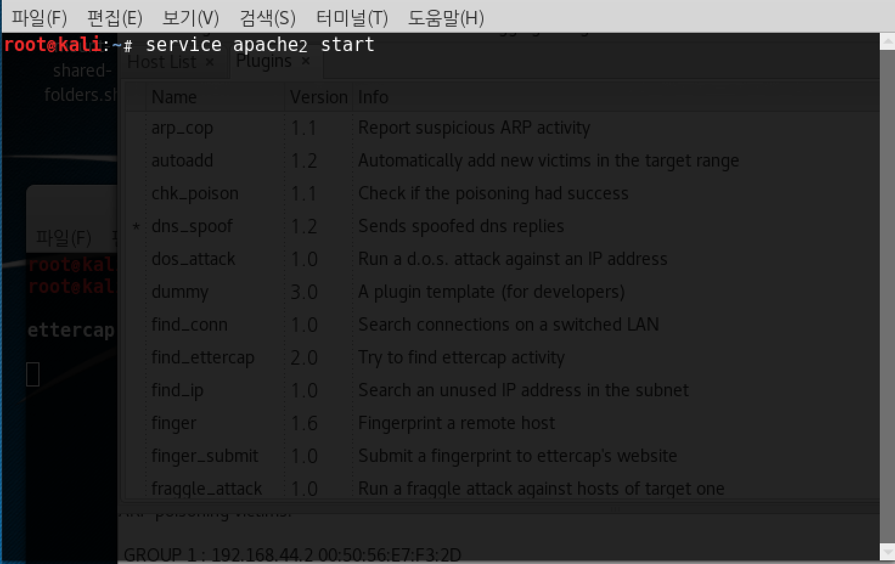
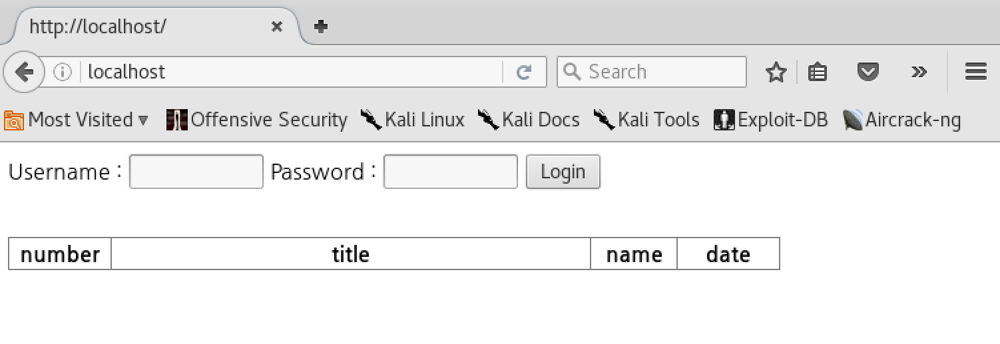
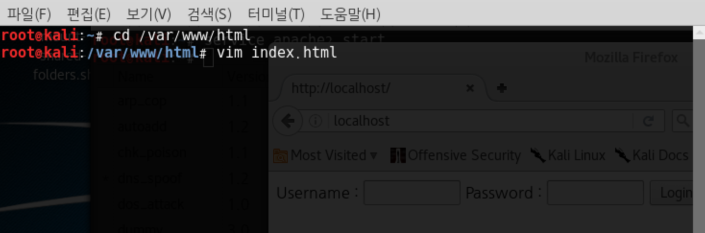

# ettercap

## MTM(Man in The Middle) attack

두 호스트 간에 통신을 하고 있을 때, 중간자가 사이에 끼어들어 통신 내용을 도청, 조작하는 공격

### ettercap 실행

root@kali:~# ettercap -G

Sniff > Unified sniffing > eth 0 ⇐ 스니핑할 NIC를 지정
Hosts > Scan for hosts ⇐ 해당 LAN에 존재하는 호스트를 검색
Hosts > Hosts list ⇐ 검색 결과를 확인

공격 대상을 지정
target1 => Gateway (192.168.111.2)
target2 => WinXP (192.168.111.140)

Apr spoofing ⇒ 공격자를 공격 대상 사이에 위치 ⇒ WinXP <---> Kali#2 <---> Gateway
Mitm > ARP Spoofing > Sniff remote connections

DNS Spoofing 공격
Plugins > Manage the plugins > dns_spoof

WinXP에서 http://www.naver.com으로 접속을 시도 → Kali#2에서 제공하는 웹 페이지가 보이면 공격 성공

<https://stackoverflow.com/questions/40515543/chrome-dns-spoofing-protections>

<https://opentogether.tistory.com/27>

<https://opentogether.tistory.com/28>

빠져 나오는 방법?

ipconfig /flushdns
