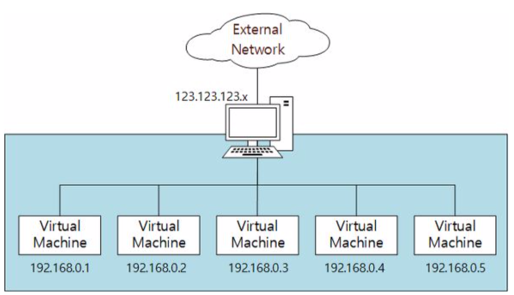
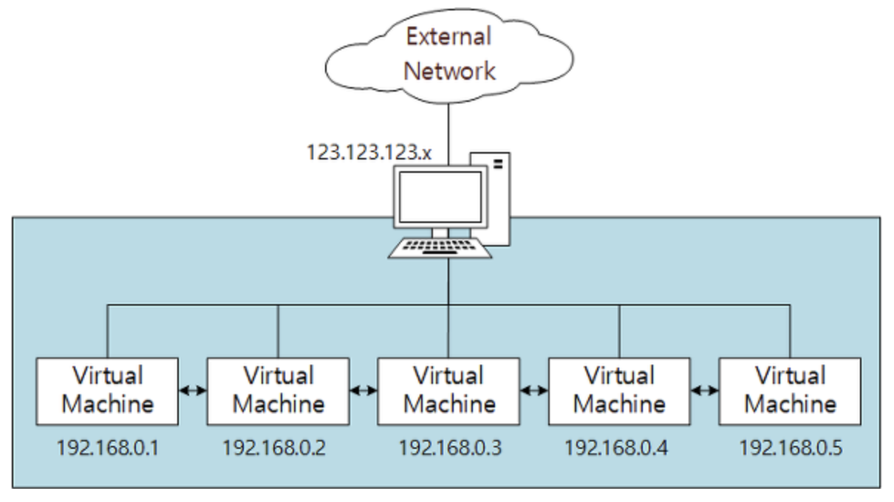
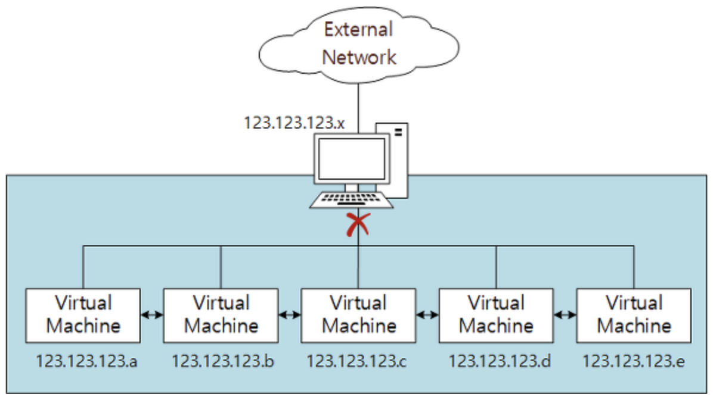

# 네트워크 컴퓨터 간 통신

## NAT(Network Address Translation)

NAT(Network Address Translation)

## NAT Network

NAT Network

## Bridged Adapter

Bridged Adapter

## Internal Network

Internal Network

- Host와의 통신 불가
- 서브네트워크 간 통신

## Host-Only Adapter

Host-Only Adapter

- 호스트와 서브네트워크 간 통신 가능
- 호스트 외부망 접속 불가

## Generic Driver

- 거의 사용하지 않음

- UDP Tunnel networking, VDE(Virtual Distributed Ethernet) 지원
