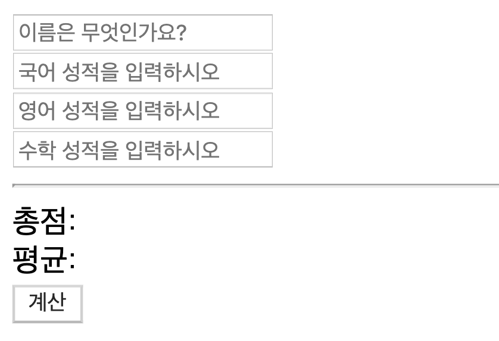
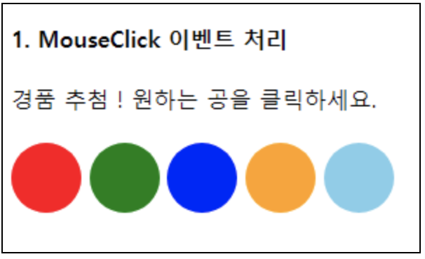
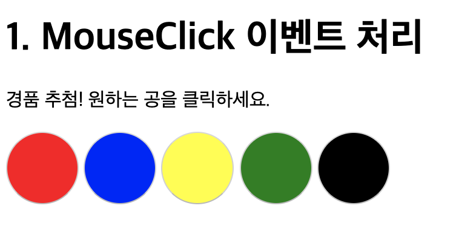

# javascript 실습 - 2019-06-25



위와 같은 폼을 만들고 자바스크립트를 이용해서 계산하는 실습을 해보자

```html
<!DOCTYPE html>
<html lang="en">
  <head>
    <meta charset="UTF-8" />
    <meta name="viewport" content="width=device-width, initial-scale=1.0" />
    <meta http-equiv="X-UA-Compatible" content="ie=edge" />
    <title>Document</title>
    <style>
      table,
      td {
        border: 1px solid black;
      }
    </style>
  </head>

  <body>
    <input
      type="text"
      name="name"
      id="name"
      placeholder="이름은 무엇인가요?"
    /><br />
    <input
      type="number"
      name="nlang"
      id="nlang"
      placeholder="국어 성적을 입력하시오"
    /><br />
    <input
      type="number"
      name="eng"
      id="eng"
      placeholder="영어 성적을 입력하시오"
    /><br />
    <input
      type="number"
      name="math"
      id="math"
      placeholder="수학 성적을 입력하시오"
    />
    <hr />
    총점: <span id="total"></span><br />
    평균: <span id="avg"></span><br />
    <button onclick="carculate()">계산</button>
    <script>
      function carculate() {
        var name = document.getElementById("name").value;
        console.log(name);
        var nlang = document.getElementById("nlang").value;
        console.log(nlang);
        var math = document.getElementById("math").value;
        console.log(math);
        var eng = document.getElementById("eng").value;
        console.log(eng);
        var total = Number(nlang) + Number(eng) + Number(math);
        console.log(total);
        var avg = total / 3;
        document.getElementById("total").innerHTML = total;
        document.getElementById("avg").innerHTML = avg;
      }
    </script>
  </body>
</html>
```

---



```html
<!DOCTYPE html>
<html lang="en">
  <head>
    <meta charset="UTF-8" />
    <meta name="viewport" content="width=device-width, initial-scale=1.0" />
    <meta http-equiv="X-UA-Compatible" content="ie=edge" />
    <title>Document</title>
    <style>
      button {
        width: 60px;
        height: 60px;
        border-radius: 50%;
      }
    </style>
  </head>

  <body>
    <h1>1. MouseClick 이벤트 처리</h1>
    <p>경품 추첨! 원하는 공을 클릭하세요.</p>
    <button onclick="alert('꽝입니다')" style="background-color: red"></button>
    <button onclick="alert('꽝입니다')" style="background-color: blue"></button>
    <button
      onclick="alert('축하합니다! 당첨되었습니다!')"
      style="background-color: yellow"
    ></button>
    <button
      onclick="alert('꽝입니다')"
      style="background-color: green"
    ></button>
    <button
      onclick="alert('꽝입니다')"
      style="background-color: black"
    ></button>
  </body>
</html>
```



---

사용자에게 숫자를 입력받아 홀수 인지 짝수인지 출력하는 스크립트를 작성하시오.

```html
<!DOCTYPE html>
<html>
  <head>
    <meta charset="UTF-8" />
  </head>

  <body>
    <script>
      function num() {
        var num = prompt("숫자를 입력하세요");
        if (num % 2 == 0) {
          alert("짝수입니다");
        } else {
          alert("홀수입니다");
        }
      }
      num();
    </script>
  </body>
</html>
```

숫자를 아무것도 입력하지 않았을 때 숫자를 입력하라는걸 띄워주는 프로그램을 만들어보자

---

회원 탈퇴여부를 묻는 창을 띄우고 “확인”, “취소” 버튼에 따라 탈퇴여부를 출력하는 스크립트를 작성하시오

```html

```
