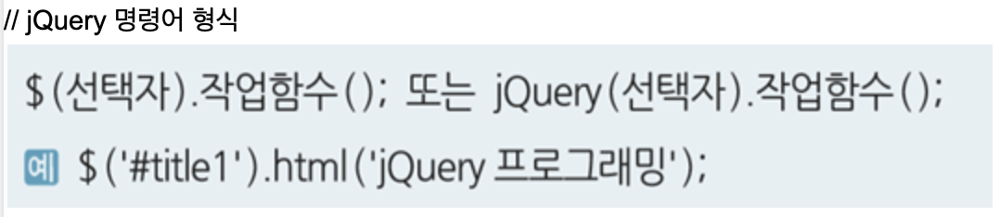
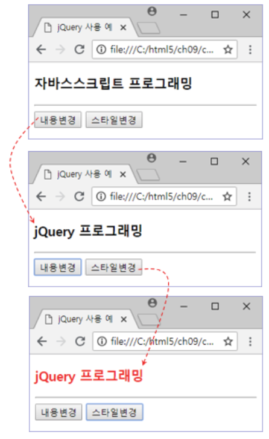
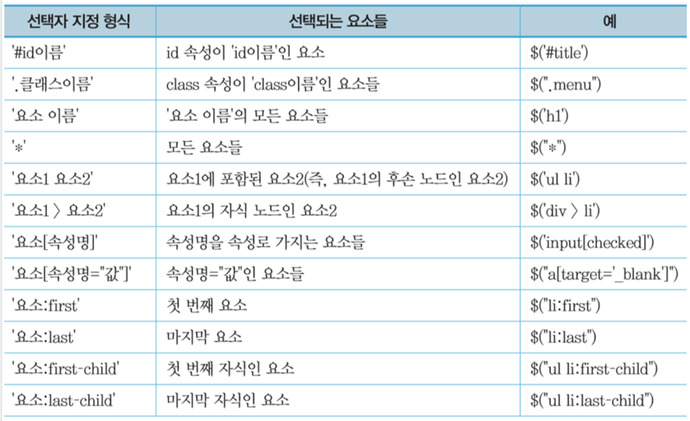
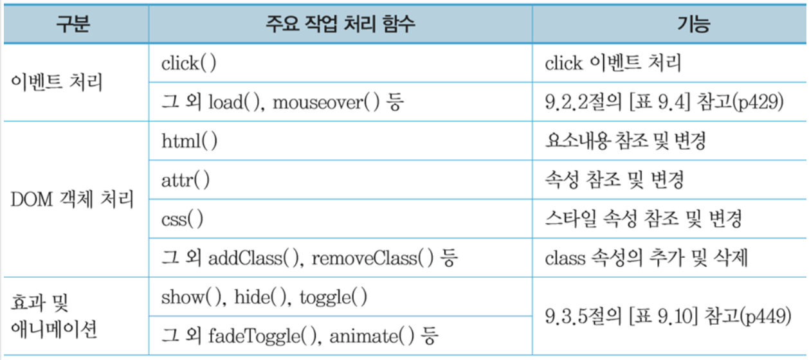
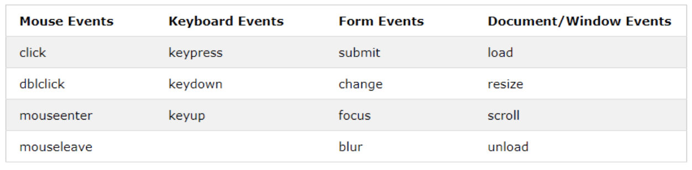

# jQuery

- 존 레식이 개발한 자바스크립트 라이브러리
- Write less, Do more

## jQuery 로 할 수 있는 일

- HTML 요소들의 내용이나 속성 변경
- HTML 요소들의 CSS3 스타일 속성변경
- HTML DOM 트리의 변경 (요소노드 추가, 삭제)
- HTML 요소들의 다양한 애니메이션 효과 지정
- 서버와의 비동기 통신(Ajax) 지원
- 웹브라우저 호환성 문제 해결

## 순수 Java Script 와 jQuery 비교


## jQuery 사용 방법

html \<head>태그에 삽입

```html
<head>
  <script src="https://ajax.googleapis.com/ajax/libs/jquery/3.4.1/jquery.min.js"></script>
</head>
```


jQuery 예제

```html
<!DOCTYPE html>
<html lang="en">
   <head>
       <title> jQuery 사용 예 </title>
       <!-- <script src='https://code.jquery.com/jquery-3.3.1.js'></script> -->
       <script src="https://ajax.googleapis.com/ajax/libs/jquery/3.4.1/jquery.min.js"></script>
   </head>

   <body>
       <h3 id="t1"> 자바스스크립트 프로그래밍 </h3>
       <hr>
       <button onclick="$('#t1').html('jQuery 프로그래밍'); ">
           내용변경
       </button>
       <button onclick="$('#t1').css('color','red'); ">
           스타일변경
       </button>
   </body>
</body>
</html>
```



## jQuery 선택자



## jQuery 주요 함수



## jQuery 적용 구조

```js
$(document).ready(function() {
  실행문;
});
$(function() {
  실행문;
});
```

```js
<!DOCTYPE html>
<html lang="ko">
<head>
   <title> jQuery 사용 예 </title>
   <script src="https://ajax.googleapis.com/ajax/libs/jquery/3.4.1/jquery.min.js"></script>
   <script>
       $(function () {
           jQuery 실행문
       });
   </script>
</head>
<body>

</body>
</html>
```

- 일반적으로 jQuery 코드들은 \$(document).ready(function() { … }); 안에 구현
- 모든 페이지가 다 로딩 된 후 jQuery 를 수행하는 것이 안전

## jQuery 선택자

### 태그 선택자

```html
<!DOCTYPE html>
<html>
  <head>
    <script src="https://ajax.googleapis.com/ajax/libs/jquery/3.4.1/jquery.min.js"></script>
    <script>
      $(document).ready(function() {
        $("button").click(function() {
          $("p").hide();
        });
      });
    </script>
  </head>

  <body>
    <h2>타이틀</h2>

    <p>This is a paragraph.</p>
    <p>This is another paragraph.</p>

    <button>클릭하면 사라짐</button>
  </body>
</html>
```

### id 선택자

```html
<!DOCTYPE html>
<html>
  <head>
    <script src="https://ajax.googleapis.com/ajax/libs/jquery/3.4.1/jquery.min.js"></script>
    <script>
      $(document).ready(function() {
        $("button").click(function() {
          $("#test").hide();
        });
      });
    </script>
  </head>

  <body>
    <h2>This is a heading</h2>

    <p>This is a paragraph.</p>
    <p id="test">This is another paragraph.</p>

    <button>Click me</button>
  </body>
</html>
```

### 클래스 선택자

```html
<!DOCTYPE html>
<html>
  <head>
    <script src="https://ajax.googleapis.com/ajax/libs/jquery/3.4.1/jquery.min.js"></script>
    <script>
      $(document).ready(function() {
        $("button").click(function() {
          $(".test").hide();
        });
      });
    </script>
  </head>

  <body>
    <h2 class="test">This is a heading</h2>

    <p class="test">This is a paragraph.</p>
    <p>This is another paragraph.</p>

    <button>Click me</button>
  </body>
</html>
```

## jQuery 이벤트



```html
<!DOCTYPE html>
<html lang="en">
  <head>
    <meta charset="UTF-8" />
    <meta name="viewport" content="width=device-width, initial-scale=1.0" />
    <meta http-equiv="X-UA-Compatible" content="ie=edge" />
    <title></title>
    <script src="https://ajax.googleapis.com/ajax/libs/jquery/3.4.1/jquery.min.js"></script>

    <script>
      $(function() {
        $("#btn1").mouseover(function() {
          $("#t1").css({ "font-size": "100px" });
          $(".classp").hide();
        });
        $("#btn2").click(function() {
          $("#t1").show();
          $(".classp").show();
        });
      });
    </script>
  </head>
  <body>
    <h3 id="t1">자바스스크립트 프로그래밍</h3>

    <p class="classp">fdsafdsafdsa</p>
    <p class="classp">fdsafdsafdsa</p>
    <p class="classp">fdsafdsafdsa</p>
    <p class="classp">fdsafdsafdsa</p>
    <div
      class="classp"
      style="width:100px; height:100px; background-color:red;"
    ></div>
    <hr />
    <button id="btn1">
      버튼1
    </button>
    <button id="btn2">
      버튼2
    </button>

    <script></script>
  </body>
</html>
```

### jQuery 이벤트 처리 (on 함수)

- on(), off() 함수 이용
- on() : 선택자로 지정된 요소에 이벤트와 이벤트 핸들러를 연결해서 이벤트 처리 등록
- off() : 등록된 이벤트 처리 제거


```js
$("p").on("click", function() {
  $(this).hide();
});

$("p").on({
  mouseenter: function() {
    $(this).css("background-color", "lightgray");
  },
  mouseleave: function() {
    $(this).css("background-color", "lightblue");
  },
  click: function() {
    $(this).css("background-color", "yellow");
  }
});
```

on()을 이용한 이벤트 등록

```html
<!DOCTYPE html>
<html>
  <head>
    <title>jQuery 사용 예</title>
    <script src="https://code.jquery.com/jquery-3.3.1.js"></script>
    <script>
      function f1() {
        $("#t1").html("jQuery 라이브러리");
      }

      function f2() {
        $("#t1").css("color", "red");
      }

      $(document).ready(function() {
        $("#b1").on("click", f1);
        $("#b2").on("click", f2);
      });
    </script>
  </head>

  <body>
    <h3 id="t1">자바스크립트 프로그래밍</h3>
    <hr />
    <button id="b1">내용변경</button>
    <button id="b2">스타일변경</button>
  </body>
</html>
```
