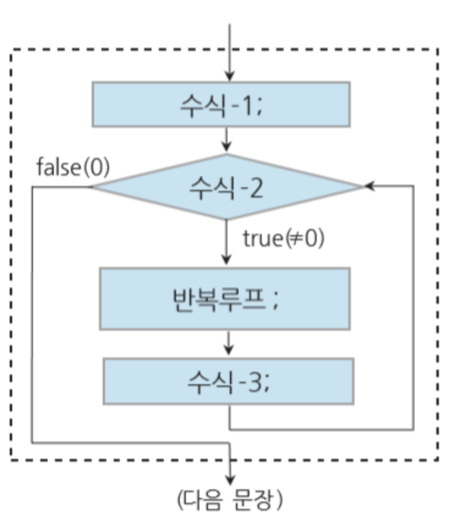
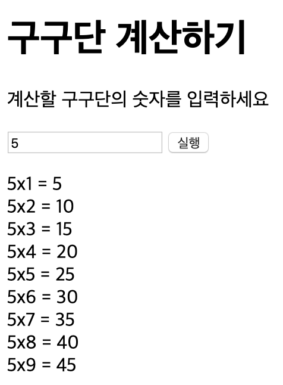

# for 문

```js
/* 
for (초기값; 조건문; 증감값) {
            반복할 문장;
        }; 
*/
let sum = 0;
for (i = o; i <= 10; i++) {
  sum = sum + i;
}
document.write(sum);
```

for(수식1; 수식2; 수식3;){
반복루프;
}


## 실습

1. for문을 이용하여 10에서 25까지 합을 구하시오

```js
let sum = 0;
// i값을 let으로 선언하는 것과 var(전역변수)로 선언하는 것의 차이에 대해 생각해보자
for (let i = 10; i <= 25; i++) {
  console.log(i);
  sum = sum + i;
}
console.log(sum);
document.write(sum);
```

2. for문을 이용하여 10에서 100까지 10, 13, 16 3씩 증가하는 합을 구하시오

```js
let sum = 0;
for (let i = 10; i <= 100; i += 3) {
  console.log(i);
  sum = sum + i;
}
console.log(sum);
document.write(sum);
```

3. 사용자에게 2~9 사이의 숫자를 입력받아 구구단을 출력하는 스크립트를 작성하시오

```html
<!DOCTYPE html>
<html lang="en">
  <head>
    <meta charset="UTF-8" />
    <meta name="viewport" content="width=device-width, initial-scale=1.0" />
    <meta http-equiv="X-UA-Compatible" content="ie=edge" />
    <title>Document</title>
  </head>

  <body>
    <h1>구구단 계산하기</h1>
    <p>계산할 구구단의 숫자를 입력하세요</p>
    <input type="number" id="gugu" />
    <button onclick="gugudan();">실행</button>
    <p id="result"></p>

    <script>
      function gugudan() {
        let x = document.getElementById("gugu").value;
        // console.log(x);
        var sum = "";
        for (let i = 1; i <= 9; i++) {
          var y;
          y = x * i;
          sum = sum + " " + x + "x" + i + " = " + y + "<br>";
          console.log(y);
          document.getElementById("result").innerHTML = sum;
        }
      }
    </script>
  </body>
</html>
```

각 단이 끝날 때 마다 스트링을 sum에 추가해주는 방식으로 표현한다


