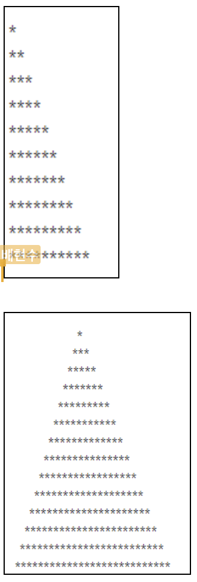

# while 문

```js
while (조건식) {
            반복할 문장
        }
```

---

### do while 문

일단 실행 후 조건이 맞으면 반복하고 아니면 중지하는 반복문

```js
do {
   반복할 문장
        } while (조건문);
```

---

## 실습



```html
<!DOCTYPE html>
<html lang="en">
  <head>
    <meta charset="UTF-8" />
    <meta name="viewport" content="width=device-width, initial-scale=1.0" />
    <meta http-equiv="X-UA-Compatible" content="ie=edge" />
    <title>Document</title>
  </head>

  <body>
    <h1>별 트리 만들기 실습</h1>
    <p id="tree"></p>

    <script>
      let x = "*";
      let y = "";
      let sum = "";
      for (let i = 0; i <= 10; i++) {
        console.log(i);
        y = y + x;
        console.log(y);
        sum = sum + y + "<br>";
      }
      document.getElementById("tree").innerHTML = sum;
    </script>
  </body>
</html>
```

```html
<!DOCTYPE html>
<html lang="en">
  <head>
    <meta charset="UTF-8" />
    <meta name="viewport" content="width=device-width, initial-scale=1.0" />
    <meta http-equiv="X-UA-Compatible" content="ie=edge" />
    <title>Document</title>
  </head>

  <body>
    <h1>별 트리 만들기 실습2</h1>
    <p id="tree"></p>

    <script>
      let x = "*";
      let ast = "";
      let sum = "";
      for (let i = 1; i <= 5; i++) {
        for (j = i; j <= 5; j++) {
          document.write("&nbsp;");
        }
        for (k = 1; k <= 2 * i - 1; k++) {
          document.write("*");
        }
        document.write("<br>");
      }
    </script>
  </body>
</html>
```
