# 객체

## 객체란?

- 자바스크립트는 객체 기반 언어이다
- 객체는 속성과 메소드로 구성
- 자바스크립트 객체는 내장객체, 브라우저 객체 모델(BOM), 도큐먼트 객체 모델(DOM) 등이 있다
- 일반적으로 같은 유형의 객체들은 속성값은 다르지만 메소드를 공유

### 자바스크립트 객체 분류

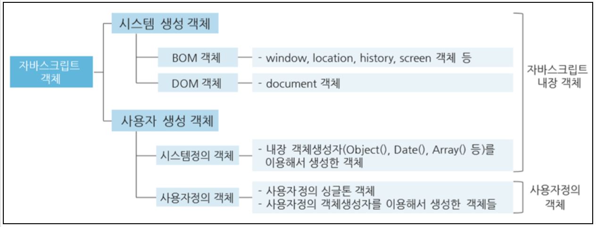

### 자동차 객체 (예시)

- 속성 : 배기량, 모델명, 색상, 차종 등
- 메소드 : start(), drive(), break(), stop()

## 객체 생성

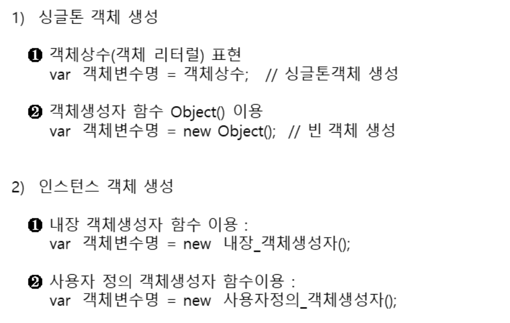

### 싱글톤 객체 생성

- 변수와 객체의 차이 (일반 변수는 하나의 값을 저장, 객체는 더 많은 정보 저장 가능)

```js
// 일반변수
var car = "fiat";

// 객체
var carobj = { type: "Fiat", model: "500", color: "white" };
f;
```

### 객체 정의

리터럴로 객체 정의 (싱글톤 객체, 객체 상수, 객체 리터럴)

- 메소드가 없는 순수 데이터형 객체 정의에 주로 사용

```js
var person = { firstName: "John", lastName: "Doe", age: 50, eyeColor: "blue" };

var person = {
  firstName: "John",
  lastName: "Doe",
  age: 50,
  eyeColor: "blue"
};
```

### 객체 속성 접근

```js
var name = person.lastName;

var age = person["age"];
```

### 객체 함수(메소드)

```js
// 선언
var person = {
 firstName: "John",
 lastName : "Doe",
 id : 5566,
 fullName : function() {
   return this.firstName + " " + this.lastName;

};

// 사용
var fullName = person.fullName();
var fullNameFunc = person.fullName;   // 함수 자체를 변수에 저장
```

### new Object()로 생성

```js
<script>
       var tv = new Object();

       tv.width = "150cm";
       tv.height = "100cm";
       tv.weight = "8kg";
       tv.color="white";
       tv.off = function () {
           document.write("전원 off", "<br />")


       document.write(tv.width, "<br />");
       document.write(tv.height, "<br />");
       document.write(tv.weight, "<br />");
       document.write(tv.color, "<br />");

       tv.off();
   </script>
```

## 내장 객체

- 브라우저의 자바스크립트 엔진에 내장된 객체
- 필요한 경우 new 생성자를 통해 인스턴스를 생성해서 사용

### Date 객체

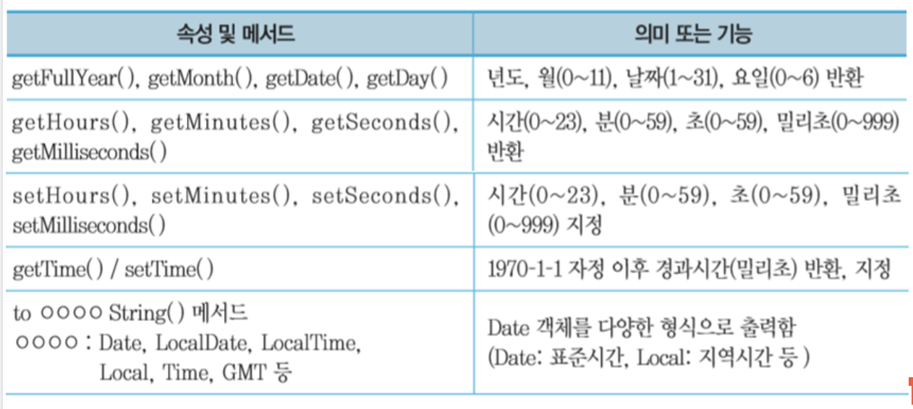

```js
var d1 = new Date(); // ❶ 현재 날짜 및 시간 표시
var d2 = new Date(2018, 0, 1, 0, 0, 1); // ❷ 2018년 1월 1일 0시 0분 1초 표시
var d3 = new Date(500000000000); // ❸ 1970년 1월 1일 이후의 경과시간(밀리초) 표시
var d4 = new Date(2000, 12, 25); // ❹ 지정된 시간(dateString) 표시

document.write(d1 + "<br>");
document.write(d2 + "<br>");
document.write(d3 + "<br>");
document.write(d4 + "<br>");
```

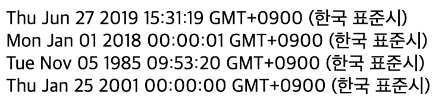

### Date 생성 및 차이 계산

```js
<script>
       var d1 = new Date();                // 현재 날짜 및 시간 표시
       var d2 = new Date(2018, 0, 1, 0, 0, 1);     // 2018년 1월 1일 0시 0분 1초 표시
       var d3 = new Date(500000000000);    // 1970년 1월 1일 이후의 경과시간(밀리초) 표시
       var d4 = new Date(2000, 12, 25);    // 지정된 시간(dateString) 표시

       document.write(d1+"<br>");
       document.write(d2+"<br>");
       document.write(d3+"<br>");
       document.write(d4+"<br>");

       // 날짜 차이
       var difference = d1.getTime() - d4.getTime(); // date1이 date2 보다 최근시간으로 가정함
       differenceDate=difference/(1000*60*60*24); // date1, date2 사이의 일수 차이
       differenceDate = parseInt(differenceDate);
       document.write(d1, " 와 ", d4, "는 <br>" )
       document.write(differenceDate, " 일 차이가 납니다.");
   </script>

```

## Math 객체

- 수학의 상수와 함수들을 나타내는 객체
- Math 객체는 new 생성자를 제공하지 않음(생성없이 사용 가능)


### 난수 발생 (Math.random())

```js
// 특정 구간 정수 난수 발생 공식
Math.floor(Math.random() * (최대값 - 최소값 + 1)  + 최소값
```

```js
 <script>
       var random1 = Math.random();        // 0 ~ 1 까지 난수
       var random2 = Math.random() * 10;   // 0 ~ 10 까지 난수
       var random3 = Math.floor(Math.random()*11);     // 0 ~ 10 까지 정수 난수
       var random4 = Math.floor(Math.random()*31) + 120; // 120 ~ 150 정수 난수

       document.write(random1, "<br>");
       document.write(random2, "<br>");
       document.write(random3, "<br>");
       document.write(random4, "<br>");

   </script>
```

## String 객체

- 문자열 데이터 취급
- 자바스크립트에서 가장 많이 사용되는 객체
- 문자열로 생성하고 추후 메소드를 사용시 객체 타입으로 자동 전환

### 문자열과 문자 객체

```js
<script>
       var str1 = "Normal string";
       var str2 = new String("String Object");

       document.write(typeof str1, "<br>");    // string
       document.write(typeof str2, "<br>");    // object
   </script>
```

### 주요 제공 함수

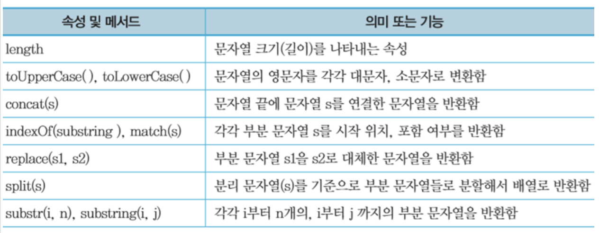

```js
<script>
       var str = "Hello Thank you good luck to you";
       document.write(str.charAt(16), "<br>");
       document.write(str.indexOf("you"), "<br>");
       document.write(str.indexOf("you", 16), "<br>");
       document.write(str.lastIndexOf("you"), "<br>");
       document.write(str.lastIndexOf("you", 25), "<br>");
       document.write(str.match("luck"), "<br>");
       document.write(str.search("you"), "<br>");
       document.write(str.substr(21, 4), "<br>");
       document.write(str.substring(6, 12), "<br>");
       document.write(str.replace("you", "me"), "<br>");
       document.write(str.toLowerCase(), "<br>");
       document.write(str.toUpperCase(), "<br>");
       document.write(str.length, "<br>");

       var arr = str.split(" ");
       document.write(arr[0], "<br>");
       document.write(arr[4], "<br>");

       document.write(str.charCodeAt(0), "<br>");
       document.write(String.fromCharCode(72), "<br>");
   </script>
```

## Number 객체

- 수치형 자료 표현

```js
var num1 = 92; // 수치값 92(number형) 저장
var num2 = new Number(256); // Number 객체 256 생성후 저장
```

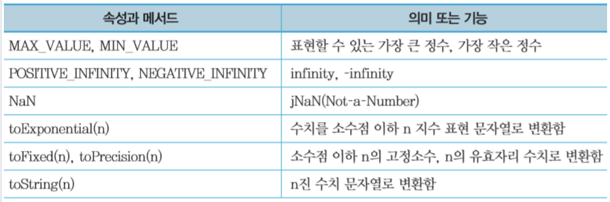

## Object 객체

- 모든 객체들의 최상위 객체
- 자바스크립트 모든 객체들은 이 객체의 속성과 메소드를 상속받음

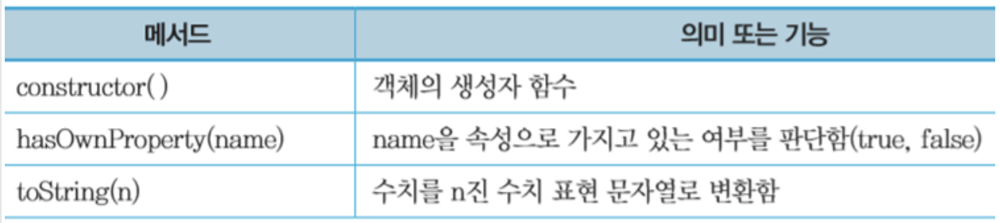

```js
   <script>
       var obj = new Object();

       obj.name = "홍길동";
       obj.major = "컴퓨터공학";

       document.write("obj의 constructor: ");
       document.write(obj.constructor + "<br>");

       document.write("obj의 toString():  ");
       document.write(obj.toString()); // 상속 메서드
       document.write("<br>");

       // toString() 재정의
       obj.toString = function () {
           document.write("{ name: " + this.name + ", major: " + this.major + " }<br>");
       };

       document.write("obj의 toString(): ");
       document.write(obj.toString()); // 재정의 메서드
   </script>
```

## BOM

웹 브라우저는 웹문서를 로드하면, 현재 웹 브라우저와 관련된 정보들을 객체로 표현해서 제공함

- window객체 : 현재 열린 웹 브라우저 윈도우 관련 정보
- Document 객체 : 웹 브라우저에 로드된 HTML 문서 정보 (HTML DOM)
- Location 과 history 객체 : 현재 윈도우의 방문 이력과 이동 관련 정보를 지원함
- Navigator, screen 객체 : 웹 브라우저와 모니터 정보를 제공함.

### window 객체

- 브라우저 객체의 최상위 객체.
- 자바스크립트 코드에 정의하는 모든 전역변수와 함수, 객체들은 자동으로 window 객체의 멤버
- window.alert(), window.confirm(), window.prompt()
- Window객체는 window를 열 때마다 생성되고, 닫으면 소멸됨

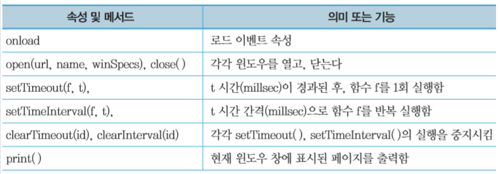

### window.open

- window.open(“url경로”, “창이름”, “옵션”);

  - Url 경로 : 새창에서 열 파일이름 혹은 url 경로
  - 창 이름 : 팝업을 띄울 창 이름 지정
  - 옵션 설정 : 팝업 창의 크기, 높이, 위치, 도구상자 노출 여부 등을 설정

```html
<!DOCTYPE html>
<html lang="en">
  <head>
    <meta charset="UTF-8" />
    <meta name="viewport" content="width=device-width, initial-scale=1.0" />
    <meta http-equiv="X-UA-Compatible" content="ie=edge" />
    <title>Document</title>
  </head>

  <body>
    <h1>window 객체 테스트</h1>
    <button onclick="win_open();">윈도우 오픈</button>
    <button onclick="win_move();">윈도우 이동</button>
    <button onclick="win_resize();">윈도우 크기변경</button>
    <button onclick="win_close();">윈도우 닫기</button>

    <script>
      var targetWindow;

      function win_open() {
        targetWindow = window.open(
          "http://127.0.0.1:5500/JavaScript/ex23.html",
          "pop1",
          "width=400, height=500, left=50, top=10, \
            scrollbars=no, toolbars=no, location=no"
        );
      }

      function win_move() {
        alert(targetWindow);
        targetWindow.moveTo(100, 100);
        targetWindow.focus();
      }

      function win_resize() {
        targetWindow.resizeTo(600, 400);
        targetWindow.focus();
      }

      function win_close() {
        targetWindow.close();
      }
    </script>
  </body>
</html>
```

### setInterval() / clearInterval()

- setInterval : 일정한 시간간격으로 스크립트 실행 반복
- clearInterval : setInterval 취소할 때 사용

```js
<script>
       // var 참조변수 = setInterval("스크립트 실행문;", 시간 간격);
       // clearInterval(참조변수);

       var i = 0;
       // 3초마다 증분
       var autolog = setInterval("console.log(i++);", 3000);

// 버튼을 추가해서 myfunc()를 누르면 인터벌 초기화
       function myfunc() {
           clearInterval(autolog);
       }
   </script>
```

### setTimeout() / clearTimeout()

```js
var 참조변수 = setTimeout("스크립트 실행문", 시간 간격);
       cleartimeout(참조변수);
```

```js
<script>
       //var 참조변수 = setTimeout("스크립트 실행문", 시간 간격);
       //cleartimeout(참조변수);

       var i = 0;
       var autolog = setTimeout("dosomething()", 3000);

       function dosomething() {
           console.log(i++);
           autolog = setTimeout("dosomething()", 3000);
       }

       function myfunc() {
           clearTimeout(autolog);
       }
   </script>
```

### window.print() - 프린트 출력

### screen 객체

- 컴퓨터 모니터 정보

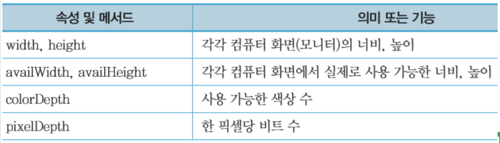

```html
<script>
  document.write("screen width = ", screen.width, "<br>");
  document.write("screen height = ", screen.height, "<br>");
  document.write("screen availWidth = ", screen.availWidth, "<br>");
  document.write("screen availHeight = ", screen.availHeight, "<br>");
  document.write("screen colorDepth = ", screen.colorDepth, "<br>");
</script>
```

### location 객체

- 웹 브라우저의 주소 표시 영역
- 주소창을 동적으로 처리 가능

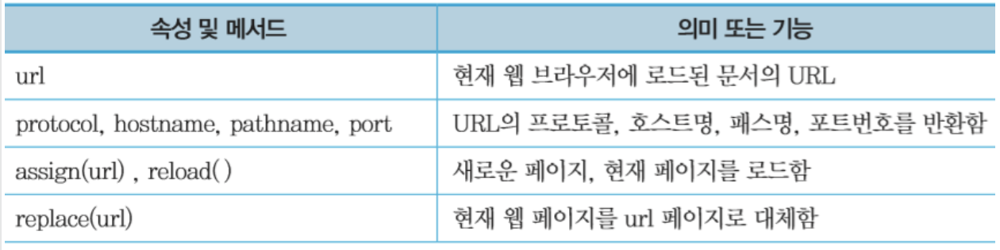

- location='url'; 또는 location.href='url'; // url로 지정한 문서를 로드함
- location.assign('url'); // url로 지정한 문서를 로드함
- location.replace(); // url로 지정한 문서를 로드함
- location.reload(); // 현재 문서를 다시 로드함

```html
<h1>location 객체</h1>
<hr />
<button onclick="myfunc()">버튼</button>
<script>
  function myfunc() {
    location.href = "https://www.naver.com";
  }
</script>
```

### history 객체

- 웹 브라우저의 히스토리 정보

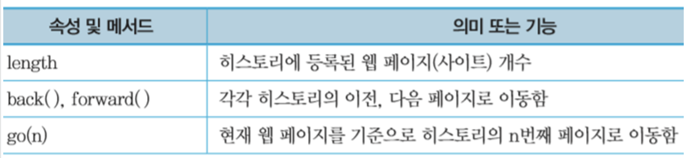

### navigator 객체

- 사용자의 운영체제 정보 및 브라우저 정보

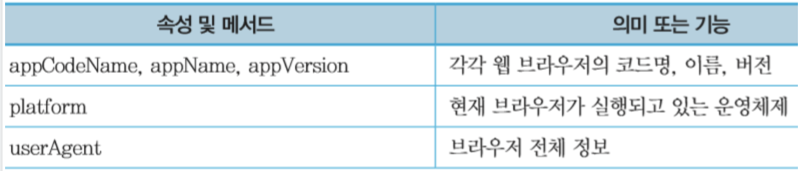

```html
<script>
  var output = "";
  for (var info in navigator) {
    output = output + info + ":" + navigator[info] + "<br>";
  }
  document.write(output);
</script>
```

---

## 실습

1. 오늘부터 올해 12/31일까지 남은 일 수 계산하기

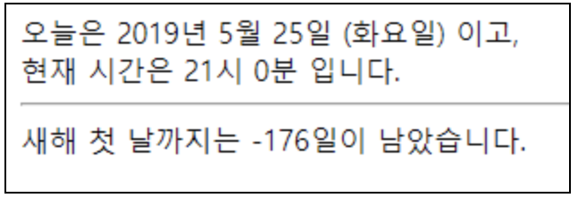

```html

```

2. 숫자 맞추기 게임(난수 적용)

3) 로또 번호 생성기

4. 가위/바위/보 게임

5. 사용자로부터 email 주소를 입력받아 @ 앞뒤 분리

6. 다음 문장에서 각 알파벳의 개수를 배열에 저장해서 출력할것
   (총 단어는 몇 개 인지, 각 단어는 몇 개씩 있는지 배열에 저장)

Lorem Ipsum is simply dummy text of the printing and typesetting industry. Lorem Ipsum has been the industry's standard dummy text ever since the 1500s, when an unknown printer took a galley of type and scrambled it to make a type specimen book. It has survived not only five centuries, but also the leap into electronic typesetting, remaining essentially unchanged. It was popularised in the 1960s with the release of Letraset sheets containing Lorem Ipsum passages, and more recently with desktop publishing software like Aldus PageMaker including versions of Lorem Ipsum.

```html
<!DOCTYPE html>
<html lang="en">
  <head>
    <meta charset="UTF-8" />
    <meta name="viewport" content="width=\, initial-scale=1.0" />
    <meta http-equiv="X-UA-Compatible" content="ie=edge" />
    <title>Document</title>
  </head>

  <body>
    <script>
      var data = `Lorem Ipsum is simply dummy text of the printing and typesetting industry. Lorem Ipsum has been the industry's standard dummy text ever since the 1500s, when an unknown printer took a galley of type and scrambled it to make a type specimen book. It has survived not only five centuries, but also the leap into electronic typesetting, remaining essentially unchanged. It was popularised in the 1960s with the release of Letraset sheets containing Lorem Ipsum passages, and more recently with desktop publishing software like Aldus PageMaker including versions of Lorem Ipsum.`;

      // 1. 문자를 대문자 혹은 소문자로 변환시킨다
      data = data.toUpperCase();

      // 2. 알파벳을 객체로 담기위해 객체 변수를 만든다
      var alphabet = {};

      // 3. for문을 이용하여 알파벳 한 글자씩 나눠서 alphabet 변수에 담는다. 숫자 및 특수기호는 건너뛰기 위해서 if~else 문을 이용하고 continue를 사용한다

      for (let i = 0; i < data.length; i++) {
        let char = data[i];
        if (char == " ") continue;
        if (char == ",") continue;
        if (char == ".") continue;
        if (char == "'") continue;
        if (char >= 0 && char <= 9) continue;

        // 만약 객체 alphabet의 키 값 char의 밸류 값이 없을 경우 키값에 char, 밸류 1을 입력한다.
        if (!alphabet[char]) {
          alphabet[char] = 1;
        } else {
          // 만약 char의 밸류값이 있을경우 증분 시킨다
          alphabet[char]++;
        }
        console.log(alphabet);
      }

      // document에 출력하기 위한 참조사항
      var data2 = {
        key1: "data1",
        key2: "data2",
        key3: "data3"
      };
      // Object 함수의 keys 메소드를 이용하여 data2의 키값을 배열로 출력한다
      console.log(Object.keys(data2));
      // data2의 key1 값의 밸류를 출력
      console.log(data2["key1"]);

      // for문을 이용하여 배열에 출력 할 때 아래를 참조한다
      console.log(data2[Object.keys(data2)[i]]);
    </script>
  </body>
</html>
```

7. 아래와 같은 타이머를 만드시오
   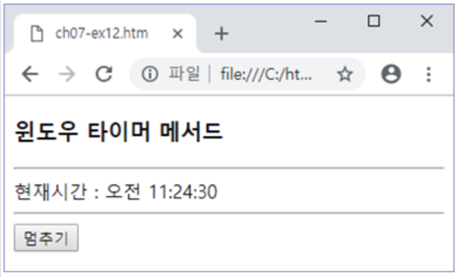
