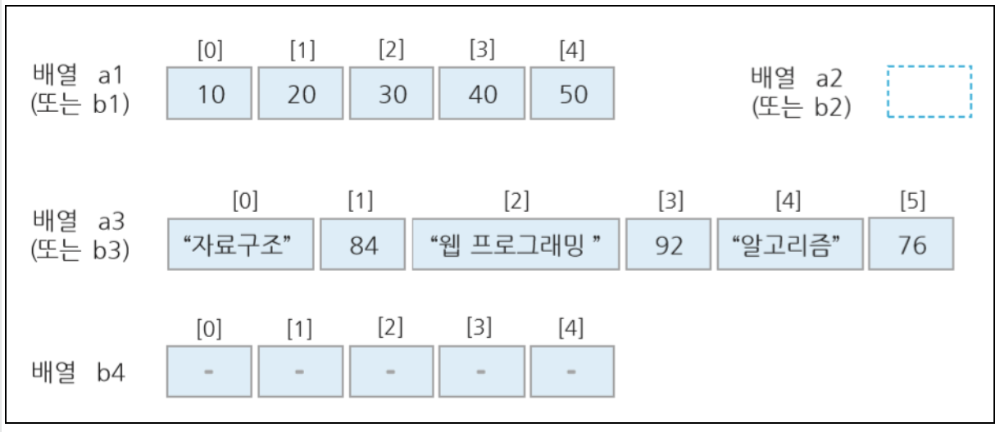

# 배열

- 연속된 여러개의 메모리공간을 확보하여 하나의 저장소로 관리
- 0번부터 인덱스를 사용해서 접근 가능
- 자바스크립트 배열은 미리 ㅓㅇ의하지 않고 사용할 수 있고,
- 배열 크기도 동적으로 변경 가능
- 배열 원소들의 자료형이 같지 않아도 됨
- 배열 원소에 다른 객체 저장 가능

## 배열 정의 방법

### 리터럴들을 나열한 배열 정의

❶ var a1 = [10, 20, 30, 40, 50]; // 크기 5 인 배열 생성  
❷ var a2 = []; // 빈 배열 생성  
❸ var a3 = ["자료구조", 84, "웹 프로그래밍", 92, "알고리즘", 76]; // 크기 6 인 배열 생성

### 객체생성자함수 Array()를 이용한배열정의

❹ var b1 = new Array(10,20,30,40,50); // ❶과 같음  
❺ var b2 = new Aarray(); // ❷와 같음  
❻ var b3 = new Array("자료구조", 84, "웹 프로그래밍", 92, "알고리즘", 76); // ❸과 같음  
❼ var b4 = new Aarray(5); // 크기가 5 인 배열 생성함



```js
// 변수 a에 빈 배열을 생성한다
var a = [];

// 변수 a의 0번째 인자에 1을 입력한다.
a[0] = 1;

a[1] = "name";

a[2] = "kimkihong";
```

```js
<script>
    var months = [1, 2, 3, 4, 5, 6, 7, 8, 9, 10, 11, 12];
    var days = ["Sun", "Mon", "Tue", "Wen","Thu", "Fri", "Sat"];
    var season = ["봄", "여름", "가을", "겨울"];

    document.write("월 : " + months + "<br>"); // 배열명 참조
    document.write("요일 : " + days + "<br>"); // 배열명 참조
    document.write("<hr>" + season.length + " 계절 종류 : ");
    for (i = 0; i<season.length; i++){
        document.write(season[i] + ' '); // 배열원소 참조
    }
    </script>
```

배열을 그대로 불러오면 인자 값 사이에 , 가 자동으로 붙게 된다.
for 문을 이용하여 하나씩 불러와서 나열 할 수도 있다.

```js
<script>
        var months = [1, 2, 3, 4, 5, 6, 7, 8, 9, 10, 11, 12];
        var days = ["Sun", "Mon", "Tue", "Wen", "Thu", "Fri", "Sat"];
        var season = ["봄", "여름", "가을", "겨울"];

        document.write("월 : " + months + "<br>"); // 배열명 참조
        document.write("요일 : " + days + "<br>"); // 배열명 참조
        document.write("<hr>" + season.length + " 계절 종류 : ");
        for (i = 0; i < season.length; i++) {
            document.write(season[i] + ' '); // 배열원소 참조
        };
        document.write("<br>");
        document.write("<hr>" + season.length + " 계절 종류 : ");
        season.forEach(function (value) {
            document.write(value, " ");
        });

        document.write("<br>");
        document.write("<hr>" + season.length + " 계절 종류 : ");
        for (var i in season) {
            document.write(season[i] + ' ');
        }
    </script>
```

### forEach 이터레이션

```html
<!DOCTYPE html>
<html lang="en">
  <head>
    <meta charset="UTF-8" />
    <meta name="viewport" content="width=device-width, initial-scale=1.0" />
    <meta http-equiv="X-UA-Compatible" content="ie=edge" />
    <title>Document</title>
  </head>

  <body>
    <h2>Javascript Array.forEach()</h2>
    <p id="demo"></p>
    <p id="demo2"></p>
    <script>
      var txt = "";
      var numbers = [45, 4, 9, 16, 25];

      // forEach 1
      numbers.forEach(function(value, index, array) {
        txt = txt + value + ", ";
      });
      document.getElementById("demo").innerHTML = txt;
      console.log(txt);

      txt = "";
      numbers.forEach(function(value) {
        txt = txt + value + ", ";
      });
      document.getElementById("demo2").innerHTML = txt;
    </script>
  </body>
</html>
```

```html
<!DOCTYPE html>
<html lang="en">
  <head>
    <meta charset="UTF-8" />
    <meta name="viewport" content="width=device-width, initial-scale=1.0" />
    <meta http-equiv="X-UA-Compatible" content="ie=edge" />
    <title>Document</title>
  </head>

  <body>
    <h2>Javascript Array.forEach</h2>
    <p id="demo"></p>

    <script>
      var txt = "";
      var number = [45, 4, 9, 16, 25];

      for (var i in number) {
        txt = txt + number[i] + ", ";
      }
      document.getElementById("demo").innerHTML = txt;
    </script>
  </body>
</html>
```

```html
<!DOCTYPE html>
<html lang="en">
  <head>
    <meta charset="UTF-8" />
    <meta name="viewport" content="width=device-width, initial-scale=1.0" />
    <meta http-equiv="X-UA-Compatible" content="ie=edge" />
    <title>Document</title>
  </head>

  <body>
    <script>
      let score = [10, 20, 30, 40, 50];
      let data = new Array(10, 20, 30); // 배열 [10, 20, 30]과 동일
      let data2 = []; // 빈 배열을 생성
      let data3 = new Array(); // 빈 배열을 생성
      let data4 = new Array(10); // new Array(); 명령을 실행 할 때 인자 값을 하나만 주면 배열에 담긴 값이 아닌 빈 배열 인자 10개를 입력한다
      let data5 = ["Hello", 1, 3.14, [3, 4], new Array(10, 20)]; // 배열 안에 배열을 담을 수 있다

      document.write(score[0], " ", score[1], " ", score[3], "<br>");
      document.write(data5[0], ", ", data5[3][1], ", ", data5[4], ", ");

      // for 문을 이용하여 배열을 순서대로 출력하기
      for (let i = 0; i < data5.length; i++) {
        document.write("[" + i + "] = ", data5[i], "<br>");
      }

      console.log(score);
      console.log(data);
      console.log(data2);
      console.log(data3);
      console.log(data4);
      console.log(data5);
      console.log(data5[0], ", ", data5[3][1], ", ", data5[4], ", ");
      /*
                score.push(100); // score 변수에 100을 배열 마지막에 담는다
                score.push(50); // score 변수에 50을 배열 마지막에 담는다
                score.push("Hello"); // string "Hello"를 담는다
                console.log(score);

                score.pop(); // 배열 마지막 값을 잘라낸다
                score.pop(); // 배열 마지막 값을 잘라낸다
                let data_a = score.pop(); // 배열 마지막 값을 잘라내어 data_a 변수에 저장한다
                let data_b = score[0];
                console.log(data_a);
                console.log(data_b);
                console.log(score);
                */
      let data_a = score.shift(); // shitf()는 pop()과 반대로 배열 제일 앞 값을 잘라낸다.
      console.log(data_a);
      console.log(score);
      score.unshift(100); // 앞에 데이터를 추가
      console.log(score);

      let data_b = score.slice(2, 4);
      console.log(data_b);
      console.log(score);

      // 중간에 데이터를 추가하고 싶을 때 splice(); 메소드 사용
      score.splice(2, 0, 1000); // 배열 3번째에 0개를 삭제하고 1000을 추가
      console.log(score);
      score.splice(3, 2, 5000); // 배열 4번째에 2개를 삭제하고 5000을 추가
      console.log(score);
      score.splice(1, 2); // 배열 2번째에 2개를 삭제
      console.log(score);

      console.log(score.join("----")); // 배열을 나열 할 때 연결문자를 지정 할 수 있다

      var data_d = score.concat(data5); // data5값을 score에 삽입
      console.log(data_d);
    </script>
  </body>
</html>
```

### 배열 관련 메서드

| 종류                     | 설명                                                   |
| ------------------------ | ------------------------------------------------------ |
| Join(연결문자)           | 배열요소를 연결문자로 연결해 하나의 문자열로 출력      |
| reverse()                | 배열 요소의 순서를 거꾸로 바꿔서 출력                  |
| sort()                   | 배열요소를 오름차순으로 정렬                           |
| slice(start, end)        | 배열 객체 중 일부를 잘라서 출력                        |
| splice(pos, n, data... ) | 시작 인덱스부터 size만큼 잘라내고 새로운 데이터 삽입   |
| concat()                 | 2개의 배열 객체를 하나로 결합                          |
| pop()                    | 마지막 인덱스에 저장된 데이터를 꺼내오고 배열에서 삭제 |
| push(new data)           | 배열 객체 마지막에 새 데이터 삽입                      |
| shift()                  | 첫번째 인덱스 데이터 삭제                              |
| unshift()                | 첫번째 인덱스에 데이터 추가                            |
| length                   | 배열 요소 개수 반환                                    |

### pop()

```html
<h2>JavaScript Array Methods</h2>

<h2>pop()</h2>

<p>The pop() method removes the last element from an array.</p>

<p id="demo1"></p>
<p id="demo2"></p>
<p id="demo3"></p>

<script>
  var fruits = ["Banana", "Orange", "Apple", "Mango"];
  document.getElementById("demo1").innerHTML = fruits;
  var result = fruits.pop();
  document.getElementById("demo2").innerHTML = fruits;
  document.getElementById("demo3").innerHTML = result;
</script>
```
