# DNS 서버 - ubuntu 18.04

<https://blog.lael.be/post/6308>

## 도메인 네임서버란?

Domain Name Server는 "네임서버" 또는 "DNS"라고 부른다

도메인 네임서버는 사람이 읽을 수 있는 도메인 이름을 기계가 읽을 수 있는 IP주소로 변환하는 일을 한다

도메인 네임서버는 보통 계층형으로 이루어지고 결과를 캐쉬한다

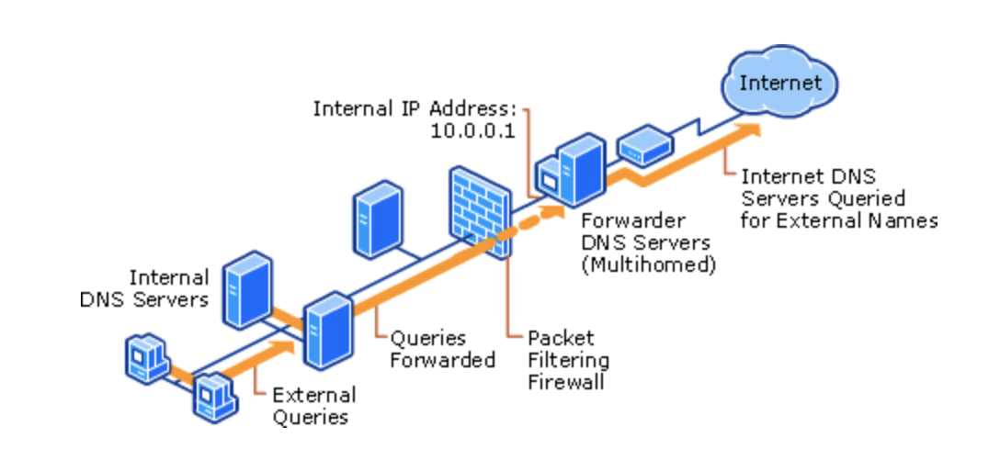
계층형 DNS

## 네임서버 구축하기

Ubuntu Linux에서 zone 파일을 구성하여 네임서버를 구축하는 방법

### 운영체제의 apt 패키지 목록 갱신

```bash
sudo apt-get update
```

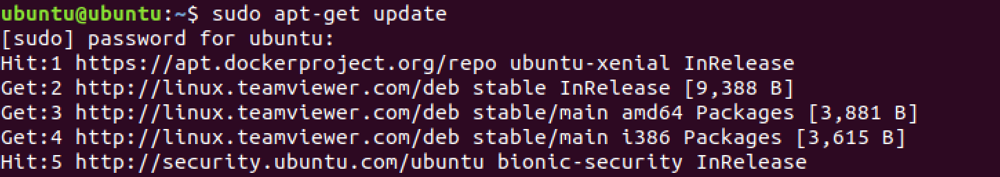

### 네임서버 소프트웨어 Bind9 설치

```bash
sudo apt-get -y install bind9
```

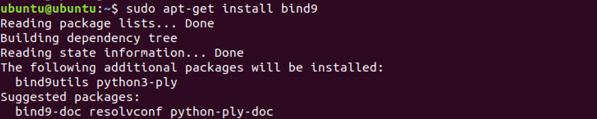

### 네임서버 서비스 켜기

```bash
service bind9 start
```

### 네임서버 서비스 상태 보기

```bash
service bind9 status
```

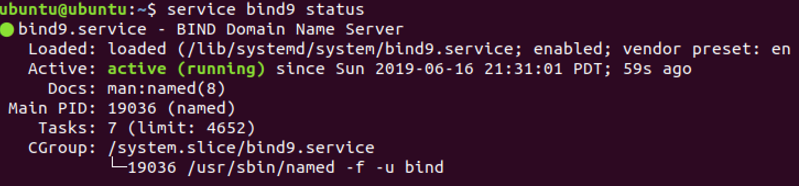

### 네임서버 서비스 테스트

설치한 네임서버 서비스에게 google.com의 아이피가 어떤 것인지 물어보는 명령어를 실행해보자


### 네임서버 환경설정

```bash
sudo vim /etc/bind/named.conf.options
```

파일의 기본 값은 다음과 같다
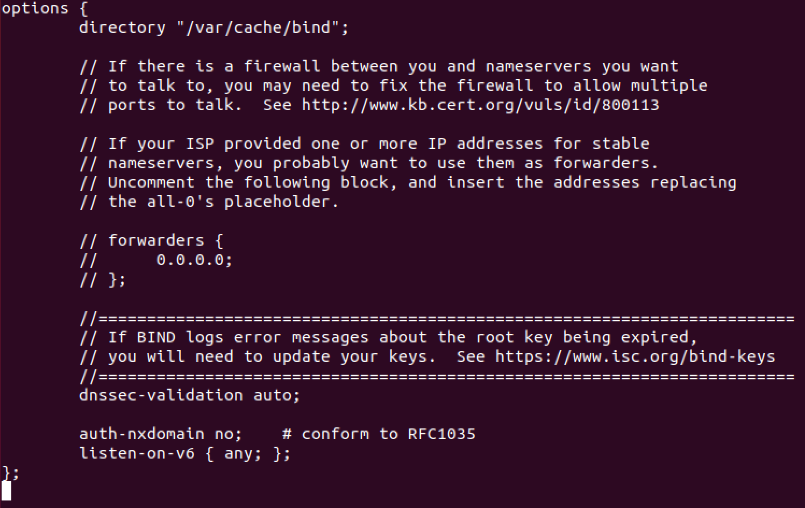

주석을 제거하면 아래와 같다
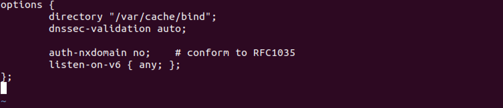

다음 내용과 같이 몇 줄을 더 추가해준다  
/etc/bind/named.conf.options

```bash
options {
    directory "/var/cache/bind";
    dnssec-validation auto;

    auth-nxdomain no;    # conform to RFC1035
    listen-on-v6 { any; };

    recursion yes;
    # recursion no;  라고 설정하면 이 서버에서 정의되지 않은 도메인 요청은 거부(REFUSE)한다. 이 경우 forward 관련 구문은 무시된다.
    # recursion yes; 라고 설정하면 이 서버에서 정의되지 않은 도메인 요청을 forwarders 서버에 전달하고 결과를 알려준다. 일반적으로 recursion yes를 많이 사용한다
    allow-transfer { none; };

    forwarders {
        # 구글의 공개 DNS 8.8.8.8, 8.8.4.4
            8.8.8.8;
            8.8.4.4;
    };
    forward only;
    allow-query { any; };
    # allow-query 는 DNS 요청을 허용할 IP 주소이다. any 는 모든 IP 에 대하여 호출 허용한다는 뜻.
    # 접근 허용 IP 제한은 네트워크 방화벽 또는 클라우드 방화벽 또는 iptables 방화벽 등에서 적절히 설정하자. (udp 53번 포트)

};
```

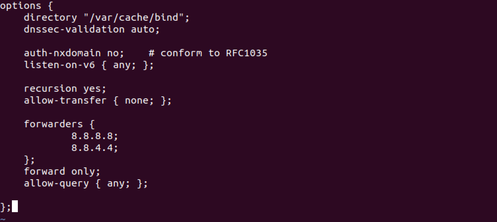

### 도메인 네임 zone 파일 추가

```bash
sudo vim /etc/bind/named.conf.local
```

1차 도메인 주소를 적는다. 이 도메인 주소의 모든 서브도메인을 관리한다

```bash
zone "naver.com" { type master; file "/etc/bind/db.naver.com"; };
```

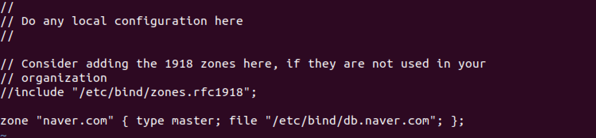

### 도메인 네임 세부 값 설정

```bash
sudo vim /etc/bind/db.naver.com
```

```bash
$TTL    86400
@   IN  SOA localhost. root.localhost. (
                  1     ; Serial
             14400      ; Refresh
              14400     ; Retry
            1209600     ; Expire
              86400 )   ; Negative Cache TTL
@   IN  NS  localhost.
# A 레코드 google.com의 ip주소 172.217.31.142
@   IN  A   172.217.31.142
blog   IN  A   172.217.31.142
```

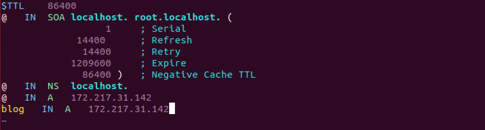

### 구문 오류 테스트

```bash
named-checkconf

named-checkzone naver.com /etc/bind/db.naver.com
```


### 변경사항 적용

```bash
service bind9 reload
```

### 방화벽 설정

네임서버 표준 포트는 UDP 53이다. 접근 제어 권한을 설정하자

```bash
# 53번 포트 허용
sudo ufw allow 53
```

### 사용하기

네임서버를 사용할 pc로 이동한 후 네트워크 설정을 한다
테스트 환경은 우분투 19.04이다.
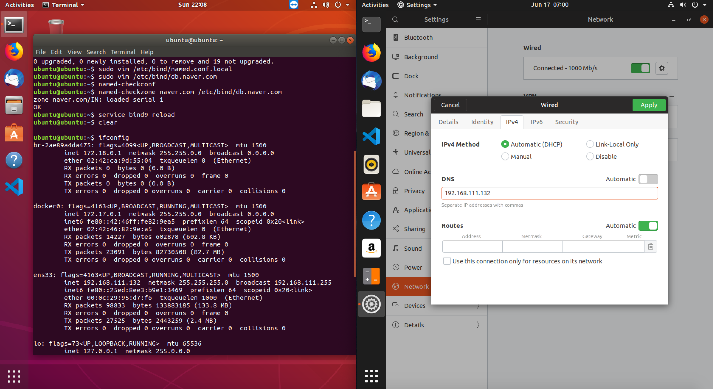

네임 서버를 위와 같이 변경한 컴퓨터에서 naver.com 및 blog.naver.com 이동시 다음과 같이 google.com 페이지가 나타나면 성공

인데 실패함;;
방법을 찾아보자
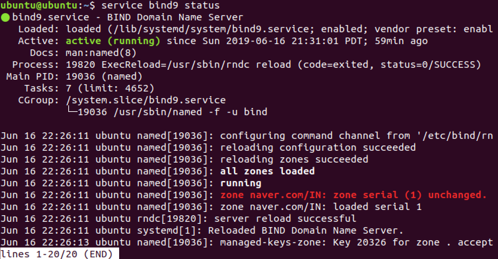

### 응용

개인정보를 가로채는 피싱(phishing) 사이트 만들때 위와 같이 작업한다.

공유기 내부의 사내 서버를 도메인 접근하고 싶을 때 사용한다.

회사 구성원끼리 개발 사이트를 정의할 때 사용된다. (각 PC의 host 파일을 변경할 필요가 없어진다.)

## 네임서버 확인

```bash
# 네임서버의 IP 정보를 확인
nslookup

# 현재 Server에 설정되어 있는 네임 서버 확인
> server

# google ip 확인
> www.google.com

# blochaid ip 확인
> blochaid.io
```

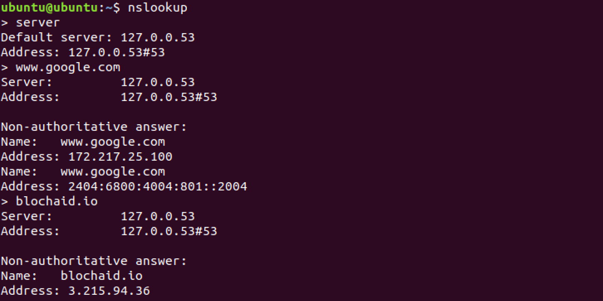

```bash
# 네임서버가 설정된 파일을 확인한다
cat /etc/resolv.conf
```

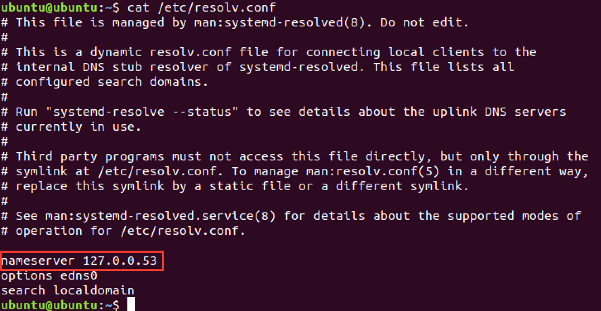
resolv.conf 파일을 잘못 수정하면 도메인을 ip로 변환할 수 없으므로 인터넷 연결이 되지 않는다

```bash
# resolve 상태를 확인한다. uplink DNS 서버에 대한 상태를 알려준다
systemd-resolve --status
```

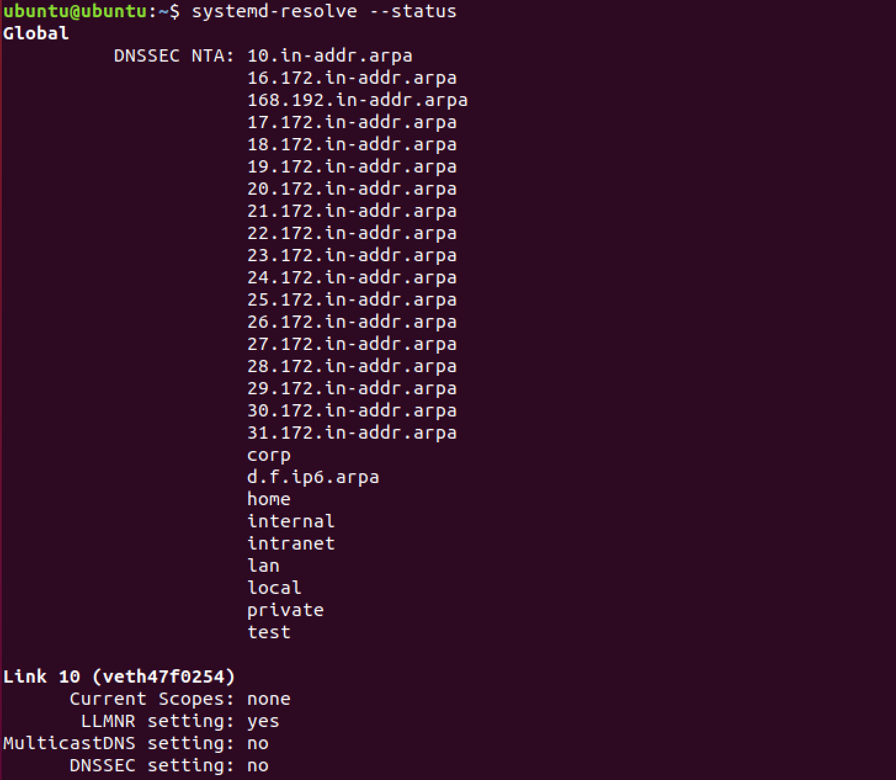

uplink DNS 를 바꾸려면 `systemd-resolve` 데몬이 이를 수행하는데, 다음과 같은 위치의 파일들을 읽어서 동작한다

```bash
/etc/systemd/resolved.conf
/etc/systemd/resolved.conf.d/*.conf
/run/systemd/resolved.conf.d/*.conf
/usr/lib/systemd/resolved.conf.d/*.conf
```

Ubuntu 18.04 에서는 `/etc/systemd/resolved.conf` 파일이 존재한다

```bash
sudo vim /etc/systemd/resolved.conf
```

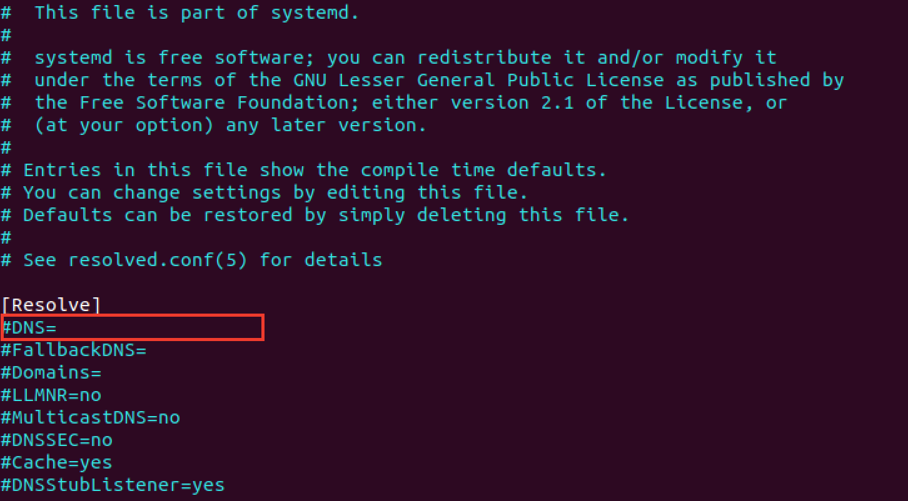
`DNS=` 행에 DNS 서버를 `space`로 구분해서 리스트로 적어놓을 수 있다

`DNS=8.8.8.8` 을 입력하고 `systemctl restart systemd-resolved`를 하면 적용된다
