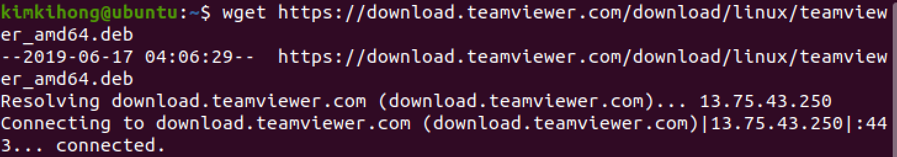
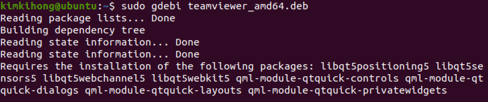
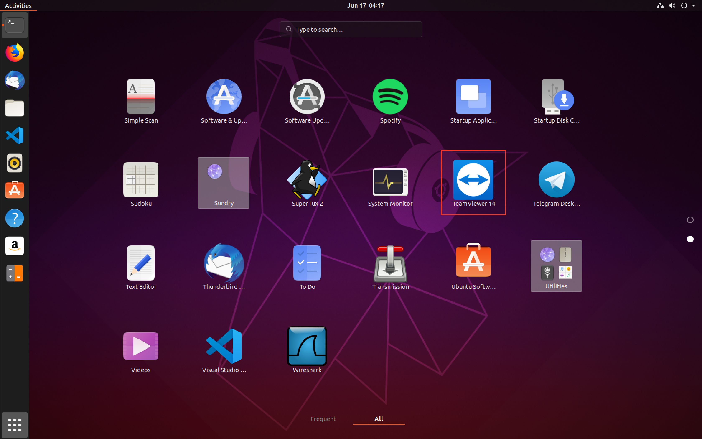
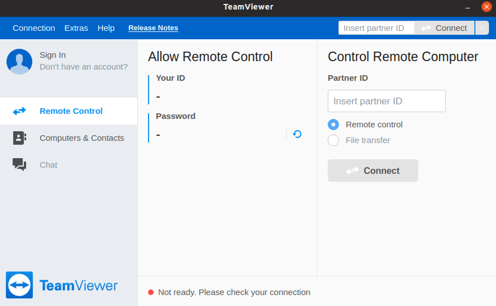
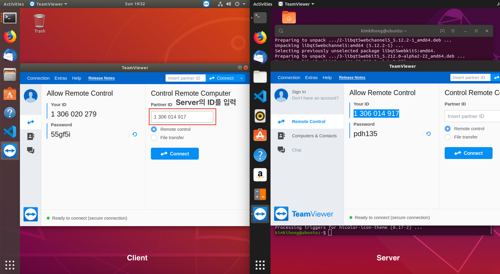
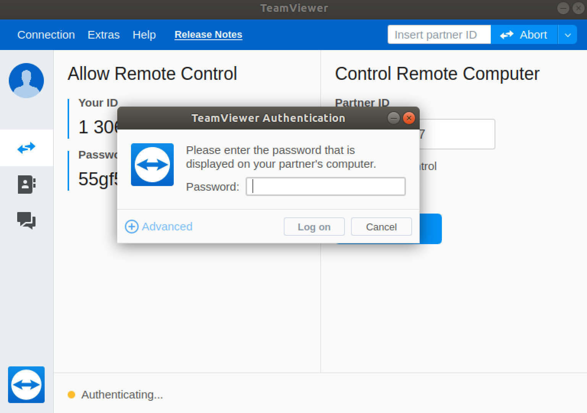
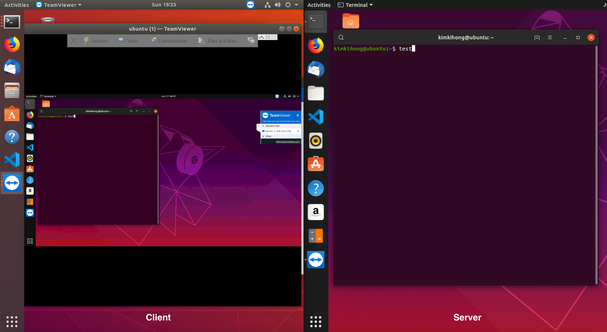

# TeamViewer 설치하기

<https://www.teamviewer.com/ko/download/linux/>

```bash
wget https://download.teamviewer.com/download/linux/teamviewer_amd64.deb
```


deb 패키지 설치를 위해 gdebi 패키지를 설치

```
sudo apt install gdebi-core
```


gdebi 를 이용해 팀뷰어 deb 파일을 설치

```bash
sudo gdebi teamviewer_amd64.deb
```



애플리케이션을 실행한다


실행되었다


---

## 팀뷰어 클라이언트에서 접속


클라이언트에서 팀뷰어 애플리케이션을 실행시키고 Control Remote Computer에서 Server ID를 입력해준다


비밀번호를 입력한다


클라이언트에서 서버로 접속이 되었다
이제 클라이언트에서 서버를 제어 할 수 있다
