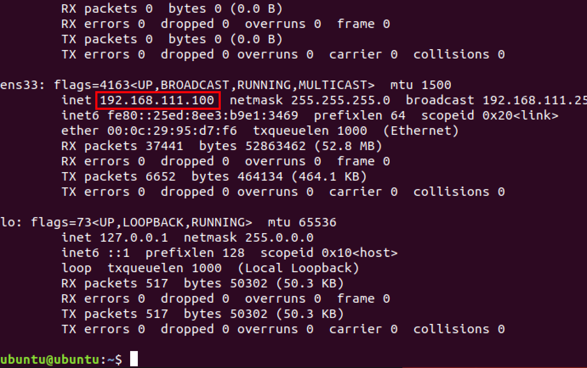
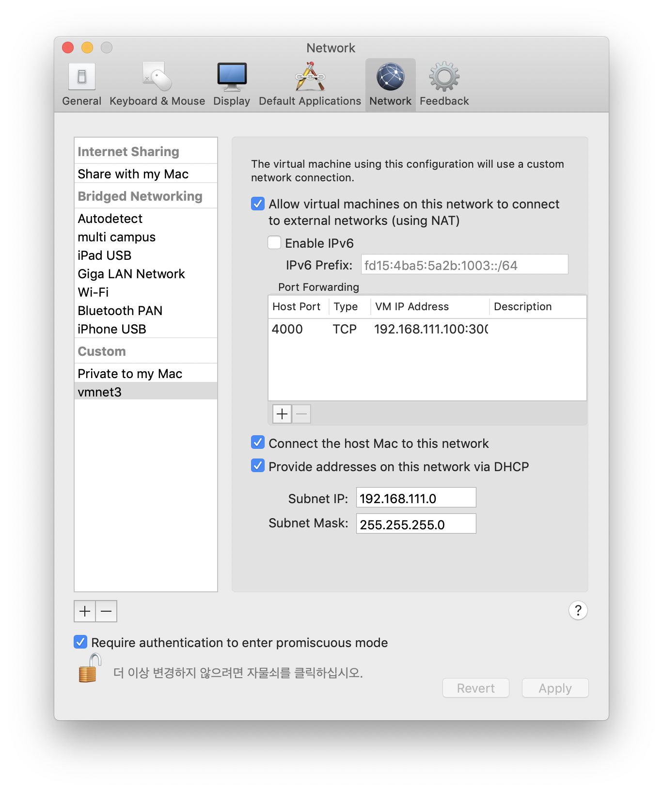
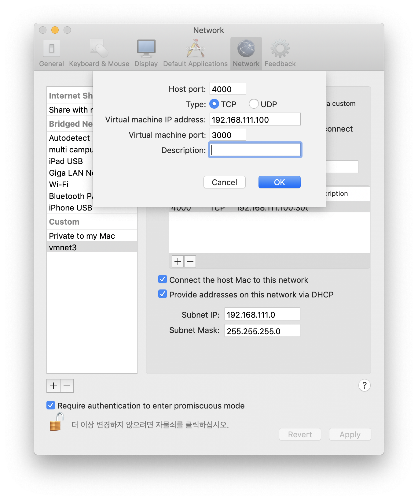

# VMware 포트 포워딩 하기

## 가상화 VM ip 확인

```bash
ifconfig
```



## VMware 설정

VMware -> Preferences -> Network





Host port : 호스트 서버에서 포트포워딩 할 포트 주소

Virtual machine IP address : VMware 가상 게스트 IP 주소

Virtual machine port : VMware 가상 게스트 포트 번호
