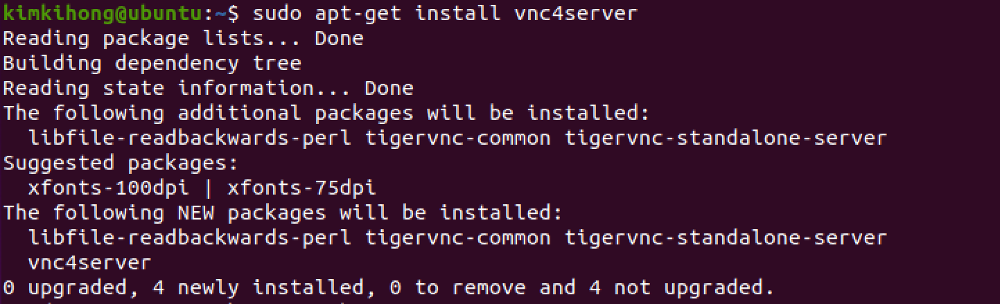
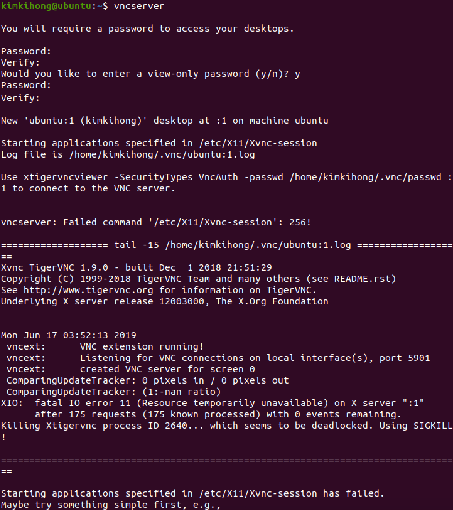

# VNC 서버 설치하기

```bash
sudo apt-get install gnome-panel gnome-settings-daemon metacity vnc4server
```

```bash
sudo apt-get install vnc4server
```



```bash
reboot
# or
init 6
```

### vnc 서버 서비스 가동

```bash
vncserver
```



나머지 정리하기
