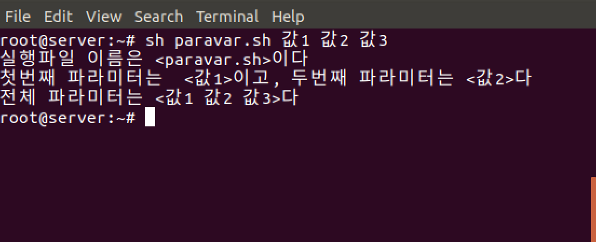

# bash 배시 셸

bash(Bourne Again SHell)

- 셀 명령문 처리 방법  
  (프롬프트) 명령어 [옵션][인자]  
  ex) # rm -rf /mydir

## 변수의 기본

- 셸 스크립트에서는 변수를 사용하기 전에 미리 선언하지 않음  
  변수에 값이 할당되면 자동으로 변수가 생성됨

- 변수에 넣는 모든 값은 문자열(string)으로 취급한다. 숫자를 넣어도 문자열로 취급

- 변수 이름은 대소문자를 구분 ex) $aa !== $AA

- 번수를 대입할 때 '=' 좌우에 공백이 없어야 한다

```bash
#!/bin/sh
# 앞 뒤 공백으로 오류 출력
testval = Hello     # 오류
testval=Hello    # 정상

# 값에 공백이 있을 경우 오류를 나타낸다. 쌍따옴표로 묵어줘야함
testval=Yes Sir     # 오류
testval="Yes Sri"   # 정상

# 숫자는 문자열로 출력한다
testval=7+5
echo $testval    # testval 변수를 불러오면 7+5라는 문자열로 출력한다
```

## 변수의 입력과 출력

'\$' 문자가 들어간 글자를 출력하려면 ' '로 묶거나 문자열 앞에 \ 를 붙여서 이스케이프 시킨다

```bash
#!/bin/sh
# 변수 myvar에 Hi Woo를 입력
myvar="Hi Woo"

# myvar 출력
echo $myvar
Hi Woo

# 쌍따옴표 적용시
echo "$myvar"
Hi Woo

# 홀따옴표 적용시 escape
echo '$myvar'
$myvar

# \ 적용시 escape
echo \$myvar
$myvar

# 한글 출력
echo 값 입력 :

# 변수 입력값을 받아서 myvar에 지정
read myvar

# 홀따옴표와 비교
echo '$myvar' = $myvar
$myvar = Hi Woo

# 쌍따옴표 아래에 홀따옴표는 문자열로 인식된다
echo "'$myvar' = $myvar"
'Hi Woo' = Hi Woo
```

## 숫자 계산

변수에 +, -, *, / 등의 연산을 하려면 expr 키워드를 사용  
단 수식과 함께 `로 묶어줘야 한다  
또한 괄호와 *를 사용하려면 앞에 역슬래시(\)를 붙여준다

```bash
#!bin/sh
num1=100
num2=$num1+200
echo $num2    # 100 + 200 이 출력된다
num3=`expr $num1 + 200`
echo $num3    # 300이 출력된다
num4=`expr \( $num1 + 200 \) / 10 \* 2`
echo $num4    # 60이 출력된다
exit 0
```

## **파라미터 변수**

파라미터변수는 $0, $1, \$2 등의 형태를 갖는다. 이는 실행하는 명령의 부분 하나하나를 변수로 지정한다는 의미  
예를 들어 apt-get -y install gftp 명령을 실행한다면, 파라미터 변수는 다음과 같이 지정 할 수 있다.

| 명령          | apt-get | -y  | install | gftp |
| ------------- | ------- | --- | ------- | ---- |
| 파라미터 변수 | \$0     | \$1 | \$2     | \$3  |

$0에는 apt-get, $1에는 -y를 저장한다.  
명령 전체의 파라미터 변수는 \$\*로 표현한다

paravar.sh 파일을 생성하여 아래와 같이 작성한다

```bash
#!/bin/sh
echo "실행파일 이름은 <$0>이다"
echo "첫번째 파라미터는 <$1>이고, 두번째 파라미터는 <$2>다"
echo "전체 파라미터는 <$*>다"
exit 0
```



## 리다이렉트 Redirect

### \>

출력 리다이렉션. 명령 실행의 표준 출력(stdout)을 파일로 저장. 장치도 파일로 처리하기 때문에 명령 실행 결과를 장치로 보낼 수 있음.

```bash
# good morning 을 현재 디렉토리의 today.txt파일로 출력해서 저장
echo "good morning" > ./today.txt

# 디바이스로 보내면 어디서 볼 수 있을까?
echo "good morning" > /dev/null
```

### \<

입력 리다이렉션. 파일 내용을 읽어 명령의 표준 입력(stdin)으로 사용.

```bash
# 현재 폴더의 today.txt 파일을 입력받아 화면에 출력한다
cat < ./today.txt
```

### \>>

명령 실행의 표준 출력(stdout)을 파일에 추가한다  
`>` 는 파일을 덮어쓰지만 `>>` 는 파일 뒷 부분에 내용을 추가한다

```bash
# 현재 디렉토리의 today.txt 파일에 good afternoon 마지막에 출력하여 저장한다
echo "good afternoon" >> ./today.txt
```

### 2>

명령 실행의 표준 에러(stderr)를 파일로 저장

### 2>>

명령 실행의 표준 에러(stderr)를 파일에 추가

### &>

표준 출력과 표준 에러를 모두 파일로 저장

### 1>&2

표준 출력을 표준 에러로 보낸다. `echo` 명령으로 문자열을 표준 출력으로 출력했지만 표준 에러로 보냈기 때문에 변수에는 문자열이 들어가지 않는다

```bash
# 변수 hello에 "Hello wordl"를 출력하고 표준 에러로 보냄
hello=$(echo "Hello world" 1>&2)

# "Hello world" 를 표준 에러로 보냈기 때문에 변수 hello에는 문자열이 들어가지 않음
echo $hello
```

### 2>&1

표준 에러를 표준 출력으로 보냄.

```bash
# abc라는 명령은 없기 때문에 에러가 발생하지만 에러를 표준 출력으로 보낸 뒤 다시 /dev/null로 보냈기 때문에 아무것도 출력되지 않는다
abd > /dev/null 2>&1

# abc 명령이 없기 때문에 나오는 오류를 test.txt파일에 출력해서 저장한다. cat test.txt를 명령하면 저장된 오류 내용을 볼 수 있다.
abd > test.txt 2>&1
```

### |

파이프. 첫 번째 명령의 출력 값을 두 번째 명령에서 입력받아 처리한다.

```bash
# 리스트 중에 확장자 .txt파일을 출력한다
ls -al | grep .txt
```

> 연습문제

2단부터 9단까지 구구단을 세로로 출력하라

```bash
for i in {2..9}
do
    for j in {1..9}
    do
        echo "$i * $j"=`expr $i \* $j`
    done
done
exit 0
```

2단부터 9단까지 구구단을 가로로 출력하라

```bash
#!/bin/bash

# i x j = x
for (( j = 1 ; j < 10 ; j ++ ))
do
	for (( i = 2 ; i < 10 ; i ++ ))
	do
		# printf "%s x %s = %s \t" $i $j `expr $i \* $j`
		x=`expr $i \* $j`
		echo -e -n "$i x $j = $x\t"
	done
	# printf "\n"
	echo
done
```

> 연습문제 2

1. 임의의 숫자를 생성
2. 사용자가 숫자를 입력해서 1.에서 생성한 숫자를 맞추는 게임
3. 만약 사용자가 입력한 숫자가 1.에서 생성한 숫자와 다르면, 크다, 작다 메시지를 출력하고, 맞으면 정답 메시지를 출력하고 종료한다
4. 맞추는 회수는 10회로 제한한다
5. 10회를 초과하면 실패 메시지를 출력하고 종료한다.

```bash
#!/bin/bash
r=$(rand)

count=0
while [ $count -lt 10 ]
do
	echo 숫자를 입력하세요.
	read num

	if [ $num -eq $r ]
	then
		echo 정답입니다.
		exit 0
	fi

	if [ $num -lt $r ]
	then
		echo 더 큰 수를 입력하세요.
	else
		echo 더 작은 수를 입력하세요.
	fi
	count=`expr $count + 1`
done
echo 회수를 초과했습니다.
exit 1
```

---

## 참조

<http://www.pyrasis.com/book/DockerForTheReallyImpatient/Chapter04>
