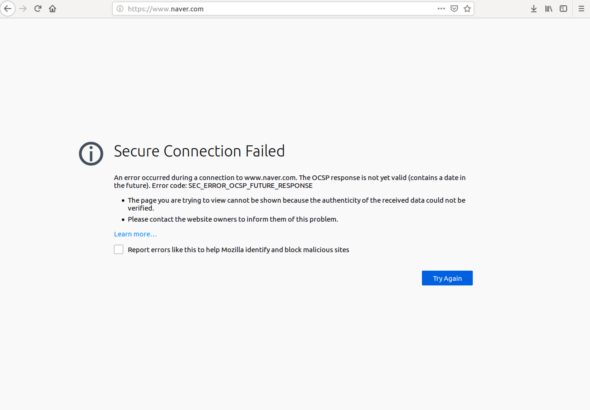
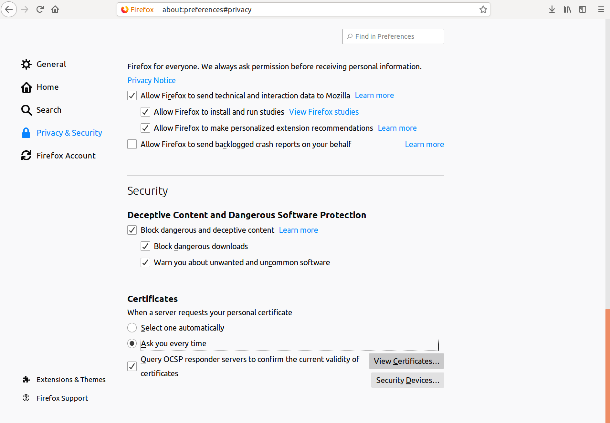
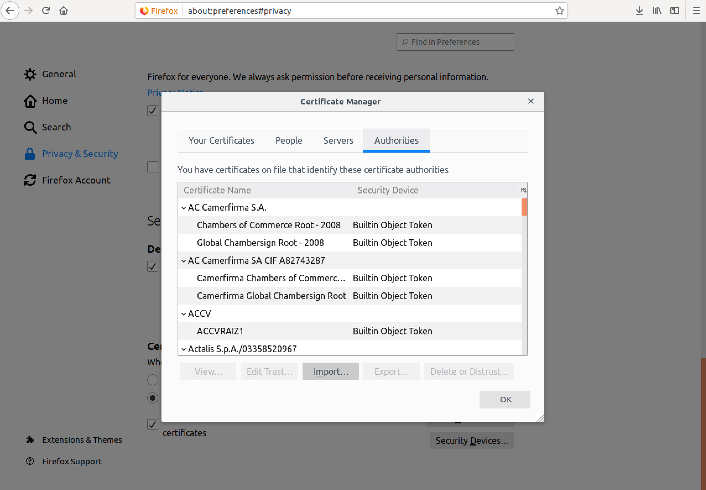
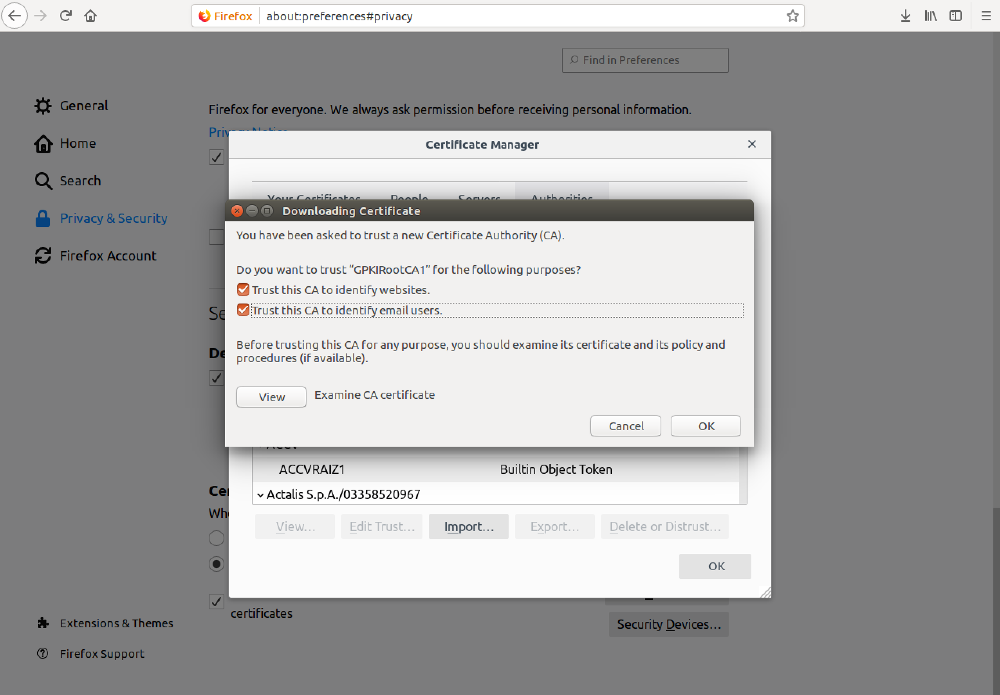
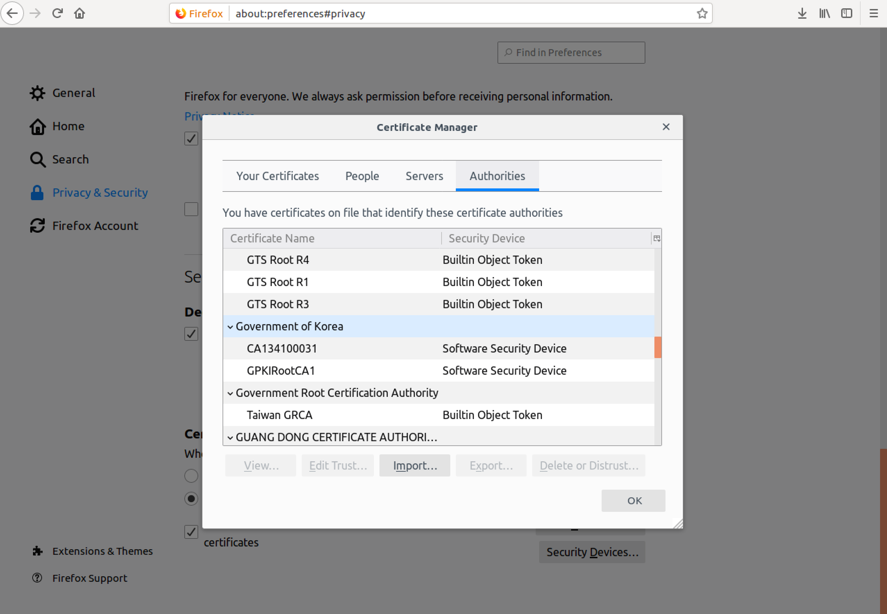

# firefox "Secure Connection Failed"

<https://blog.naver.com/kasodma/221072942981>

[GPKI.zip](./file/GPKI.zip)

https 로 웹사이트 접속시
`Secure Connection Failed` 오류가 발생한다  
이유는 파이어폭스는 TLS(전송 계층 보안 :Transport Layer Security)로 사이트에 암호화를 적용하기 때문이다

해당 사이트의 보안 인증서가 유효한지 확인과정을 거치는데 보안 인증서가 유효하지 않으면 오류를 띄운다

체크박스 전부 선택

Preferences > Privacy & Security > View Certificates  
Government fo Korea 항목에 보면 인증서가 설치 되었다

이제 정상적으로 파이어폭스 브라우저에서 https 사이트에 접속 가능하다
