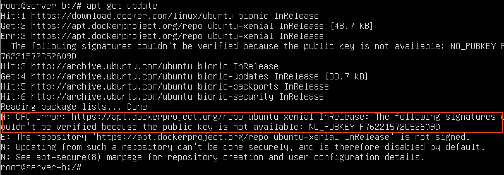
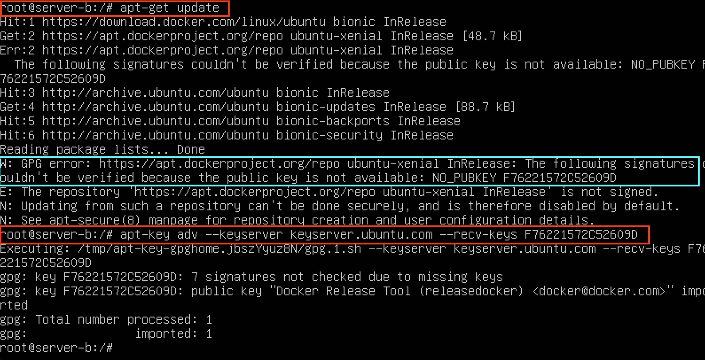

# Fix apt-get update “the following signatures couldn’t be verified because the public key is not available”

<https://chrisjean.com/fix-apt-get-update-the-following-signatures-couldnt-be-verified-because-the-public-key-is-not-available/>

apt-get update 명령을 했는데 GPG error가 발생하면서 진행되지 않았다



Public key 를 추가해준다. 위의 경우 `F76221572C52609D`

```bash
apt-key adv --keyserver keyserver.ubuntu.com --recv-keys F76221572C52609D
```



이제 `apt-get update` 명령을 실행하면 정상 처리된다
