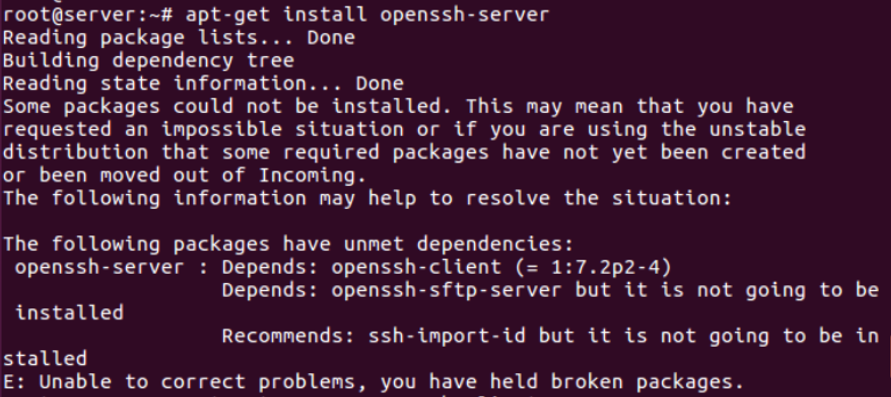
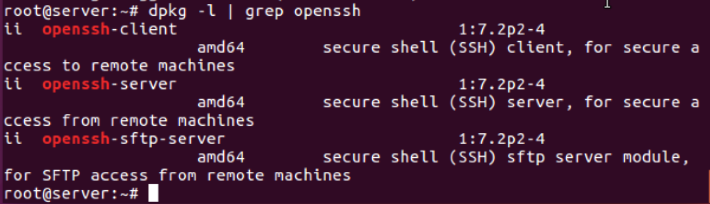

# 우분투에서 패키지 설치시 의존성문제가 생겼을 때 해결 방법

의존성 문제가 생긴 패키지를 먼저 삭제하고 패키지를 다시 설치한다


예시)openssh-server

```bash
apt-get remove openssh-client

apt-get remove openssh-sftp-server

apt-get clean && apt-get purge

apt-get update

apt-get install openssh-server

dpkg -l | grep openssh
```



예시)vim

```bash
apt-get remove vim-common

apt-get clean && apt-get purge

apt-get update && apt-get install vim
```
