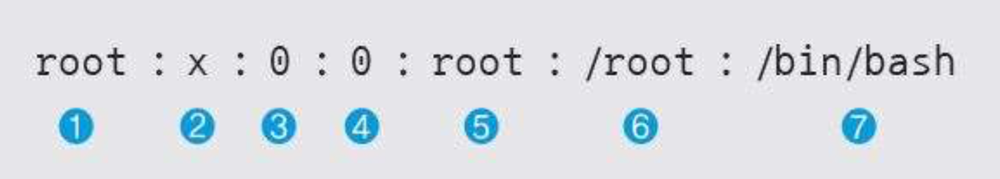

# 리눅스 계정 관리

## 계정 목록 확인

/etc/passwd 파일에서 계정 목록 확인

```bash
cat /etc/passwd
```



❶ 사용자 계정.  
❷ 패스워드가 암호화되어 shadow 파일에 저장되어 있음을 나타냄.  
❸ 사용자 번호. (0 이면 root 권한)  
❹ 그룹 번호. (0 이면 root 권한)  
❺ 실제 이름으로, 시스템 설정에 영향을 주지 않으므로 자신의 이름을 입력해도 됨.  
❻ 사용자의 홈 디렉터리 설정으로, 이 예에서는 관리자 계정이므로 홈 디렉터리가 /root. 일반 사용자는 /home/wishfree와 같이 /home 디렉터리의 하위에 위치.  
❼ 사용자의 셸 정의로 기본 설정은 bash 셸. 사용하는 셸을 이곳에 정의.

## 암호 저장 파일 확인

실제 암호는
`/etc/shadow` 에 해쉬로 담겨있음

```bash
cat /etc/shadow
```

## 계정 리스트만 뽑아 보기

```bash
cut -f1 -d: /etc/passwd
```

## uid 500 이상인 계정만 뽑아 보기

```bash
awk -F':' '{if($3>=500)print $1}' /etc/passwd
```

## 사용자 계정 개수 확인하기

```bash
cat /etc/passwd | wc -l
```

## uid 500 이상인 계정 개수 확인하기

```bash
awk -F':' '{if($3>=500)print $1}' /etc/passwd | wc -l
```

## 계정 추가

```bash
adduser newuser
# or
useradd newuser

# 사용자 id를 100으로 지정하여 생성
adduser --uid 100 newuser

# 사용자 id를 생성 할 때 그룹 ID가 1000에 포함시킴
adduser --gid 1000 newuser

# 홈디렉토리를 /newhome으로 지정하여 생성
adduser --home /newhome newuser

# 셀을 /bin/csh로 지정하여 생성
adduser --shell /bin/csh newuser
```

## 계정 삭제

```bash
deluser --remove newuser
# or
userdel --remove newuser
```

## chage

CHange AGE의 약자  
사용자 암호를 주기적으로 변경하도록 설정

```bash
# newuser에 설정된 사항을 확인
chage -l newuser

# newuser에 설정한 암호를 사용해야 하는 최소일자( 변경 후 최소 2일은 사용해야함 )
chage -m 2 newuser

# newuser에 설정된 암호를 사용 할 수 있는 최대 일자 ( 변경 후 최대 30일까지 사용 가능 )
chage -M 30 newuser

# newuser에 설정된 암호가 만료되는 날짜 ( 2020/12/01까지 사용 가능 )
chage -E 2020/12/01 newuser

# newuser에 설정한 암호가 만료되기 전에 경고 하는 기간, 지정하지 않을 경우 기본값 7일 ( 예시는 만료되기 10일 전에 경고 )
chage -W 10 newuser
```

## 계정 변경

```bash
# su = switch user
su username
```

## 그룹 확인

```bash
cat /etc/group
cut -f1 -d: /etc/group
```

## 그룹 파일 구조


❶ 그룹 이름으로, 여기서는 root 그룹을 말함.  
❷ 그룹에 대한 패스워드로, 일반적으로는 사용하지 않음.  
❸ 그룹 번호로, 0은 root 그룹.  
❹ 해당 그룹에 속한 계정 목록.

## 그룹 추가

### groupadd

> 기능  
> 그룹을 생성한다
>
> 형식  
> groupadd [option] groupname
>
> 옵션  
> -g gid : 그룹의 GID를 지정  
> -o : GID의 중복을 허용

```bash
# 옵션이 없으면 GID를 가장 마지막 번호의 다음 번호로 자동 설정
groupadd newgroup
addgroup newgroup1

# GID 지정하여 그룹 생성
groupadd -g 1234 newgroup2

# GID 중복 지정
groupadd -g 1234 -o newgroup3

# -r
groupadd -r newgroup4

# --system
addgroup --system newgroup5
```

# 그룹 정보 수정하기

> 기능  
> 그룹 정보를 수정한다
>
> 형식  
> groupmod [옵션] 그룹명
>
> 옵션  
> -g gid : 그룹의 GID를 수정한다  
> -o : GID의 중복을 허용한다  
> -n 그룹명 : 그룹명을 다른 이름으로 바꾼다
>
> 사용 예  
> groupmod -g 3001 gtest  
> groupmod -g 3001 -o gtest2  
> groupmod -n gtest1 gtest

### GID 바꾸기 : -g 옵션

```bash
# gtest01 그룹의 GID를 2301에서 2500으로 변경
groupmod -g 2500 gtest01

# 확인
grep gtest01 /etc/group
```

## 그룹 이름 바꾸기 : -n 옵션

```bash
# gtest01 그룹의 이름을 gtest11으로 변경
groupmod -n gtest11 gtest01
```

## 그룹 확인

```bash
cat /etc/group
```

## 그룹 패스워드 파일 확인

```bash
cat /etc/gshadow
```

## 그룹 삭제

```bash
groupdel newgroup
delgroup newgroup
```

## 그룹 암호 설정하고 사용하기

> 기능  
> /etc/group과 /etc/gshadow 파일을 관리한다
>
> 형식  
> gpasswd [옵션] 그룹명  
> -a 사용자 계정 : 사용자 계정을 그룹에 추가한다  
> -d 사용자 계정 : 사용자 계정을 그룹에서 삭제한다  
> -r : 그룹 암호를 삭제한다
>
> 사용 예  
> gpasswd gtest01  
> gpasswd -a test01 gtest01  
> gpasswd -r gtest01

## 그룹에 멤버 추가하기 : -a 옵션

```bash
# gtest11 그룹에 user01 멤버를 추가
gpassdwd -a user01 gtest11

# gtest11 그룹 멤버 확인
grep gtest11 /etc/group
```

## 그룹 멤버 삭제하기 : -d 옵션

```bash
# 멤버 user01을 그룹 gtest11에서 삭제
gpasswd -d user01 gtest11
```

## 그룹 암호 설정하고 제거하기

```bash
# gtest11 그룹 암호 바꾸기
gpasswd gtest11

# gtest11 그룹 암호 확인
grep gtest11 /etc/gshadow
```

## 소속 그룹 변경하기 : newgrp

> 기능  
> 소속 그룹을 다른 그룹으로 바꾼다
>
> 형식  
> newgrp 그룹명
>
> 사용 예  
> newgrp adm

```bash
# 소속 그룹 확인
id

# 소속 그룹을 2차 그룹 중 하나로 변경
newgrp [2차 그룹]

# 소속 그룹을 gtest11로 변경 -> 소속 그룹이 아니므로 암호를 물어봄
newgrp gtest11
```

## 그룹 암호 삭제하기 : -r

```bash
# gtest11 암호 삭제
gpasswd -r gtest11
```

## 계정 추가시 기본 파일 복사

/etc/skel 폴더에 파일을 넣어두면 계정 생성시 홈 디렉토리로 복사

## 중복된 root 계정 존재 여부 확인

```bash
grep ‘:0:’ /etc/passwd
```
