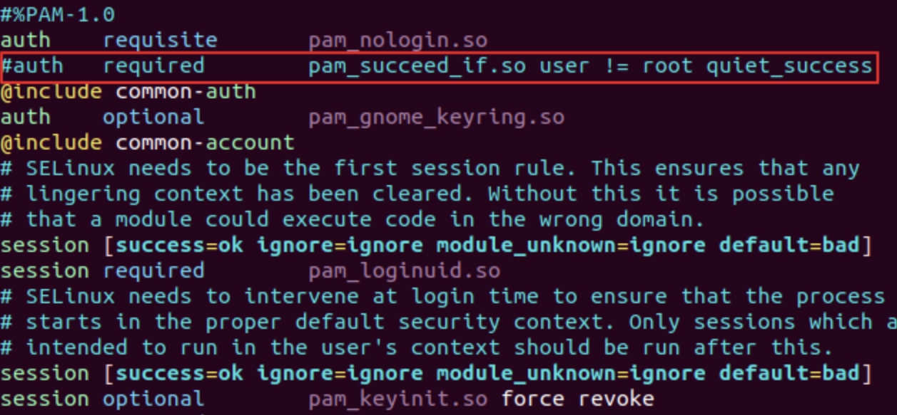
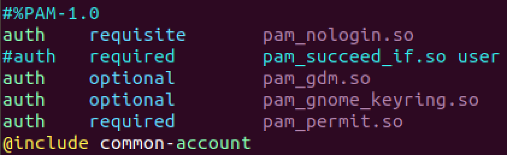
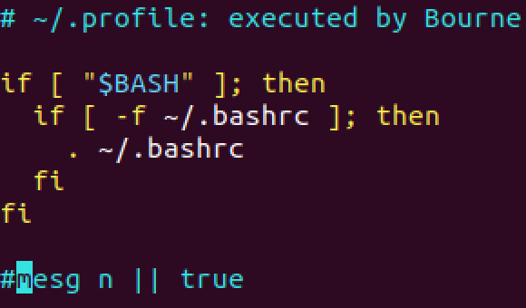

# 로그인을 root 계정으로 변경

## ubuntu 16.04 이하

/etc/lightdm 경로로 이동하여 lightdm.conf 파일을 생성

```bash
vi /etc/lightdm/lightdm.conf
```

> [Seat:*]  
> autologin-user=root

```bash
vi /root/.profile
```

마지막 행 `mesg n || true` 주석처리

## ubuntu 18.04 이후

/etc/gdm3 경로로 이동하여 custom.conf 파일을 수정

```
vi /etc/gdm3/custom.conf
```

[security] 항목의 root 활성화 옵션 추가

> [daemon]
> AutomaticLoginEnable=true
> AutomaticLogin=root
>
> [security]  
> AllowRoot=true

/etc/pam.d 경로로 이동하여 gdm-password 파일을 수정 후 저장

```bash
vi /etc/pam.d/gdm-password
```

auth required 주석 처리


/etc/pam.d 경로로 이동하여 gdm-login 파일을 수정 후 저장

```bash
vi /etc/pam.d/gdm-login
```

auth required 주석 처리


`mesg n || true` 주석처리

```bash
vi /root/.profile
```


