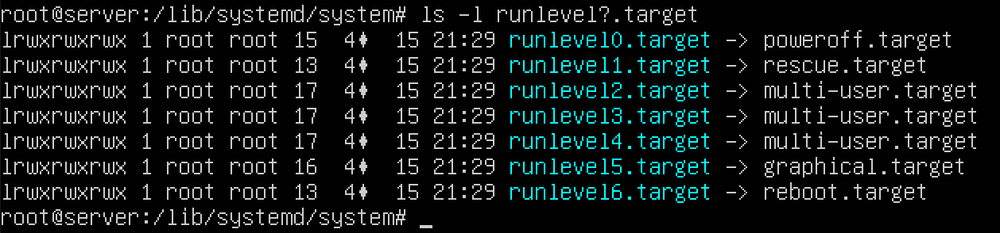
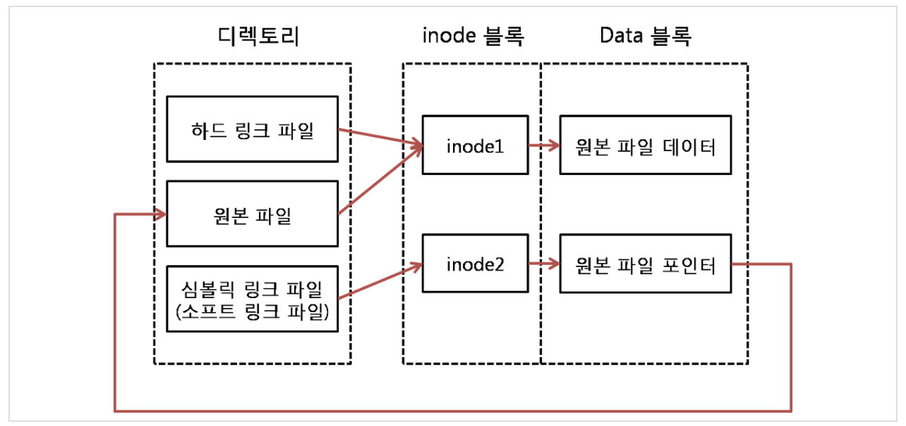

# Linux Ubuntu 서버 운용을 위한 명령어

## 관리자 활성화 및 비밀번호 지정

```bash
# 리눅스 관리자 root 활성화
sudo su - root
[sudo] password for ubuntu: # 현재 사용자 계정 패스워드를 입력해서 루트권한에 진입

# root 패스워드 지정
passwd
# root 사용자의 비밀번호 생성 (password 2회 입력)
```

## 부팅을 위한 중요한 디렉토리 삭제

```bash
# rm = remove, -rf = 강제로 /boot 디렉토리를 삭제
rm -rf /boot
```

## 시스템 종료

```bash
halt -p
# or
poweroff
# or
init 0
# or shutdown 옵션
shutdown -P +10    # 10분 후에 종료 (P: poweroff)
shutdown -r 22:00    # 오후 10시에 재부팅 (r: reboot)
shutdown -c    # 예약된 shutdown을 취소(c: cancle)
shutdown -h 5    # 5분 뒤에 시스템 종료
shutdown -k +15    # 현재 접속한 사용자에게 15분 후에 종료된다는 메시지를 보내지만 실제로는 종료 안 됨
```

## 시스템 재부팅

```bash
reboot
# or
shutdown -r now
# or
init 6
```

## 로그아웃

```bash
logout
# or
exit
```

## 가상 콘솔

- 우분투 18.04 환경  
  x 윈도우는 ctl+alt+f1  
  그 뒤로 f2~f6 까지는 가상 콘솔

## 런레벨

init 명령어 뒤에 붙는 숫자를 런레벨(RunLevel)이라고 부른다

| 런레벨 | 영문 모드  | 설명                           | 비고             |
| ------ | ---------- | ------------------------------ | ---------------- |
| 0      | Power Off  | 종료 모드                      |
| 1      | Rescue     | 시스템 복구 모드               | 단일 사용자 모드 |
| 2      | Multi-User |                                | 사용하지 않음    |
| 3      | Multi-user | 텍스트 모드의 다중 사용자 모드 |
| 4      | Multi-User |                                | 사용하지 않음    |
| 5      | Graphical  | 그래픽 모드의 다중 사용자 모드 |
| 6      | Reboot     |                                |

> 런레벨 확인

```bash
cd /lib/systemd/system
ls -l runlevel?.target
```



ubuntu desktop은 부팅과 동시에 자동으로 x 윈도우가 실행되므로, 런레벨 5번으로 지정된다

ubuntu server는 텍스트 모드로 시작되므로, 런레벨 3번으로 지정된다

현재 시스템에 설정된 런레벨은 링크 파일인 `/lib/systemd/system/default.target` 을 확인하면 알 수 있다

## 자동 완성과 히스토리

파일이나 디렉토리 일부분만 입력하고 `TAP` 키를 누르면 나머지가 자동으로 완성되는 기능

## 명령했던 기록 보기

```bash
# 지난 기록 전부 보기
history

# 기억된 기록 전부 삭제
history -c
```

## 도움말

명령어 옵션에 대한 도움말을 보기 위해서는 `man + 명령어`

```bash
# ex) ls(리스트) 명령어에 대한 도움말 보기
man ls
```

## 옵션의 상세 설명

> 명령어 --help

## mount 마운트

mount [옵션][포멧] [현재Device위치][mount할 디렉토리 위치]

```bash
# 현재 마운트된 장치 확인
mount

# ex) cdrom 마운트 해제
unmount /dev/cdrom
```

## ISO 파일 생성

genisoimage 패키지 설치

```bash
dpkg --get-selections genisoimage
```

```bash
# ex) /boot 디렉토리 파일들을 boot.iso 파일로 생성
genisoimage -r -J -o boot.iso /boot

# '-r -J'는 8글자 이상의 파일 이름 및 대소문자를 구분하기 위한 옵션
# -o 는 출력할 파일을 위한 옵션
```

## Link 링크

파일의 링크는 `하드 링크`와 `심볼릭 링크(소프트 링크)` 2가지 존재

> inode는 리눅스/유닉스 파일 시스템에서 사용하는 자료구조, 파일이나 디렉토리의 여러가지 정보가 들어있다. 해당 파일의 소유권, 허가권, 파일 종류 등의 정보와 해당 파일의 실제 데이터가 어디에 있는지 위치(주소)도 포함되어있다.



```bash
# 하드 링크 생성
ln

# 소프트 링크 생성
ln -s
```

## 서비스(데몬) 설정

rcconf 명령어 사용, 서비스(데몬)의 시작, 중지, 재시작 및 사용 여부를 설정

```bash
# rcconf 설지
apt-get -y install rcconf

# 실행
rcconf
```

## CRON 과 AT

### cron

- 주기적으로 반복되는 일을 자동으로 실행할 수 있도록 시스템 작업을 예약해 놓는 것
- 데몬(서비스)은 crond, 관련 파일은 /etc/crontab

문항1
다음 조건을 만족하는 쉘 스크립트 파일(backup.sh)과 crontab 파일을 제출하시오.

매월 16일 새벽 3시 20분에 /home 디렉터리 전체를 백업해서 /backup 디렉터리에 저장합니다.  
백업 파일은 "backup.년.월.일.tar.xz" 형식으로 생성합니다. ( 예: backup.2019.05.21.tar.xz )  
백업 기능은 /root/backup.sh 쉘 스크립트 파일로 구현하고, cron에 등록해서 주기적으로 실행합니다.  
쉘 스크립트 파일의 소유자는 root입니다.

/root/backup.sh

```bash
#!/bin/bash
set $(date)
fname="backup$1$2$3tar.xz"
tar cfJ /backup/$fname /home
```

/etc/crontab

```bash
20   03   16    *    *     root    /root/backup.sh
```

### at

- 일회성 작업을 예약하는 것, 한 번만 실행되고 소멸
- at 명령어를 입력한 후에 원하는 명령을 순차적으로 입력한 후에 Ctrl + d
- 입력받은 명령어들은 /var/spool/at 디렉토리 아래 파일로 저장

> 주요 옵션  
> -c : 작업정보를 출력
> -d : 예약한 작업 삭제 (=atrm)
> -l : 큐에 있는 작업을 출력. root인 경우 모든 작업 목록들이 출력됨 (=atq)

```bash
# ex)
at 23:00
at> data > /tmp/date.out
at> Ctrl + d

# 작업취소
atrm 작업번호
```

## 파이프

2개의 프로그램을 연결해주는 연결 통로  
| 를 사용

```bash
# ls -l /etc 명령을 입력하면 파일이 너무 많아서 1페이지에 모두 담을 수 없으므로 1페이지씩 나눠서 보자
ls -l /etc | less
```

## 필터

필터란 필요한 것만 걸러주는 명령어.  
grep, tail, wc, sort, awk, sed 명령어 등이 있다  
주로 파이프와 같이 사용한다

```bash
# ps -ef 명령을 입력하면 모든 프로세스 번호를 출력하므로, bash라는 글자가 들어간 프로세스만 출력하게 된다
ps -ef | grep bash
```

## 리디렉션

리디렉션은 표준 입출력의 방향을 바꿔줌  
표준 입력은 키보드, 표준 출력은 모니터이지만 이를 파일로 처리하고 싶을 때 주로 사용

```bash
# ls -l 명령의 결과를 화면에 출력하지 말고 list.txt파일에 저장
ls -l > list.txt

# 위와 같지만 list.txt 파일이 기존에 있으면 기존의 내용에 이어서 쓴다
ls -l >> list.txt

# list.txt 파일을 정렬해서 화면에 출력
sort < list.txt

# list.txt 파일을 정렬해서 out.txt 파일에 쓴다
sort < list.txt > out.txt
```

> root@server:/tmp# date > aaa  
> root@server:/tmp# cat aaa
>
> 2019. 5.  27. (월) 17:29:34 KST  
>               root@server:/tmp# date > bbb  
>               root@server:/tmp# cat bbb
> 2020. 5.  27. (월) 17:29:49 KST
>
> cat all 명령어의 실행 결과가 아래와 같이 나오도록 all 파일을 생성해 보세요.  
> root@server:/tmp# cat all
>
> 2019. 5.  27. (월) 17:29:34 KST
> 2020. 5.  27. (월) 17:29:49 KST  
>               정답  
>               root@server:/tmp# cat aaa bbb > all  
>               root@server:/tmp# cat all
> 2021. 5.  27. (월) 17:29:34 KST
> 2022. 5.  27. (월) 17:29:49 KST
