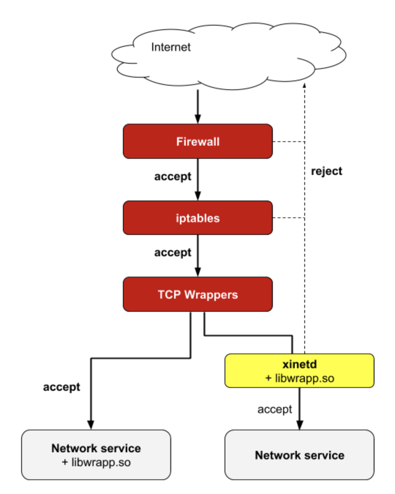
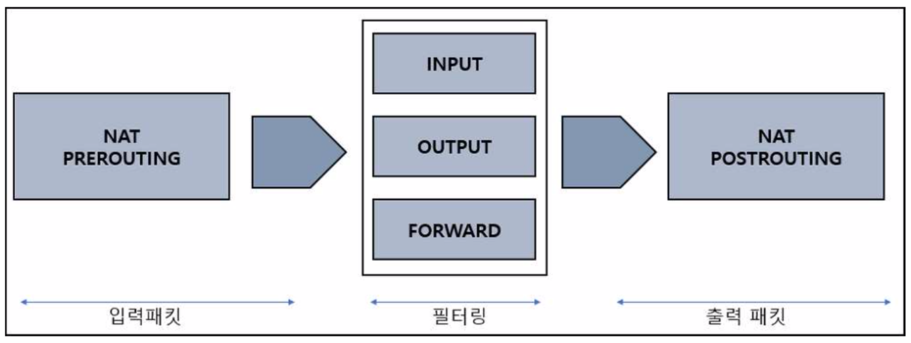
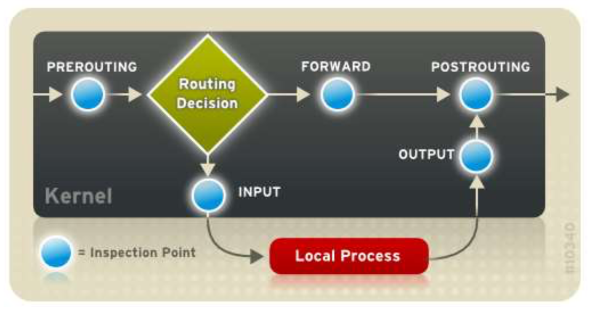
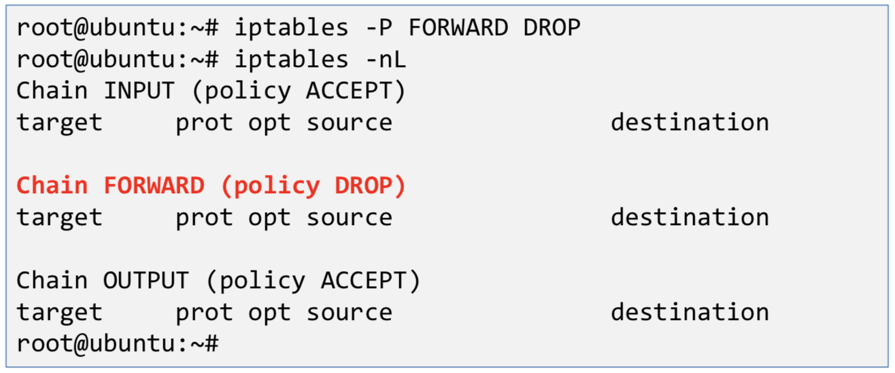

# 리눅스 접근 제어

## 네트워크 인터페이스 정보 확인

```bash
# if = interface
ifconfig
```

```bash
# 인터페이스의 MAC 주소
Hwaddr 02:42:38:56:85:78
# 인터페이스에 할당된 IP 주소
Inet addr:192.168.0.211
# 서브넷 마스크
Mask:255.255.255.0
# 부팅 후 현재까지 받은 패킷 정보
RX packets:1392 errors:0 dropped:0 overruns:0 frame:0 RX bytes:289164 (289.1 KB)
# 부팅 후 현재까지 보낸 패킷 정보
TX packets:2238 errors:0 dropped:0 overruns:0 carrier:0 TX bytes:258103 (258.1 KB)
```

## 리눅스 접근 제어


출처:<https://blog.naver.com/hymne/220959758635>

네트워크 레벨의 접근 제어

- 네트워크 방화벽 장비 등

운영체제 레벨의 접근 제어

- iptables 이용

어플리케이션 레벨의 접근 제어

- TCPWrapper 이용

## IPTABLES

iptables

- 리눅스 운영체제 레벨에서의 접근제어 도구
- 패킷 필터링을 하는 커널의 netfilter에 대한 정책 결정
- 특정 호스트가 해당 호스트에 접근하는 것을 제어

Iptables의 4가지 기능

- 상태 추적 기능 : 신규 접속, 재 접속 등의 상태 추적 가능
- 매칭 기능 : 출발지 / 목적지 IP, 출발지 / 목적지 포트, 프로토콜 별 처리
- 로깅 기능 : 매칭되는 패킷에 대해 로깅
- 포트 포워딩 : NAT 기능을 포함

필터 체인

- 입력(INPUT) : 외부에서 유입되는 패킷에 대한 체인
- 출력(OUTPUT) : 로컬에서 생성되어 외부로 나가는 패킷에 대한 체인
- 포워드(FORWARD) : 로컬 시스템을 경유하는 패킷에 대한 체인

필터 적용

- INPUT, OUTPUT, FORWARD에 대해 허용(ACCEPT), 거부(REJECT), 드랍(DROP) 할 것인지 결정



## 필터 체인 내부 연결도



## iptables 기본 동작

- iptables 명령어를 실행하면 즉시 시스템에 적용
- 등록된 순서에 따라 규칙이 먼저 적용됨
  - 규칙에 해당하는 패킷에 대하여 지정한 ACCEPT, REJECT, DROP 수행
  - 허용하는 정책이 먼저 오고 거부하는 정책이 나중에 와야 함
  - 규칙 적용 후 뒤에 오는 추가 규칙은 무시
- 체인의 모든 규칙 중 하나도 매칭되지 않는 경우 기본 정책이 수행
  - 기본 정책은 ACCEPT, DROP 중 하나로 설정
  - 일반적으로 특별히 지정된 포트와 IP 주소 등에 대해서만 ACCEPT

## iptables 설치 확인 및 설치

```bash
dpkg -l | grep iptables
sudo apt-get install iptables
```

## iptables 실행

```bash
iptables
```

## 현재 설정된 방화벽 확인

```bash
iptables -nL
iptables -nL -line-numbers
iptables -L -v
```

# 현재 방화벽 설정 내용 백업(루트 권한)

방화벽 설정 이상 시 복원을 위해 작업 전에 백업

```bash
# 백업 할 위치 생성 - firewall_rules
mkdir firewall_rules

# ./firewall_rules로 이동
cd firewall_rules

# iptables_backup_date로.rules로 백업
iptables-save > iptables_backup_date.rules
```

## 방화벽 설정 초기화

```bash
iptables -F
```

## 방화벽 설정 내용 복구 (루트 권한)

```bash
# iptables_backup_date.rules에서 복구
iptables-restore < iptables_backup_date.rules
```

## iptables 기본 정책 변경

```bash
# 기본 정책 확인
iptables -nL

# FORWARD 기본 정책을 DROP으로 변경
iptables -P FORWARD DROP

# 기본 정책 적용 확인
iptables -nL
```



## 특정 인터페이스에 대한 접근 제어(-i)

```bash
iptables –A INPUT –I lo –j ACCEPT
```

## 특정 IP에 대한 접근 제어 (-s)

```bash
iptables –A INPUT –s 192.168.0.11 –j ACCEPT

iptables –A INPUT –s 192.168.0.12 –j DROP

iptables –A INPUT –s 192.168.0.* -j ACCEPT
```

## 특정 포트 및 프로토콜 접근 제어 (-p)

```bash
iptables –A INPUT –p tcp --dport 80 –j ACCEPT

iptables –A INPUT –p tcp --dport 443 –j DROP

iptables –A INPUT –s 192.168.0.* -p udp --dport 777 –j ACCEPT

iptables –A INPUT –p udp –dport 6000:6050 –j ACCEPT
```

## iptables 초기화

```bash
iptables -F
```

## Ping 막기

```bash
iptables –A INPUT –p icmp –m icmp –icmp-type echo-request
```

## SSH 열기

```bash
iptables -A INPUT –m state --state NEW –m tcp –p tcp --dport 22 –j
ACCEPT
```

## WEB 포트 열기

```
iptables –A INPUT –p tcp --dport 80 –j ACCEPT

iptables –A INPUT –p tcp --dport 443 –j ACCEPT

iptables –A INPUT –p tcp --dport 3000 –j ACCEPT
```

## 기본 정책을 설정

```
iptables –P INPUT DROP

iptables –P FORWARD DROP

iptables –P OUTPUT ACCEPT
```

## 서버 취약점 보완

- NULL 패킷 차단 (정찰용)
  ```bash
  iptables –A INPUT –p tcp –tcp-flags ALL NONE –j DROP
  ```
- Syn-flood 패킷 차단
  ```bash
  iptables –A INPUT –p tcp ! –syn –m state –state NEW –j DROP
  ```
- XMAS 패킷 차단 (정찰)
  ```bash
  iptables –A INPUT –p tcp --tcl-flags ALL ALL –j DROP
  ```

## 재부팅 시에도 정책 적용

```bash
# 현재 설정된 규칙을 자동으로 저장
apt-get install iptables-persistent
```

## 설정 내용 확인

`/etc/iptables/rules.4 파일 확인`

## 재부팅 후 적용 확인

```bash
iptables -nL
```
