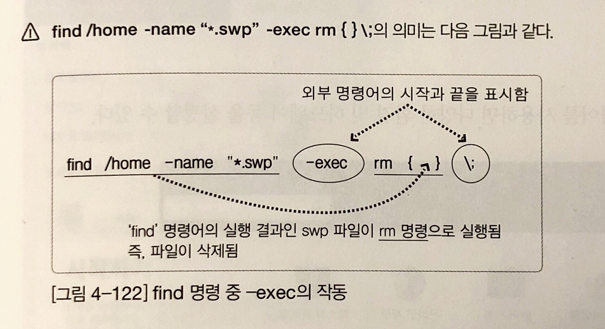

# 파일 압축

## xz

확장명 xz로 압축하거나 풀어준다

```bash
# 'filename'을 압축 파일인 'filename.xz'로 만든다. 기존 파일은 삭제
xz filename

# 'filename.xz'를 압축 풀어서 'filename'으로 만듦 (-d : Decompress)
xz -d filename.xz

# 'filename.xz' 압축 파일에 포함된 파일 목록과 압축률 등을 출력 (-l : list)
xz -l filename.xz

# 압축 후 기존 파일을 삭제하지 않음
xz -k filename.xz (-k : keep)
```

## bzip2

확장명 bz2로 압축하거나 푼다

```bash
# 옵션 -d 는 압축해제, -k 는 기존파일 삭제하지 않음
bzip2 [옵션] filename
```

# gzip

확장명 gz로 압축하거나 푼다

```bash
# 'filename'을 압축파일인 'filename.gz'로 만듦
gzip filename

# 압축 해제
gzip -d filename.gz
```

## zip/unzip

윈도우와 호환되는 확장명 zip로 압축하거나 풀어준다

```bash
# 'filename'을 'newfilename.zip'으로 만든다. 기존 파일은 유지됨
zip newfilename.zip filename

# 'filename.zip' 압축 풀기
unzip filename.zip
```

# 파일 묶기

윈도우와 달리 리눅스(유닉스)는 파일 압축과 파일 묶기가 원칙적으로 별개의 프로그램으로 실행하도록 되어있다

## tar

확장명 tar로 묶음 파일을 만들어 주거나 묶음을 풀어준다

> c - 새로운 묶음을 만든다  
> x - 묶인 파일을 푼다  
> t - 묶음을 풀기 전 묶인 경로를 보여줌  
> C - 묶음을 풀 때 지정된 디렉토리에 압축을 푼다. 지정하지 않으면 동일한 디렉토리에 묶음이 풀린다  
> f - 묶음 파일 이름 지정. tar는 테이프(tape) 장치 백업이 기본  
> v - visual의 의미로 파일이 묶이거나 풀리는 과정을 보여준다  
> J - tar + xz  
> z - tar + gzip  
> j - tar + bzip2

```bash
# 묶기
tar cvf ex.tar /etc

# 묶기 + xz 압축
tar cvfJ ex.tar.xz /etc

# 묶기 + gzip 압축
tar cvfz ex.tar.gz /etc

# 묶기 + bzip2 압축
tar cvfj ex.tar.gz /etc

# 파일 확인
tar tvf ex.tar

# tar 풀기
tar xvf my.tar

# newdir에 tar 풀기
tar Cxvf newdir ex.tar

# xz 압축 해제 + tar 풀기
tar xFJ ex.tar.xz
```

## 파일 위치 검색

### find 경로 옵션 조건 action

> 옵션

-name, -user, -newer(전, 후), -perm(허가권), -size(크기)

> action

-print(기본 값), -exec(외부 명령 실행)

기본 사용 예

```bash
# /etc 디렉토리 하위에 확장명이 .conf인 파일 검색
find /etc -name "*.conf"

# /home 디렉토리 하위에 소유자가 ubuntu인 파일 검색
find /home -user ubuntu

# 현재 사용자의 홈 디렉토리 하위에 허가권이 644인 파일 검색
find ~ -perm 644

# /usr/bin 디렉토리 하위에 파일 크기가 10KB~100KB인 파일 검색
find /usr/bin -size +10k =size -100k
```

고급 사용 예

```bash
# 현재 사용자의 홈 디렉토리 하위에 파일 크기가 0인 파일의 목록을 상세히 출력
find ~ -size 0k -exec ls -l { } \;

# /home 홈 디렉토리 하위에 확장명이 *.swp인 파일을 삭제
fine /home -name "*.swp" -exec rm { } \;
```


